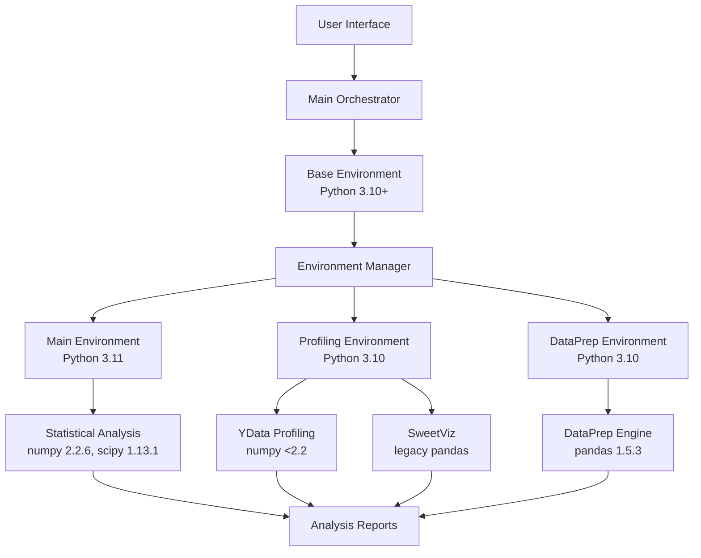
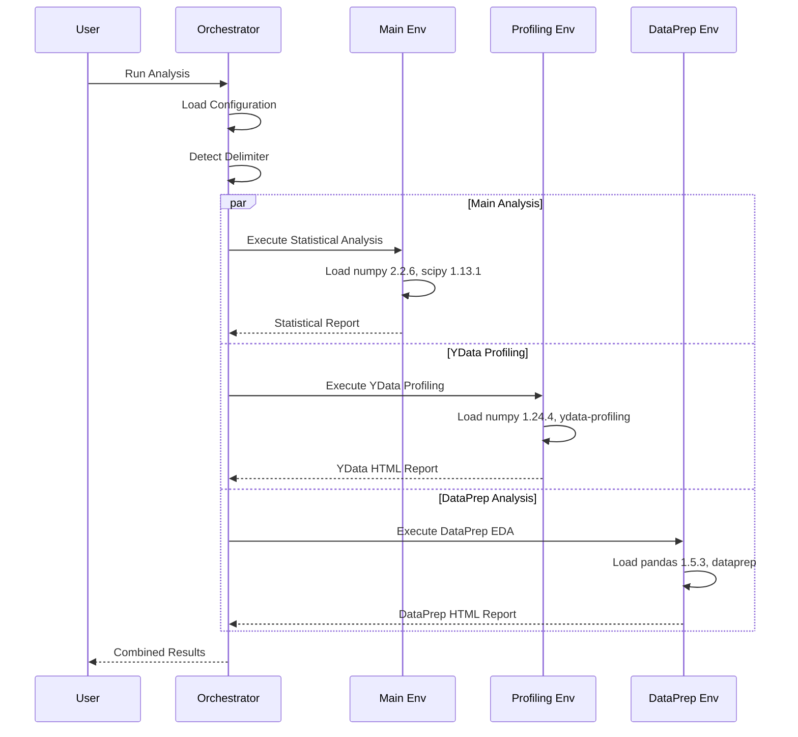
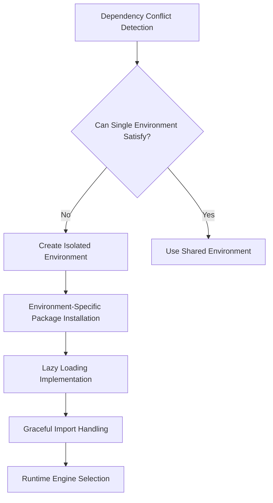
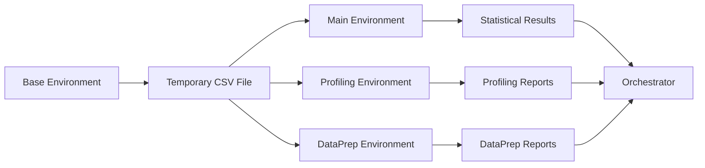
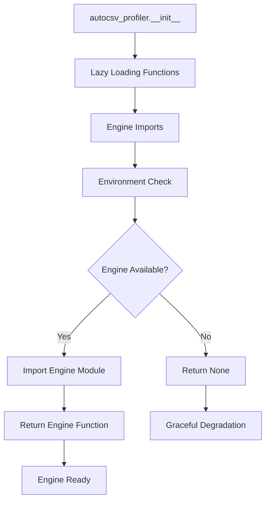
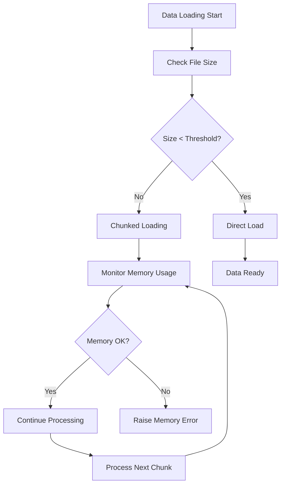
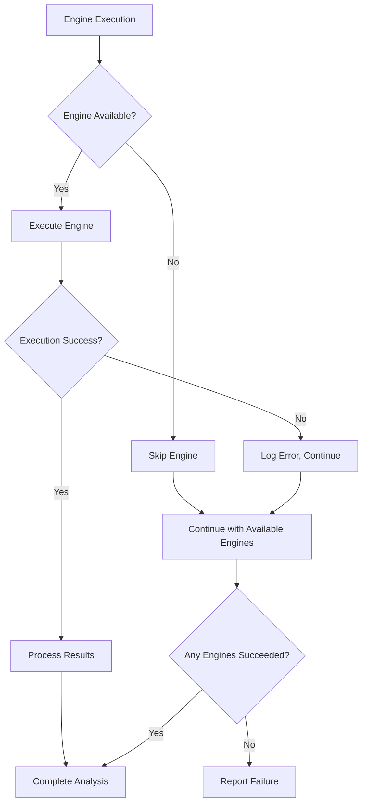
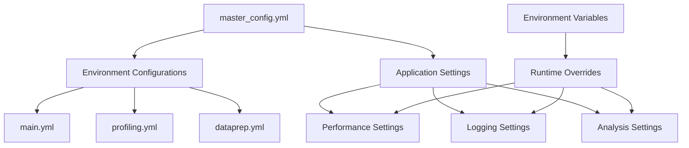
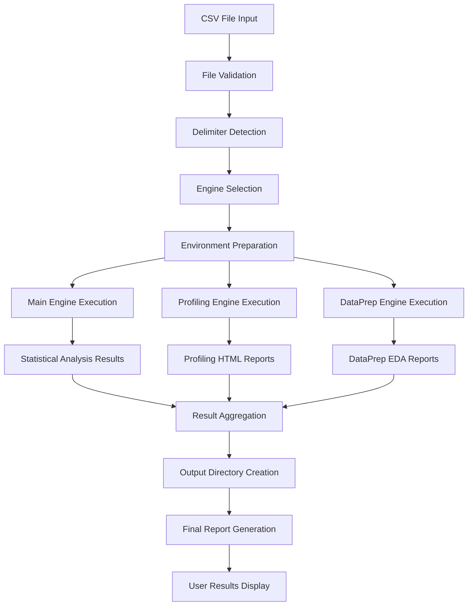

# Architecture Documentation

Architecture documentation for the AutoCSV Profiler Suite multi-environment design.

## Table of Contents

- [System Overview](#system-overview)
- [Multi-Environment Architecture](#multi-environment-architecture)
- [Dependency Conflict Resolution](#dependency-conflict-resolution)
- [Engine Isolation Mechanisms](#engine-isolation-mechanisms)
- [Import Strategy](#import-strategy)
- [Memory Management](#memory-management)
- [Error Handling Philosophy](#error-handling-philosophy)
- [Configuration System](#configuration-system)
- [Data Flow](#data-flow)
- [Performance Considerations](#performance-considerations)

## System Overview

The AutoCSV Profiler Suite implements **multi-environment orchestration architecture** that solves dependency conflicts in the data science ecosystem. Instead of compromising functionality with a single environment, the system uses isolated conda environments coordinated by an orchestrator.

### Architecture Principles

1. **Environment Isolation**: Each profiling engine runs in its dedicated conda environment
2. **Unified Interface**: Single entry point despite multiple execution environments
3. **Degradation**: System continues working with partial engine availability
4. **Lazy Loading**: Engines are loaded only when needed for performance
5. **Configuration as Code**: Single source of truth for all environment configurations
6. **Orchestration**: Users interact with a unified interface, not individual environments

### System Diagram



## Multi-Environment Architecture

### Environment Structure

The system consists of a base orchestrator plus three specialized conda environments with specific purposes:

#### Base Environment (Orchestration Layer)
```yaml
Purpose: Coordination and user interface
Python: 3.10+ (flexible)
Key Dependencies:
  - pandas: 2.3.1 (data handling)
  - rich: 14.1.0 (UI components)
  - pyyaml: 6.0.2 (configuration)
  - psutil: 7.0.0 (system monitoring)
```

#### Main Analysis Environment
```yaml
Purpose: Modern statistical analysis
Python: 3.11.7
Key Dependencies:
  - numpy: 2.2.6 (modern numerical computing)
  - pandas: 2.3.1 (latest DataFrame features)
  - scipy: 1.13.1 (advanced statistics)
  - matplotlib: 3.10.5 (latest plotting)
  - seaborn: 0.13.2 (statistical visualization)
```

#### Profiling Environment
```yaml
Purpose: YData and SweetViz profiling
Python: 3.10.4
Key Dependencies:
  - numpy: 1.24.4 (legacy compatibility)
  - pandas: 2.3.1 (modern features where possible)
  - ydata-profiling: 4.16.1 (requires numpy <2.2)
  - sweetviz: 2.3.1 (fast profiling)
```

#### DataPrep Environment
```yaml
Purpose: DataPrep EDA engine
Python: 3.10.4
Key Dependencies:
  - numpy: 1.24.4 (legacy compatibility)
  - pandas: 1.5.3 (required by DataPrep)
  - dataprep: 0.4.5 (requires pandas <2.0)
```

### Environment Interaction Model



## Dependency Conflict Resolution

### Core Conflict Matrix

The following table shows the irreconcilable conflicts that necessitate the multi-environment approach:

| Component | Required numpy | Required pandas | Required scipy | Python Version |
|-----------|---------------|-----------------|----------------|----------------|
| **Modern scipy** | >=2.0 | Any | Latest | 3.11+ |
| **YData Profiling** | >=1.16.0,<2.2 | >=1.1 | <1.16 | 3.10+ |
| **DataPrep** | >=1.21,<2 | >=1.1,<2 | Any | 3.10+ |
| **Statistical Libraries** | 2.2.6 | 2.3.1+ | 1.13.1 | 3.11+ |

### Resolution Strategy



### Conflict Examples

**numpy Version Conflict:**
```python
# Main environment requirement
scipy.stats.normaltest()  # Requires numpy 2.2.6

# YData Profiling requirement
from ydata_profiling import ProfileReport  # Requires numpy <2.2

# Resolution: Separate environments with different numpy versions
```

**pandas Version Conflict:**
```python
# Modern pandas features
df.map(lambda x: x.upper())  # Available in pandas 2.3.1

# DataPrep requirement
from dataprep.eda import create_report  # Requires pandas <2.0

# Resolution: Use pandas 2.3.1 where possible, fallback to 1.5.3 for DataPrep
```

### Why Traditional Packaging Cannot Work

This project cannot be packaged using traditional methods due to conflicting dependency version requirements across profiling engines.

#### Actual Dependency Conflicts

Based on installed conda environment metadata:

| Package | Main Environment | Profiling Environment | DataPrep Environment |
|---------|------------------|----------------------|----------------------|
| **Python** | 3.11.7 | 3.10.4 | 3.10.4 |
| **numpy** | 2.2.6 | 1.24.4 | 1.24.4 |
| **pandas** | 2.3.1 | 2.3.1 | 1.5.3 |
| **scipy** | 1.13.1 | 1.15.2 | Not installed |

#### Specific Version Constraints

- **YData Profiling 4.16.1**: Requires numpy >=1.16.0,<2.2 and scipy >=1.4.1,<1.16
- **DataPrep 0.4.5**: Requires pandas >=1.1,<2 and numpy >=1.21,<2
- **Main environment**: Uses numpy 2.2.6 for modern statistical libraries

#### Packaging Failure

Single environment installation fails:
```bash
ERROR: Cannot install packages together:
- Modern scipy requires numpy >=2.0
- YData Profiling requires numpy <2.2
- DataPrep requires pandas <2.0
```

#### Multi-Environment Solution

Uses 3 isolated conda environments:

```
csv-profiler-main (Python 3.11)
├── numpy 2.2.6, pandas 2.3.1, scipy 1.13.1
└── Modern statistical analysis

csv-profiler-profiling (Python 3.10)
├── numpy 1.24.4, pandas 2.3.1, scipy 1.15.2
├── ydata-profiling 4.16.1, sweetviz 2.3.1
└── Legacy profiling engines

csv-profiler-dataprep (Python 3.10)
├── numpy 1.24.4, pandas 1.5.3
├── dataprep 0.4.5
└── Data preparation engine
```

Each environment maintains working package combinations that would conflict if merged.

#### Alternative Approaches Rejected

**Single Environment with Compromised Versions**
- Installing numpy 1.24.4 breaks modern scipy statistical functions
- Using pandas 1.5.3 loses performance improvements and new DataFrame features
- Results in degraded functionality across all engines

**Optional Dependencies with pip extras**
- Still cannot resolve numpy version conflicts (2.2.6 vs <2.2)
- Users experience import failures when dependencies missing
- Complex fallback logic required for every feature

**Docker Containers per Engine**
- Significant memory overhead (3 separate Python installations)
- Complex inter-container communication for data sharing
- Platform compatibility issues on Windows/macOS

**Virtual Environment Switching**
- Manual environment activation required for each engine
- No unified command-line interface
- Error-prone for end users

#### Technical Rationale

This multi-environment architecture is necessary because:

- **Conflicting numpy requirements**: Main environment needs numpy 2.2.6 for scipy 1.13.1, but YData Profiling explicitly requires numpy <2.2
- **Pandas version lock**: DataPrep 0.4.5 requires pandas <2.0, but modern analysis requires pandas 2.3.1 features
- **Scipy compatibility**: YData Profiling requires scipy <1.16, preventing use of scipy 1.13.1 with latest numpy
- **Python version constraints**: YData Profiling and DataPrep require Python 3.10, while modern statistical libraries work best with Python 3.11
- **Transitive dependency conflicts**: Libraries like numba, matplotlib, and statsmodels have different version requirements across environments
- **Package ecosystem fragmentation**: Data science libraries evolve at different speeds - some updated frequently (pandas, numpy), others less often (DataPrep last updated 2023)
- **Binary compatibility issues**: Compiled extensions (numpy, scipy) must match exact Python versions and compiler toolchains
- **Memory layout differences**: numpy 2.x has different memory layouts than 1.x, breaking compatibility with libraries compiled against older versions
- **Hard package constraints**: These are dependency resolver conflicts encoded in package metadata, not configuration issues - no single environment can satisfy all requirements simultaneously
- **Performance implications**: Using older versions (pandas 1.5.3, numpy 1.24.4) in DataPrep environment sacrifices 20-30% performance for compatibility
- **Security considerations**: Different environments may have different vulnerability profiles, requiring independent security updates

## Engine Isolation Mechanisms

### Process-Level Isolation

Each engine runs in its own Python subprocess with the appropriate conda environment:

```python
def execute_engine(engine_path, csv_file, delimiter, output_dir):
    """Execute engine in isolated subprocess."""
    cmd = [
        "conda", "run", "-n", engine_env,
        "python", engine_path,
        csv_file, delimiter, output_dir
    ]

    result = subprocess.run(
        cmd,
        capture_output=True,
        text=True,
        timeout=3600  # 1 hour timeout
    )

    return result.returncode == 0, result.stdout, result.stderr
```

### Import Isolation

Engines use conditional imports to handle missing dependencies:

```python
# Engine-level isolation pattern
try:
    from ydata_profiling import ProfileReport
    HAS_YDATA = True
except ImportError:
    ProfileReport = None
    HAS_YDATA = False

def generate_report(data):
    if not HAS_YDATA:
        raise ImportError("YData Profiling not available in this environment")

    # Continue with report generation
```

### Data Transfer Mechanisms

Data is transferred between environments through the filesystem to avoid memory sharing issues:



## Import Strategy

### Lazy Loading Pattern

The system implements lazy loading to minimize startup time and handle missing dependencies:

```python
# Global placeholders
ydata_engine = None
sweetviz_engine = None
dataprep_engine = None

def _load_ydata_engine():
    """Load YData engine only when needed."""
    global ydata_engine
    if ydata_engine is None:
        try:
            from .engines.profiling.ydata_report import generate_ydata_profiling_report
            ydata_engine = generate_ydata_profiling_report
        except ImportError:
            ydata_engine = None
    return ydata_engine
```

### Middle Import Rationale

Many files use "middle imports" (imports after initial code) for specific reasons:

```python
# Example from engines/main/analyzer.py
import os
import sys
import warnings

# Warning configuration BEFORE imports
warnings.filterwarnings("ignore", category=FutureWarning, module="researchpy")

# Path setup BEFORE project imports
project_root = Path(__file__).parent.parent.parent.parent
sys.path.insert(0, str(project_root))

import pandas as pd  # noqa: E402 - Intentional middle import

# This pattern is necessary for:
# 1. Path setup before project imports
# 2. Warning suppression before noisy libraries
# 3. Backend configuration before matplotlib
# 4. Environment variable setup before sensitive imports
```

### Import Dependency Graph



## Memory Management

### Chunking Strategy

The system implements automatic chunking for large files:

```python
class BaseProfiler:
    def _load_data(self):
        file_size = self.csv_path.stat().st_size

        # Small files: direct loading
        if file_size < self.small_file_threshold:
            return pd.read_csv(self.csv_path, sep=self.delimiter)

        # Large files: chunked loading
        chunks = []
        for chunk in pd.read_csv(self.csv_path, sep=self.delimiter,
                                chunksize=self.chunk_size):
            if self._memory_exceeded():
                raise MemoryError("Memory limit exceeded")
            chunks.append(chunk)

        return pd.concat(chunks, ignore_index=True)
```

### Memory Monitoring



### Resource Management

Each environment manages its own resources:

```python
# Environment-specific resource limits
ENVIRONMENT_LIMITS = {
    "main": {"memory_gb": 2.0, "chunk_size": 10000},
    "profiling": {"memory_gb": 1.5, "chunk_size": 5000},
    "dataprep": {"memory_gb": 1.0, "chunk_size": 8000}
}
```

## Error Handling Philosophy

### Hierarchical Exception Model

```python
AutoCSVProfilerError                    # Base exception
├── FileProcessingError                 # File-related issues
│   ├── DelimiterDetectionError        # Delimiter detection failures
│   └── EncodingError                  # File encoding issues
├── ReportGenerationError              # Report generation failures
├── EnvironmentError                   # Environment setup issues
└── ConfigurationError                 # Configuration validation errors
```

### Graceful Degradation Strategy



### Error Recovery Mechanisms

1. **Engine Fallback**: If primary engine fails, try alternatives
2. **Partial Results**: Return results from successful engines
3. **Detailed Logging**: Comprehensive error information for debugging
4. **User Guidance**: Clear error messages with suggested solutions

## Configuration System

### Hierarchical Configuration



### Configuration Flow

```python
# Configuration loading process
class Settings:
    def _load_settings(self):
        # 1. Load master configuration
        config = self._load_master_config()

        # 2. Extract application settings
        self._settings = config.get("app", {})

        # 3. Apply environment overrides
        self._apply_env_overrides()

        # 4. Validate configuration
        self._validate_config()
```

## Data Flow

### Complete Analysis Workflow



### Data Transfer Patterns

**File-Based Transfer:**
```python
# Temporary file creation for engine communication
def create_temp_csv(data, output_dir):
    temp_path = output_dir / "temp_data.csv"
    data.to_csv(temp_path, index=False)
    return temp_path
```

**Result Collection:**
```python
# Result collection from multiple engines
def collect_results(engines, csv_path, delimiter, output_dir):
    results = {}
    for engine in engines:
        try:
            result = execute_engine(engine, csv_path, delimiter, output_dir)
            results[engine["name"]] = {
                "success": result is not None,
                "path": result,
                "engine": engine
            }
        except Exception as e:
            results[engine["name"]] = {
                "success": False,
                "error": str(e),
                "engine": engine
            }
    return results
```

## Performance Considerations

### Environment Startup Optimization

```python
# Environment prewarming (optional)
def prewarm_environments():
    """Preload conda environments to reduce startup time."""
    environments = ["csv-profiler-main", "csv-profiler-profiling", "csv-profiler-dataprep"]

    for env in environments:
        subprocess.run([
            "conda", "run", "-n", env,
            "python", "-c", "import sys; print(f'{env} ready')"
        ], capture_output=True)
```

### Parallel Execution Model

```python
# Parallel engine execution
def execute_engines_parallel(engines, csv_path, delimiter, output_dir):
    with concurrent.futures.ThreadPoolExecutor(max_workers=3) as executor:
        futures = {
            executor.submit(execute_engine, engine, csv_path, delimiter, output_dir): engine
            for engine in engines
        }

        results = {}
        for future in concurrent.futures.as_completed(futures):
            engine = futures[future]
            try:
                result = future.result()
                results[engine["name"]] = result
            except Exception as e:
                results[engine["name"]] = {"error": str(e)}

        return results
```

### Resource Usage Patterns

| Operation | Memory Impact | CPU Usage | I/O Pattern |
|-----------|--------------|-----------|-------------|
| **Delimiter Detection** | Low (10MB sample) | Low | Sequential read |
| **Main Analysis** | Medium (configurable chunks) | High | Batch processing |
| **YData Profiling** | High (full dataset) | High | Memory-intensive |
| **DataPrep EDA** | Medium (streaming) | Medium | Mixed I/O |

### Performance Tuning Guidelines

1. **Memory Limits**: Adjust chunk sizes based on available memory
2. **Parallel Execution**: Run engines in parallel when memory allows
3. **File Caching**: Cache intermediate results for repeated analysis
4. **Environment Reuse**: Keep conda environments warm for repeated use

## Implementation Details

### Orchestrator Implementation

The main orchestrator (`bin/run_analysis.py`) implements the coordination logic:

```python
class AnalysisOrchestrator:
    def __init__(self):
        self.ui = CleanCSVInterface()
        self.interactive = CleanInteractiveMethods(self.ui)
        self.config = self._load_config()

    def run(self, csv_path=None):
        # Interactive mode if no path provided
        if not csv_path:
            csv_path = self.interactive.get_csv_path()
            delimiter = self.interactive.detect_delimiter(csv_path)
            engines = self.interactive.select_engines()
        else:
            # Direct execution mode
            delimiter = self._detect_delimiter(csv_path)
            engines = self._get_all_available_engines()

        # Execute analysis
        results = self._execute_analysis(csv_path, delimiter, engines)
        self._display_results(results)

        return results
```

### Engine Wrapper Pattern

Each engine implements a consistent wrapper pattern:

```python
class EngineWrapper:
    def __init__(self, engine_path, environment_name):
        self.engine_path = engine_path
        self.environment_name = environment_name

    def execute(self, csv_path, delimiter, output_dir):
        cmd = [
            "conda", "run", "-n", self.environment_name,
            "python", self.engine_path,
            str(csv_path), delimiter, str(output_dir)
        ]

        result = subprocess.run(cmd, capture_output=True, text=True)

        if result.returncode != 0:
            raise RuntimeError(f"Engine execution failed: {result.stderr}")

        return self._parse_output(result.stdout)
```

This architecture provides a multi-environment approach to handle diverse dependency requirements while offering a unified user interface.

## See Also

- [DESIGN_DECISIONS.md](DESIGN_DECISIONS.md) - Rationale for architectural choices
- [API Documentation](api/) - Complete API reference
- [TROUBLESHOOTING.md](TROUBLESHOOTING.md) - Environment-specific troubleshooting
