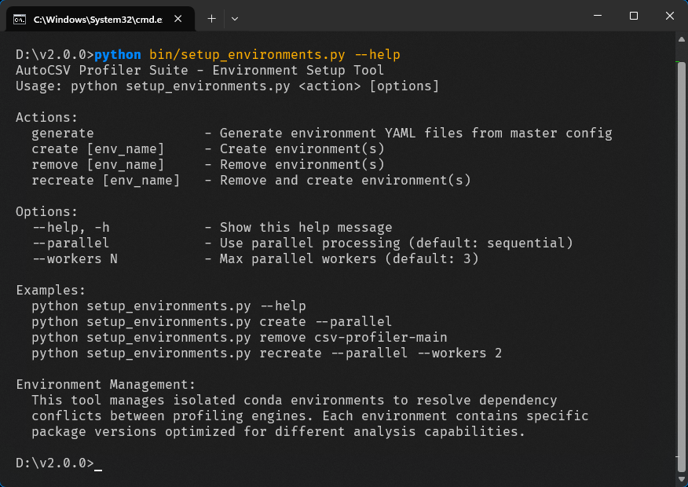
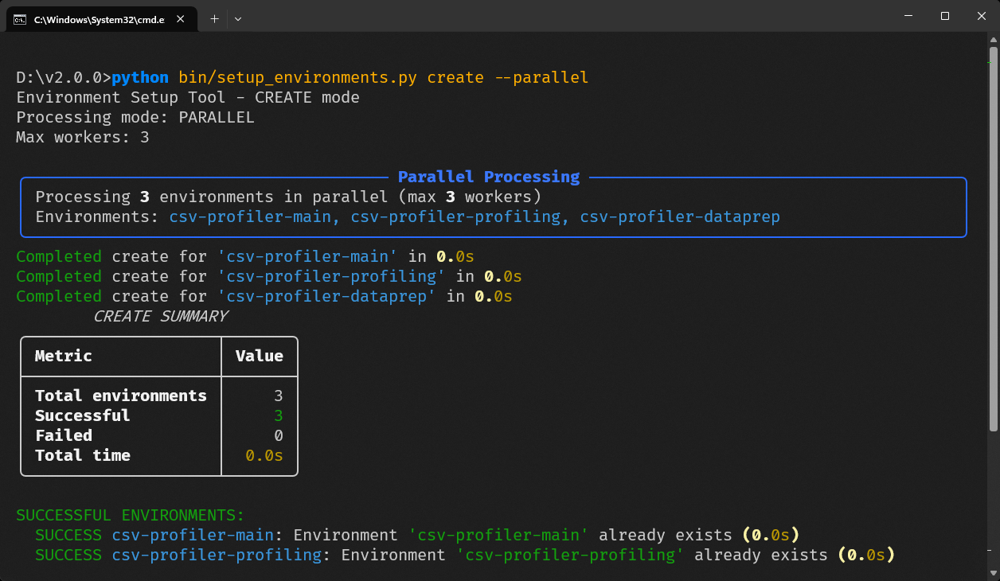

# Installation Guide

Setup instructions for AutoCSV Profiler Suite multi-environment architecture.

## Table of Contents

- [Prerequisites](#prerequisites)
- [Installation Steps](#installation-steps)
- [Verification Procedures](#verification-procedures)
- [Common Installation Issues](#common-installation-issues)
- [Platform-Specific Instructions](#platform-specific-instructions)
- [Offline Installation](#offline-installation)
- [Environment Management](#environment-management)

## Prerequisites

### System Requirements

**Operating System**:
- Windows 10 or higher
- macOS 10.14 (Mojave) or higher
- Linux: Ubuntu 18.04+, CentOS 7+, Debian 10+, or equivalent

**Hardware**:
- 4GB RAM minimum, 8GB recommended for large files
- 3GB free disk space (2GB for conda environments, 1GB for data/outputs)
- Internet connection for initial setup

### Required Software

#### 1. Conda (Required)

Install Anaconda or Miniconda before proceeding:

**Option A: Anaconda**
- Download from: [Anaconda Download](https://www.anaconda.com/download)
- Full data science environment (~3GB download)
- Includes Jupyter, Spyder, and common packages

**Option B: Miniconda**
- Download from: [Miniconda Download](https://docs.conda.io/en/latest/miniconda.html)
- Minimal conda installation (~400MB download)
- Faster installation, smaller footprint

**Verify conda installation**:
```bash
conda --version
# Expected output: conda 23.x.x or higher
```

#### 2. Python

Base environment requires **Python 3.10** or higher:
- Python 3.10, 3.11, 3.12, or 3.13 supported
- The conda environments will use specific Python versions as needed

**Check Python version**:
```bash
python --version
# Expected: Python 3.10.x, 3.11.x, 3.12.x, or 3.13.x
```

#### 3. Git (Optional)

For cloning the repository, install Git from [git-scm.com](https://git-scm.com/) or use the system package manager.

## Installation Steps

### Step 1: Get the Project

**Option A: Clone with Git**
```bash
git clone https://github.com/dhaneshbb/autocsv-profiler-suite.git
cd autocsv-profiler-suite
```

**Option B: Download ZIP**
1. Go to [GitHub repository](https://github.com/dhaneshbb/autocsv-profiler-suite)
2. Click "Code" → "Download ZIP"
3. Extract to preferred location
4. Navigate to the extracted folder

### Step 2: Install Base Requirements

Install Python packages for the orchestration layer:

```bash
pip install -r requirements.txt
```

This installs:
- `pandas==2.3.1` - Data processing
- `pyyaml>=6.0` - Configuration parsing
- `rich>=13.0.0` - Terminal interface
- `psutil>=5.8.0` - System monitoring
- `charset-normalizer>=3.0.0` - File encoding detection

**Verify base installation**:
```bash
python -c "import pandas, yaml, rich, psutil, charset_normalizer; print('Base requirements installed successfully')"
```

### Step 3: Create Conda Environments

This is the core step that creates the isolated environments:

**View all setup options**:
```bash
python bin/setup_environments.py --help
```

<table>
<tr>
<td width="50%" align="center">

**Setup Configuration Options:**


</td>
<td width="50%" align="center">

**Concurrent Environment Creation:**


</td>
</tr>
</table>

**Parallel Installation (increased processing speed)**:
```bash
python bin/setup_environments.py create --parallel
```

**Sequential Installation (fallback for system limitations)**:
```bash
python bin/setup_environments.py create
```

**Worker Configuration (hardware-specific optimization)**:
```bash
python bin/setup_environments.py create --parallel --workers 2
```

**What this creates** (3 specialized conda environments):
- `csv-profiler-main` - Python 3.11 with numpy 2.2.6, pandas 2.3.1, scipy 1.13.1
- `csv-profiler-profiling` - Python 3.10 with ydata-profiling 4.16.1, sweetviz 2.3.1
- `csv-profiler-dataprep` - Python 3.10 with dataprep 0.4.5, pandas 1.5.3

**Note**: The base environment (where these commands run) serves as the orchestrator and is not a conda environment.

**Installation time**: 3-8 minutes depending on internet speed and system performance.

### Step 4: Install Development Tools (Optional)

For contributing or advanced usage:

```bash
pip install -r requirements-dev.txt
```

This adds:
- `pytest>=7.0.0` - Testing framework
- `mypy>=1.0.0` - Type checking
- `black>=23.0.0` - Code formatting
- `flake8>=6.0.0` - Code linting
- `pre-commit>=3.0.0` - Git hooks

## Verification Procedures

### Basic Verification

**1. Check conda environments exist**:
```bash
conda env list | grep csv-profiler
```

Expected output:
```
csv-profiler-main        /path/to/anaconda3/envs/csv-profiler-main
csv-profiler-profiling   /path/to/anaconda3/envs/csv-profiler-profiling
csv-profiler-dataprep    /path/to/anaconda3/envs/csv-profiler-dataprep
```

**2. Test orchestrator**:
```bash
python bin/run_analysis.py --help
```

Expected: Help message showing available options.

**3. Test environment activation**:
```bash
# Test main environment
conda activate csv-profiler-main
python -c "import numpy, pandas, scipy, matplotlib, seaborn; print('Main environment OK')"
conda deactivate

# Test profiling environment
conda activate csv-profiler-profiling
python -c "import ydata_profiling, sweetviz; print('Profiling environment OK')"
conda deactivate

# Test dataprep environment
conda activate csv-profiler-dataprep
python -c "import dataprep; print('DataPrep environment OK')"
conda deactivate
```

### Complete Integration Test

Test with a sample CSV file:

```bash
# Create test data
echo "name,age,city" > test_sample.csv
echo "Alice,25,New York" >> test_sample.csv
echo "Bob,30,San Francisco" >> test_sample.csv
echo "Carol,35,Chicago" >> test_sample.csv

# Run analysis
python bin/run_analysis.py test_sample.csv

# Clean up
rm test_sample.csv
```

Expected: Interactive prompts and successful analysis completion.

## Common Installation Issues

### Issue 1: Conda Not Found

**Error**: `conda: command not found`

**Solutions**:
1. **Restart terminal** after conda installation
2. **Add conda to PATH**:
   - Windows: Add `C:\Anaconda3\Scripts` to PATH
   - macOS/Linux: Add `~/anaconda3/bin` to PATH
3. **Initialize conda**:
   ```bash
   ~/anaconda3/bin/conda init
   source ~/.bashrc  # or ~/.zshrc
   ```

### Issue 2: Environment Creation Fails

**Error**: `CondaHTTPError` or package conflicts

**Solutions**:
1. **Update conda**:
   ```bash
   conda update conda
   ```

2. **Clear conda cache**:
   ```bash
   conda clean --all
   ```

3. **Use sequential installation**:
   ```bash
   python bin/setup_environments.py create
   ```

4. **Check internet connectivity**:
   ```bash
   ping conda-forge.org
   ```

### Issue 3: Package Import Errors

**Error**: `ImportError` when testing environments

**Solutions**:
1. **Recreate specific environment**:
   ```bash
   python bin/setup_environments.py recreate csv-profiler-main
   ```

2. **Manual package installation**:
   ```bash
   conda activate csv-profiler-main
   conda install pandas=2.3.1 numpy=2.2.6
   ```

3. **Check environment packages**:
   ```bash
   conda list -n csv-profiler-main
   ```

### Issue 4: Permission Errors

**Error**: Permission denied during installation

**Solutions**:
1. **Run with elevated privileges** (if necessary):
   - Windows: Run as Administrator
   - macOS/Linux: Use `sudo` only for system-wide conda installations

2. **Use user-level conda installation** (preferred):
   - Install Anaconda/Miniconda in user directory
   - No admin rights required

### Issue 5: Disk Space Issues

**Error**: No space left on device

**Solutions**:
1. **Check available space**:
   ```bash
   df -h  # Linux/macOS
   dir C:\  # Windows
   ```

2. **Clean conda packages**:
   ```bash
   conda clean --packages --tarballs
   ```

3. **Change conda environment location**:
   ```bash
   conda config --add envs_dirs /path/to/larger/disk
   ```

## Platform-Specific Instructions

### Windows

#### Special Considerations

1. **UTF-8 Console Support**:
   The application automatically configures UTF-8 encoding, but manual configuration may be needed:
   ```cmd
   chcp 65001
   ```

2. **Long Path Support** (Windows 10/11):
   Enable long paths in Group Policy or Registry if path length errors occur.

3. **PowerShell vs Command Prompt**:
   Both work, but PowerShell is recommended for better Unicode support.

#### Installation Commands

**Follow the standard [Installation Steps](#installation-steps) above.** Use PowerShell (recommended) for better Unicode support.

### macOS

#### Special Considerations

1. **Xcode Command Line Tools**:
   Some packages require compilation tools:
   ```bash
   xcode-select --install
   ```

2. **Apple Silicon (M1/M2)**:
   Conda environments work natively on Apple Silicon. Use:
   ```bash
   conda config --set subdir osx-arm64
   ```

3. **Homebrew Compatibility**:
   If Homebrew Python is installed, ensure conda environments take precedence.

#### Installation Commands

```bash
# Install Xcode tools if needed
xcode-select --install
```

**Execute standard [Installation Steps](#installation-steps).**

### Linux

#### Special Considerations

Python packages are installed via conda environments and do not require additional system dependencies beyond the standard conda installation.

#### Installation Commands

**Execute standard [Installation Steps](#installation-steps).**

## Offline Installation

For environments without internet access, manual environment recreation is required using exported environment specifications.

### Step 1: Export Environment Specifications

On a machine with internet access and working environments:

```bash
# Export environment specifications
conda env export -n csv-profiler-main > env_main.yml
conda env export -n csv-profiler-profiling > env_profiling.yml
conda env export -n csv-profiler-dataprep > env_dataprep.yml
```

### Step 2: Transfer to Offline Machine

Copy the `.yml` files and project source code to the target machine.

### Step 3: Recreate Environments Offline

```bash
# Create environments from exported specifications
conda env create -f env_main.yml
conda env create -f env_profiling.yml
conda env create -f env_dataprep.yml
```

Note: This requires conda and necessary packages to be available in the offline environment's conda channels.

## Environment Management

### Common Environment Operations

**List environments**:
```bash
conda env list
```

**Remove environments**:
```bash
python bin/setup_environments.py remove --parallel
```

**Recreate single environment**:
```bash
python bin/setup_environments.py recreate csv-profiler-main
```

**Update environments**:
```bash
# Regenerate environment configs from master
python bin/setup_environments.py generate

# Recreate with updated configs
python bin/setup_environments.py remove --parallel
python bin/setup_environments.py create --parallel
```

### Environment Customization

To add custom packages to environments:

1. **Edit master configuration**:
   ```bash
   # Edit config/master_config.yml
   # Add packages to appropriate environment sections
   ```

2. **Regenerate environments**:
   ```bash
   python bin/setup_environments.py generate
   python bin/setup_environments.py recreate csv-profiler-main
   ```

### Maintenance

**Clean up conda caches** (run periodically):
```bash
conda clean --packages --tarballs --index-cache
```

**Update conda**:
```bash
conda update conda
```

**Check environment health**:
```bash
conda list -n csv-profiler-main --explicit > main_env_check.txt
conda list -n csv-profiler-profiling --explicit > profiling_env_check.txt
conda list -n csv-profiler-dataprep --explicit > dataprep_env_check.txt
```

---

## Next Steps

After successful installation:

1. **Read the [User Guide](USER_GUIDE.md)** for usage instructions
2. **Try the interactive mode**: `python bin/run_analysis.py`
3. **Check [Troubleshooting Guide](TROUBLESHOOTING.md)** if issues occur

**For Developers:**
- **Development Setup**: See [Development Guide](DEVELOPMENT.md) for complete development environment setup
- **Engine Testing**: See [Engine Testing Guide](api/engines/ENGINE_TESTING.md) for testing individual engines

## Troubleshooting

If issues occur:

- **Check [Troubleshooting Guide](TROUBLESHOOTING.md)**
- **Search [GitHub Issues](https://github.com/dhaneshbb/autocsv-profiler-suite/issues)**
- **Create a new issue** with system details and error messages