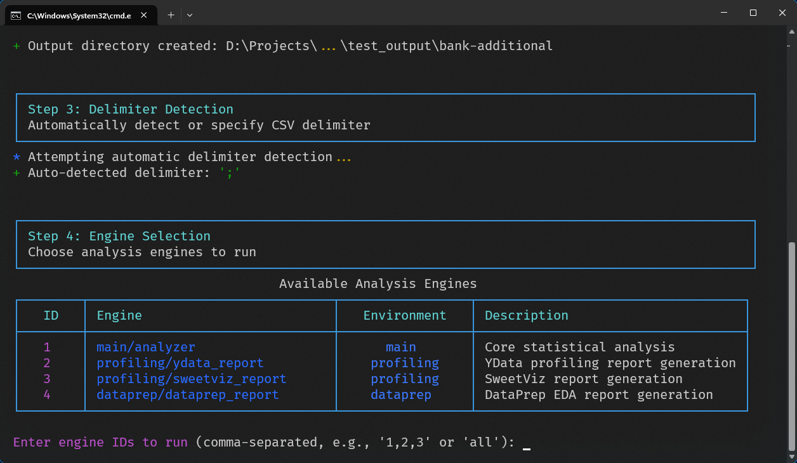

# Getting Started Tutorial

Tutorial for users to get up and running with the AutoCSV Profiler Suite.

## Table of Contents

- [Before You Begin](#before-you-begin)
- [Tutorial 1: First Analysis](#tutorial-1-first-analysis)
- [Tutorial 2: Understanding Output Reports](#tutorial-2-understanding-output-reports)
- [Tutorial 3: Comparing Different Engines](#tutorial-3-comparing-different-engines)
- [Tutorial 4: Handling Large Files](#tutorial-4-handling-large-files)
- [Tutorial 5: Troubleshooting Common Issues](#tutorial-5-troubleshooting-common-issues)
- [Next Steps](#next-steps)

## Before You Begin

### Prerequisites

**Complete the [Installation Guide](../INSTALLATION.md) before starting this tutorial.**

**Verify setup:**
```bash
conda env list | grep csv-profiler
# Should show: csv-profiler-main, csv-profiler-profiling, csv-profiler-dataprep
```

### Test Data

For this tutorial, we'll create a simple test dataset:

```bash
# Create a sample CSV file
echo "name,age,city,salary,department" > tutorial_data.csv
echo "Alice,25,New York,50000,Engineering" >> tutorial_data.csv
echo "Bob,30,San Francisco,75000,Engineering" >> tutorial_data.csv
echo "Carol,35,Chicago,60000,Marketing" >> tutorial_data.csv
echo "David,28,Austin,55000,Sales" >> tutorial_data.csv
echo "Eve,32,Seattle,70000,Engineering" >> tutorial_data.csv
```

Setup process completed.

---

## Tutorial 1: First Analysis

Run CSV analysis using the interactive mode.

### Step 1: Start the Interactive Mode

```bash
python bin/run_analysis.py
```

The welcome screen displays:


### Step 2: Select CSV File

When prompted, enter the path to the test file:

```
Step 1: File Selection
Select CSV file for analysis

Enter the path to the CSV file: tutorial_data.csv
```

The system will validate the file and show its size:

```
Setting up output directory for: tutorial_data.csv
Output will be saved to: tutorial_data_analysis_20240101_143022
```

### Step 3: Delimiter Detection

The system automatically detects the delimiter:

```
Step 2: Delimiter Detection
Analyzing file structure to determine the best delimiter

Analyzing sample data...
Detected delimiter: ',' (confidence: 0.95)
```

If detection fails, manually specify the delimiter when prompted.

### Step 4: Engine Selection

Available engines display:

  

For first analysis, select engines `1,2` (main and YData):

### Step 5: Analysis Execution

Watch the progress as each engine runs:

   


### Step 6: Review Results

Summary of generated files:

```
Analysis Results Summary

✓ main/analyzer - Completed successfully
  Generated: dataset_analysis.txt, numerical_summary.csv, categorical_summary.csv

✓ profiling/ydata_report - Completed successfully
  Generated: ydata_profiling_report.html

Analysis completed in: 12.3 seconds
Output directory: /path/to/tutorial_data_analysis_20240101_143022
```

### Analysis completed successfully.

Initial analysis completed. The output directory contains:

- **Text reports** from the main engine
- **HTML report** from YData Profiling
- **Visualizations** and additional analysis files

---

## Tutorial 2: Understanding Output Reports

Let's explore what each engine produces and how to interpret the results.

### Main Engine Output

Navigate to the output directory and examine the main engine results:

#### 1. Dataset Analysis (`dataset_analysis.txt`)

- Dataset structure and size
- Data types and quality metrics
- Missing value assessment

#### 2. Numerical Summary (`numerical_summary.csv`)

Open this CSV file to see statistical summaries:
- Central tendencies (mean, median)
- Spread (standard deviation, quartiles)
- Range (min, max values)

#### 3. Categorical Summary (`categorical_summary.csv`)

- Unique value counts
- Most frequent categories
- Category distribution patterns

### YData Profiling Report

Open the `ydata_profiling_report.html` file in a web browser.

#### Report Sections:

1. **Overview Tab**
   - Dataset summary statistics
   - Variable types breakdown
   - Warnings about data quality issues

2. **Variables Tab**
   - Detailed analysis of each column
   - Distribution plots and histograms
   - Missing value patterns
   - Unique value counts

3. **Interactions Tab**
   - Correlation matrix between variables
   - Scatter plots for numerical variables
   - Association matrices

4. **Correlations Tab**
   - Pearson, Spearman, and other correlation measures
   - Correlation heatmaps
   - Strong correlation identification

5. **Missing Values Tab**
   - Missing value matrix
   - Missing value heatmaps
   - Patterns in missing data

6. **Sample Tab**
   - First and last few rows of data
   - Random sample view

### Interpreting the Results

**For our tutorial dataset:**

1. **Data Quality**: All fields complete (no missing values)
2. **Numerical Variables**:
   - Age ranges from 25-35 (young workforce)
   - Salary ranges from $50K-75K (consistent with age)
3. **Categorical Variables**:
   - Engineering is the dominant department (3/5 employees)
   - All employees in different cities (distributed workforce)
4. **Correlations**: Age and salary show positive correlation (older = higher salary)

---

## Tutorial 3: Comparing Different Engines

Each engine has strengths for different use cases. Let's run a comparison.

### Step 1: Run All Engines

Start a new analysis with all engines:

```bash
python bin/run_analysis.py tutorial_data.csv
```

When prompted for engine selection, press Enter to select all engines.

### Step 2: Compare Engine Outputs

After completion, files include:

| Engine | Output Type | Best For | Processing Time |
|--------|-------------|----------|-----------------|
| **Main** | Text/CSV files | Statistical analysis, custom metrics | Fast |
| **YData** | Interactive HTML | Data profiling, data quality | Slow |
| **SweetViz** | Interactive HTML | Quick overview, presentations | Fast |
| **DataPrep** | Interactive HTML | EDA, distribution analysis | Medium |

### Step 3: Engine Selection Guidelines

**Use Main Engine when:**
- Detailed statistical analysis needed
- Working with large datasets
- Integrating with other data pipelines
- Need CSV output for further processing

**Use YData Profiling when:**
- Performing data exploration
- Need data quality assessment
- Want correlation analysis
- Require reports

**Use SweetViz when:**
- Need quick data overview
- Creating presentation materials
- Comparing datasets
- Time is limited

**Use DataPrep when:**
- Focus on exploratory data analysis
- Need distribution visualizations
- Working with legacy systems
- Want balanced features and speed

### Step 4: Practical Exercise

Try running the same dataset through different engines and compare:

1. **Speed**: Which engine completes fastest?
2. **Detail**: Which provides most analysis?
3. **Visualization**: Which has the clearest charts?
4. **Usability**: Which report is easiest to understand?

---

## Tutorial 4: Handling Large Files

Let's learn how to handle larger datasets efficiently.

### Step 1: Generate a Larger Test Dataset

```bash
# Create a larger sample dataset
python docs/examples/generate_sample_data.py --size medium
```

This creates a ~10-50MB file with 100,000 rows for testing memory management.

### Step 2: Configure for Large Files

Before analyzing large files, check system resources:

```bash
# Check available memory
python -c "import psutil; print(f'Available memory: {psutil.virtual_memory().available / (1024**3):.1f} GB')"
```

### Step 3: Run Analysis with Memory Monitoring

```bash
python bin/run_analysis.py medium_sample.csv
```

Additional information for large files:

```
File size analysis: 25.4 MB (large file detected)
Enabling chunked processing with progress tracking
Chunk size: 10,000 rows
Memory limit: 1.0 GB

Loading data: 100%|████████████| 10/10 [00:05<00:00, 2.1chunk/s]
```

### Step 4: Optimization Tips

For large files:

1. **Use appropriate chunk sizes**:
   - Small memory: 2,000-5,000 rows
   - Medium memory: 5,000-10,000 rows
   - Large memory: 10,000+ rows

2. **Select engines**:
   - SweetViz: Fastest for large files
   - Main: Balance of speed and detail
   - YData: Slowest but most detailed

3. **Monitor progress**:
   - Progress bars show chunk processing
   - Memory usage warnings if limits exceeded

### Step 5: Advanced Usage

For performance optimization and configuration options, see:
- [User Guide - Advanced Configuration](../USER_GUIDE.md#advanced-configuration-options)
- [Performance Guide](../PERFORMANCE.md)

---

## Tutorial 5: Getting Help

If issues occur during this tutorial:

- **Check the [Troubleshooting Guide](../TROUBLESHOOTING.md)** for detailed solutions
- **Use debug mode**: `python bin/run_analysis.py --debug` for detailed error information
- **Verify environment setup**: Ensure conda environments are properly installed

---

## Next Steps

Getting started tutorial complete. Next steps:

### Immediate Next Steps

1. **Try the Examples**:
   ```bash
   python docs/examples/simple_analysis.py
   python docs/examples/programmatic_usage.py
   ```

2. **Read the User Guide**:
   - [USER_GUIDE.md](../USER_GUIDE.md) - Usage documentation
   - [USER_GUIDE.md](../USER_GUIDE.md#advanced-configuration-options) - Configuration options
   - [TROUBLESHOOTING.md](../TROUBLESHOOTING.md) - Detailed problem-solving guide

### Advanced Topics

1. **Custom Engine Development**:
   - [Development Guide](../DEVELOPMENT.md#adding-new-engines) - Engine development guidelines

2. **Performance Optimization**:
   - [Performance Guide](../PERFORMANCE.md) - Optimization recommendations

3. **Advanced Usage**:
   ```bash
   # See individual engine testing guide
   # docs/api/engines/ENGINE_TESTING.md
   ```

### Workflow Integration

1. **Programmatic Usage**:

   **For complete usage patterns and integration examples, see [User Guide - Usage Modes](../USER_GUIDE.md#usage-modes).**

   **Quick reference:**
   ```bash
   # Interactive mode (guided workflow)
   python bin/run_analysis.py

   # Direct analysis
   python bin/run_analysis.py data.csv
   ```

2. **Automated Pipelines**:
   - Integrate with data processing workflows
   - Set up scheduled analysis jobs
   - Build custom reporting dashboards

3. **Team Usage**:
   - Share configuration files
   - Standardize analysis workflows
   - Create custom engine templates

### Getting Help

- **Documentation**: Complete guides in `docs/` directory
- **Examples**: Working examples in `docs/examples/`
- **Troubleshooting**: Solutions in `TROUBLESHOOTING.md`
- **GitHub Issues**: Report bugs or request features
- **Discussions**: Ask questions and share use cases

**The AutoCSV Profiler Suite is ready for data analysis tasks.**
