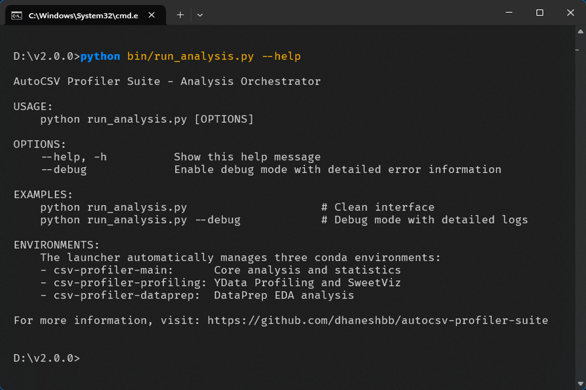
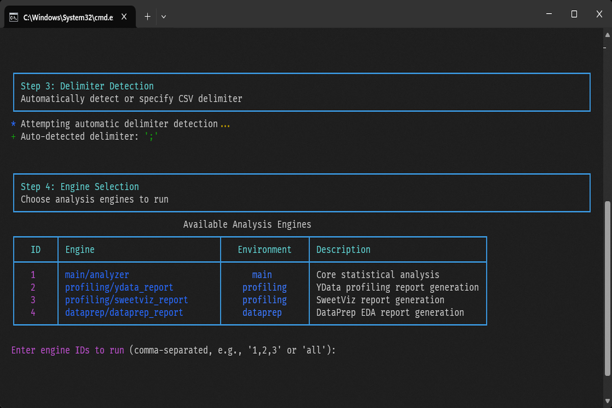
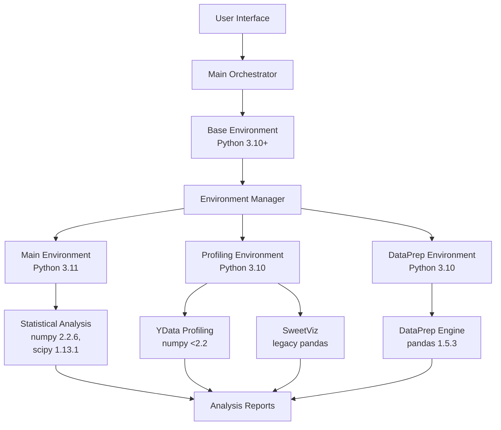

# AutoCSV Profiler Suite

**Multi-environment CSV data analysis orchestrator with isolated profiling engines**

[](https://www.python.org/downloads/)
[](LICENSE)
[](https://docs.conda.io/)
[](#)
[](#)

AutoCSV Profiler Suite resolves dependency conflicts in data science through a multi-environment architecture that isolates profiling engines while providing a unified interface.

## Project Description and Key Features

### Problem Statement

Data science projects face dependency conflicts between profiling engines and statistical libraries. This project uses isolated conda environments to prevent conflicts while maintaining functionality.

### Key Features

- **Dependency Conflict Resolution**: Three specialized conda environments plus base environment prevent library conflicts
- **Multiple Profiling Engines**: YData Profiling, SweetViz, DataPrep, and custom statistical analysis
- **Memory Management**: Chunking for large files with 1GB default limit
- **Interface**: Console interface with progress tracking and error handling
- **Lazy Loading**: Engines load only when needed for performance
- **Degradation**: Continues working even with partial engine availability
- **Cross-Platform Support**: Windows, Linux, macOS with conda environment isolation

**Architecture and dependency details**: [Architecture Guide](docs/ARCHITECTURE.md)

<div align="center">

</div>

*Demo Interactive demonstration of the complete analysis workflow from setup to results*

## Start Guide

### Prerequisites

- [Anaconda](https://www.anaconda.com/download) or [Miniconda](https://docs.conda.io/en/latest/miniconda.html)
- Python 3.10 or higher
- At least 3GB free disk space (2GB for conda environments, 1GB for data/outputs)

### Setup Steps

**Complete installation instructions**: [Installation Guide](docs/INSTALLATION.md)

**Quick setup:**
```bash
# 1. Clone and navigate
git clone https://github.com/dhaneshbb/autocsv-profiler-suite.git
cd autocsv-profiler-suite

# 2. Install requirements and setup environments
pip install -r requirements.txt
python bin/setup_environments.py create --parallel
```

**Run analysis:**

   First, explore available analysis options:
   ```bash
   python bin/run_analysis.py --help
   ```

   Then start the interactive analysis:
   ```bash
   python bin/run_analysis.py
   ```

   <table>
   <tr>
   <td width="50%" align="center">

   **Analysis Command Options:**
   

   </td>
   <td width="50%" align="center">

   **Interactive Welcome Interface:**
   

   </td>
   </tr>
   </table>

   The interface provides file selection, delimiter detection, and engine selection:

   <table>
   <tr>
   <td width="50%" align="center">

   **Choose Analysis Engines:**
   

   </td>
   <td width="50%" align="center">

   **All Reports Generated Successfully:**
   

   </td>
   </tr>
   </table>

**Setup guide**: [Installation Guide](docs/INSTALLATION.md) | **Issues**: [Troubleshooting Guide](docs/TROUBLESHOOTING.md)

## Architecture & Requirements

### System Diagram



**Architecture details**: [Architecture Guide](docs/ARCHITECTURE.md)

**Summary**: Multi-environment conda architecture resolves dependency conflicts between profiling engines. Requires conda, Python 3.10+, and 3GB free disk space.

## Usage Examples

### Interactive Mode

```bash
python bin/run_analysis.py
```

Interactive mode includes:
1. File selection with validation
2. Delimiter detection (with manual override)
3. Engine selection based on availability
4. Progress monitoring with updates
5. Result summary and output locations

### Direct Command Line

```bash
# Analyze specific file directly
python bin/run_analysis.py path/to/data.csv

# Debug mode with detailed output
python bin/run_analysis.py --debug

# Direct analysis with debug mode
python bin/run_analysis.py path/to/data.csv --debug
```

*Command options documentation available in Quick Start Guide above.*

### Programmatic Usage

**Command-line interface usage** for reliable multi-environment support:

```bash
# Interactive mode (recommended) - guides through file selection
python bin/run_analysis.py

# Direct file analysis
python bin/run_analysis.py data.csv

# Debug mode for troubleshooting
python bin/run_analysis.py --debug
```

Python API (requires proper environment setup):

```python
# Note: ImportError may occur in multi-environment setup
# CLI interface recommended for production workflows
try:
    from autocsv_profiler import profile_csv
    report_path = profile_csv("data.csv", "output_directory/")
except ImportError:
    print("Usage: python bin/run_analysis.py data.csv")
```

## Documentation

**Getting Started:**
- [Installation Guide](docs/INSTALLATION.md) - Environment setup instructions
- [Getting Started Tutorial](docs/tutorials/getting_started.md) - Step-by-step walkthrough
- [User Guide](docs/USER_GUIDE.md) - Reference for daily usage

**Technical Reference:**
- [API Documentation](docs/api/) - Technical API reference
- [Architecture Guide](docs/ARCHITECTURE.md) - Multi-environment design
- [Performance Guide](docs/PERFORMANCE.md) - Optimization and benchmarks

**Development:**
- [Development Guide](docs/DEVELOPMENT.md) - Environment setup and workflow
- [Design Decisions](docs/DESIGN_DECISIONS.md) - Architectural decision records
- [Troubleshooting Guide](docs/TROUBLESHOOTING.md) - Common issues and solutions

**Examples:**
- [Examples Directory](docs/examples/) - samples
- [Engine Testing Guide](docs/api/engines/ENGINE_TESTING.md) - Engine testing procedures

## Contributing

See [Contributing Guide](CONTRIBUTING.md) for workflow details.

## License

MIT License - see [LICENSE](LICENSE) file. Third-party dependencies have various licenses - see [NOTICE](NOTICE) for details.

**Important**: See [DISCLAIMER](DISCLAIMER) for liability limitations and dependency responsibility.

## Support

- **Issues**: [GitHub Issues](https://github.com/dhaneshbb/autocsv-profiler-suite/issues)
- **Questions**: [GitHub Discussions](https://github.com/dhaneshbb/autocsv-profiler-suite/discussions)

---

**Version 2.0.0** | **Beta** | **Python 3.10-3.13** | **Cross-Platform**
