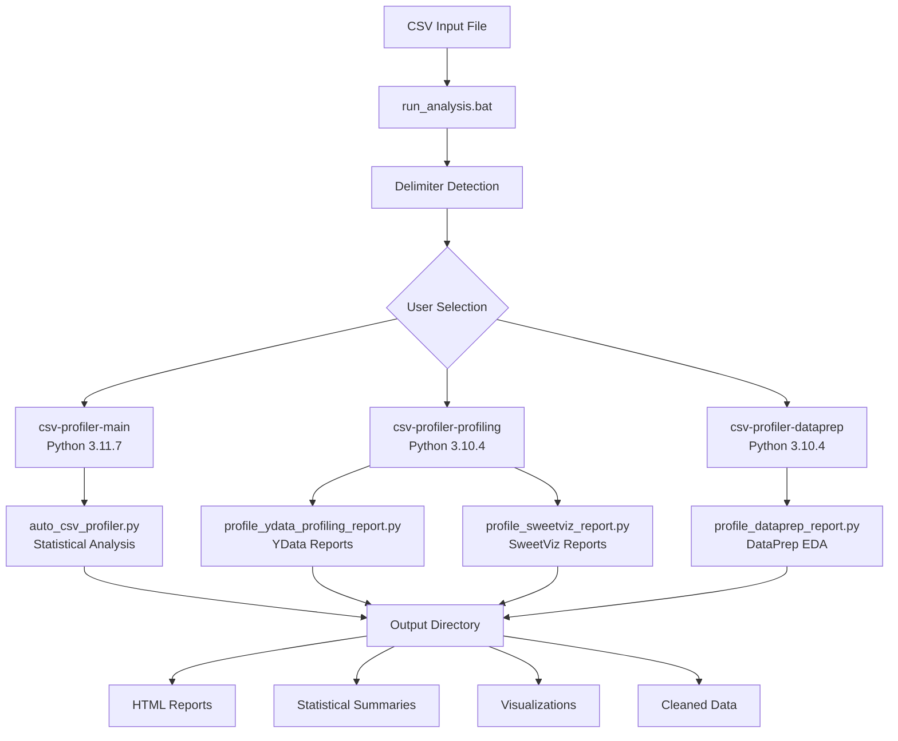
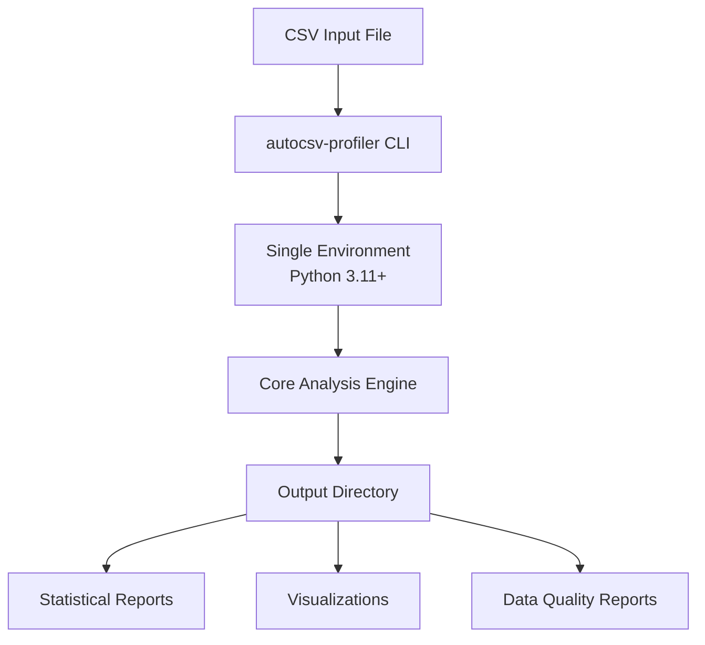
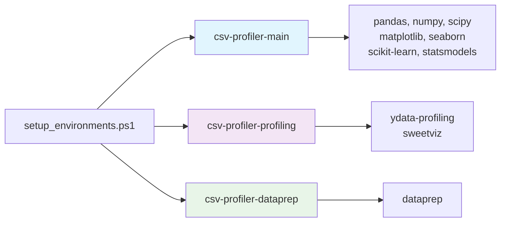
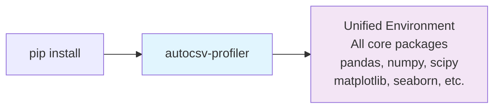
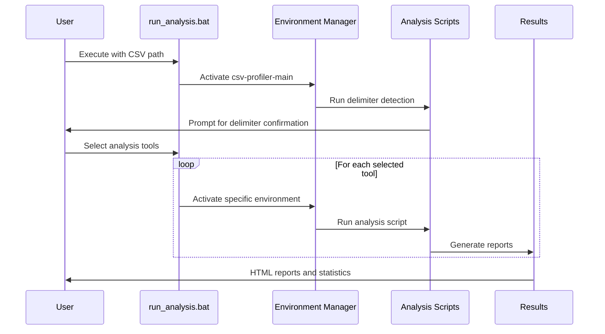
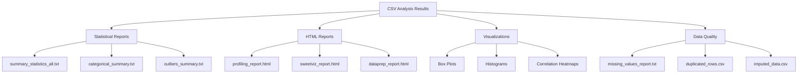

# AutoCSV Profiler Suite

[](https://badge.fury.io/py/autocsv-profiler)
[](https://pypi.org/project/autocsv-profiler/)
[](https://opensource.org/licenses/MIT)

A comprehensive toolkit for automated CSV data analysis using multiple profiling engines. This suite provides statistical analysis, data quality assessment, and interactive reporting through conda-managed environments.


## Project Structure

```
AutoCSV-Profiler-Suite/
├── README.md
├── LICENSE
├── CHANGELOG.md
├── SECURITY.md
├── .gitignore
├── run_analysis.bat
│
├── src/
│   ├── auto_csv_profiler.py
│   ├── profile_ydata_profiling_report.py
│   ├── profile_sweetviz_report.py
│   ├── profile_dataprep_report.py
│   └── recognize_delimiter.py
│
├── environments/
│   ├── environment-main.yml
│   ├── environment-profiling.yml
│   └── environment-dataprep.yml
│
├── scripts/
│   └── setup_environments.ps1
│
├── docs/
│   ├── installation.md
│   ├── usage.md
│   ├── environments.md
│   └── troubleshooting.md
│
└── examples/
    └── sample_data.csv
```

## Distribution Methods

This project is available in two formats to suit different user needs:

### 🐍 **PyPI Package** (Simplified)
```bash
pip install autocsv-profiler
autocsv-profiler data.csv
```
- **Single environment** with core analysis features
- **Command-line interface** for quick analysis  
- **Automatic dependency management**

### 📦 **Source Distribution** (Full Suite)
```bash
git clone https://github.com/dhaneshbb/AutoCSV-Profiler-Suite.git
.\scripts\setup_environments.ps1
run_analysis.bat
```
- **Three specialized environments** for different tools
- **Multiple profiling engines** (YData, SweetViz, DataPrep)
- **Interactive tool selection interface**

## Features

- **Multiple Profiling Engines**: YData Profiling, SweetViz, and DataPrep (source distribution)
- **Comprehensive Analysis**: Statistical summaries, outlier detection, missing value analysis
- **Interactive Reports**: HTML reports with visualizations and data insights
- **Environment Management**: Single or multiple conda environments
- **Flexible Installation**: Choose between simple pip install or full toolkit setup
- **Cross-Platform Support**: Works on Windows with PowerShell and batch scripts

## Project Architecture

### Source Distribution (Full Suite)


### PyPI Package (Simplified)


## Environment Structure

### Source Distribution (Multiple Environments)


### PyPI Package (Single Environment)


## Quick Start

### Prerequisites

- Windows OS with PowerShell (for source distribution)
- Python 3.9+ (for PyPI package)
- Anaconda or Miniconda (for source distribution)
- Internet connection for package downloads

### Installation Options

#### Option 1: PyPI Package (Recommended for Most Users)
```bash
# Simple installation
pip install autocsv-profiler

# Quick analysis
autocsv-profiler your_data.csv
```

#### Option 2: Source Distribution (Full Feature Set)
```bash
# Clone repository
git clone https://github.com/dhaneshbb/AutoCSV-Profiler-Suite.git
cd AutoCSV-Profiler-Suite

# Setup environments
.\scripts\setup_environments.ps1

# Run analysis
run_analysis.bat
```

## Usage Comparison

| Feature | PyPI Package | Source Distribution |
|---------|-------------|-------------------|
| **Installation** | `pip install` | Download + conda setup |
| **Setup Time** | 30 seconds | 10 minutes |
| **Environments** | 1 (unified) | 3 (specialized) |
| **Analysis Tools** | Core statistical analysis | Core + YData + SweetViz + DataPrep |
| **Interface** | Command-line | Interactive batch menu |
| **Updates** | `pip install -U` | Git pull + environment update |
| **Target Users** | Developers, quick analysis | Data analysts, comprehensive reports |

### Choose PyPI Package If:
- You want quick, straightforward CSV analysis
- You prefer command-line tools
- You need core statistical features only
- You want automatic dependency management

### Choose Source Distribution If:
- You need multiple profiling engines
- You want specialized HTML reports
- You prefer interactive tool selection
- You need the full feature set

## Usage Workflow



## Environment Management (Source Distribution)

The source distribution uses three specialized conda environments for maximum functionality and tool compatibility:

### csv-profiler-main
- **Purpose**: Core statistical analysis and data processing
- **Python Version**: 3.11.7
- **Key Packages**: pandas, numpy, scipy, matplotlib, seaborn, scikit-learn

### csv-profiler-profiling
- **Purpose**: YData Profiling and SweetViz report generation
- **Python Version**: 3.10.4
- **Key Packages**: ydata-profiling, sweetviz

### csv-profiler-dataprep
- **Purpose**: DataPrep EDA and data preparation tasks
- **Python Version**: 3.10.4
- **Key Packages**: dataprep

## Output Structure



## Documentation

### For Source Distribution
- [Installation Guide](docs/installation.md) - Full conda environment setup
- [Usage Instructions](docs/usage.md) - Multi-tool workflow
- [Environment Management](docs/environments.md) - Managing multiple environments
- [Troubleshooting](docs/troubleshooting.md) - Common issues resolution

### For PyPI Package
- Installation: `pip install autocsv-profiler`
- Usage: `autocsv-profiler --help`
- PyPI Page: [https://pypi.org/project/autocsv-profiler/](https://pypi.org/project/autocsv-profiler/)

## Contributing

1. Fork the repository
2. Create a feature branch
3. Make your changes
4. Add tests if applicable
5. Submit a pull request

## License

This project is licensed under the MIT License. See the [LICENSE](LICENSE) file for details.

## Support

- Create an [issue](https://github.com/dhaneshbb/AutoCSV-Profiler-Suite/issues) for bug reports
- Check [troubleshooting guide](docs/troubleshooting.md) for common problems
- Review [changelog](CHANGELOG.md) for recent updates

## Version

Current version: 1.1.0


For version history and changes, see [CHANGELOG.md](CHANGELOG.md).
