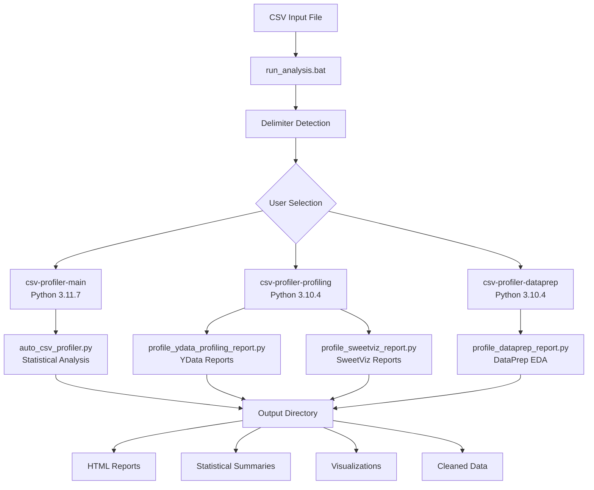
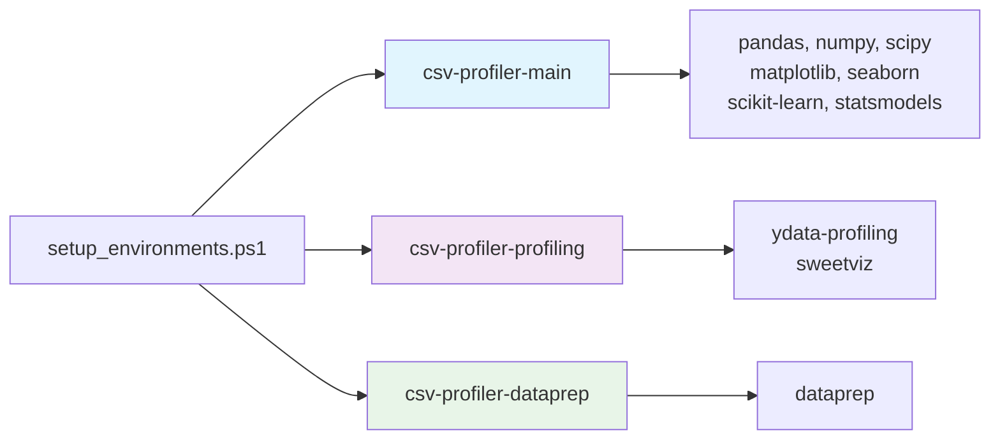
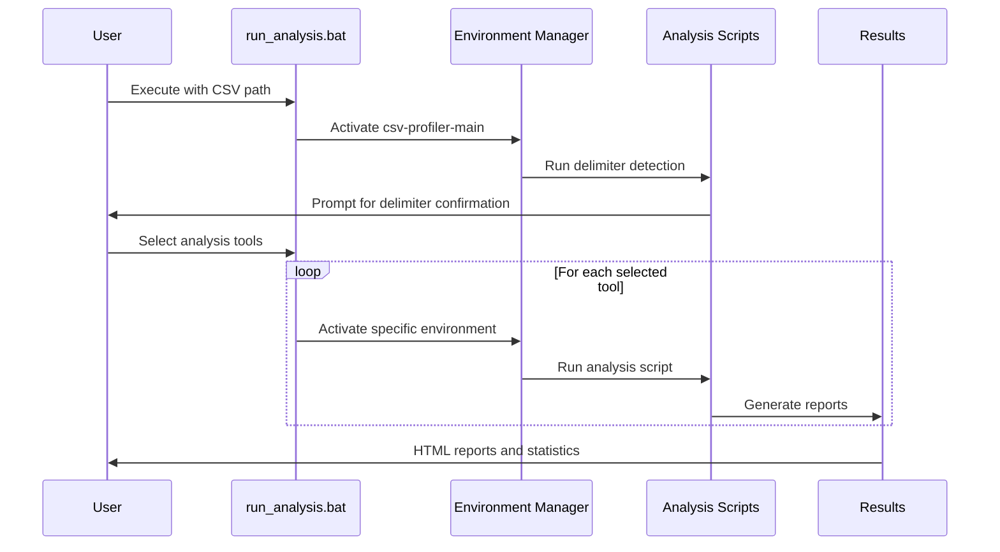
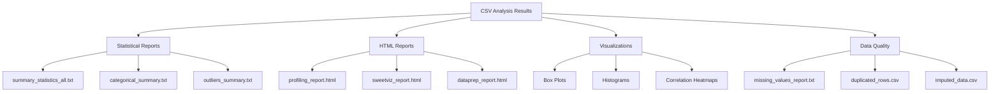

# autocsv-profiler-suite

[](https://opensource.org/licenses/MIT)
[](https://www.python.org/downloads/)
[](https://docs.conda.io/en/latest/miniconda.html)

A multi-environment toolkit for automated CSV data analysis using profiling engines. This suite provides statistical analysis, data quality assessment, and interactive reporting through three conda environments for different analysis tools.


## Installation & Usage
```bash
git clone https://github.com/dhaneshbb/autocsv-profiler-suite.git
cd autocsv-profiler-suite
.\scripts\setup_environments.ps1
run_analysis.bat
```

**Key Features:**
- **Three conda environments** for tool compatibility
- **Multiple profiling engines** (YData, SweetViz, DataPrep)
- **Interactive tool selection interface**
- **Complete analysis workflow**

**Documentation:**
- [Installation Guide](docs/Source-Suite-Guide.md#installation)
- [Usage Guide](docs/Source-Suite-Guide.md#usage)
- [Environment Management](docs/Source-Suite-Guide.md#environments)
- [Troubleshooting](docs/Source-Suite-Guide.md#troubleshooting)

## Features

- **Multiple Profiling Engines**: YData Profiling, SweetViz, and DataPrep with separate conda environments
- **Statistical Analysis**: Statistical summaries, outlier detection, missing value analysis, VIF calculation
- **Report Generation**: HTML reports with visualizations and data insights
- **Multi-Environment Setup**: Three conda environments for tool compatibility
- **Environment Management**: PowerShell scripts for conda environment setup and maintenance
- **Windows Support**: Batch scripts and PowerShell integration
- **Conda-Only Dependencies**: Package management through conda channels

## Project Architecture



## Environment Structure



## Quick Start

### Prerequisites

- Windows OS with PowerShell
- Anaconda or Miniconda installed
- Internet connection for package downloads
- At least 4GB RAM (recommended)
- 3GB free disk space for environments

### Installation

```bash
# Clone repository
git clone https://github.com/dhaneshbb/autocsv-profiler-suite.git
cd autocsv-profiler-suite

# Setup all three conda environments
.\scripts\setup_environments.ps1

# Run analysis
run_analysis.bat
```


## Usage Workflow



## Environment Management

The suite uses three specialized conda environments for maximum functionality and tool compatibility:

### csv-profiler-main
- **Purpose**: Core statistical analysis and data processing
- **Python Version**: 3.11.7
- **Key Packages**: pandas, numpy, scipy, matplotlib, seaborn, scikit-learn

### csv-profiler-profiling
- **Purpose**: YData Profiling and SweetViz report generation
- **Python Version**: 3.10.4
- **Key Packages**: ydata-profiling, sweetviz

### csv-profiler-dataprep
- **Purpose**: DataPrep EDA and data preparation tasks
- **Python Version**: 3.10.4
- **Key Packages**: dataprep

## Output Structure



## Documentation

- [Usage Guide](docs/Source-Suite-Guide.md) - Full documentation
- [Installation Guide](docs/Source-Suite-Guide.md#installation) - Setup instructions
- [Environment Management](docs/Source-Suite-Guide.md#environments) - Managing conda environments
- [Troubleshooting](docs/Source-Suite-Guide.md#troubleshooting) - Common issues and solutions

## Contributing

1. Fork the repository
2. Create a feature branch
3. Make your changes
4. Add tests if applicable
5. Submit a pull request

## License & Disclaimer

This project is licensed under the MIT License. See the [LICENSE](LICENSE) file for details.

**Important Notice:** This software is provided "as is" without warranty of any kind. Users are responsible for:
- Installing and maintaining conda environments
- Ensuring license compliance of all dependencies
- Data accuracy and analysis interpretation
- Backup and security of processed data

See [NOTICE](NOTICE) file for complete third-party license information.

## Support

- Create an [issue](https://github.com/dhaneshbb/autocsv-profiler-suite/issues) for bug reports
- Check [troubleshooting guide](docs/Source-Suite-Guide.md#troubleshooting) for common problems
- Review [changelog](CHANGELOG.md) for recent updates

## Version

Current version: 1.1.0


For version history and changes, see [CHANGELOG.md](CHANGELOG.md).


