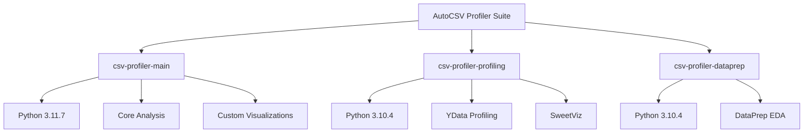
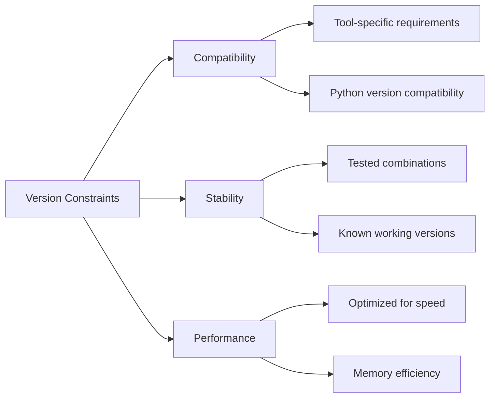
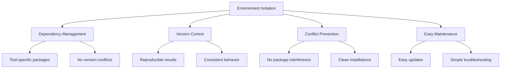

# Environment Management

AutoCSV Profiler Suite uses three specialized conda environments to ensure compatibility and optimal performance across different analysis tools.

## Environment Architecture



## Environment Details

### csv-profiler-main

**Purpose**: Core statistical analysis and custom visualizations

**Python Version**: 3.11.7

**Key Packages**:
- `pandas>=1.5.0` - Data manipulation and analysis
- `numpy>=1.24.0` - Numerical computing
- `scipy>=1.10.0` - Scientific computing
- `matplotlib>=3.6.0` - Static plotting
- `seaborn>=0.12.0` - Statistical visualization
- `scikit-learn>=1.2.0` - Machine learning utilities
- `statsmodels>=0.13.0` - Statistical modeling
- `tqdm>=4.64.0` - Progress bars
- `tableone>=0.7.12` - Descriptive statistics
- `missingno>=0.5.2` - Missing value visualization
- `tabulate>=0.9.0` - Table formatting

**Use Cases**:
- Comprehensive statistical analysis
- Custom visualization generation
- Outlier detection and analysis
- Correlation and relationship testing
- Missing value analysis and imputation

### csv-profiler-profiling

**Purpose**: Automated profiling reports with specialized tools

**Python Version**: 3.10.4

**Key Packages**:
- `pandas>=1.4.0,<2.0.0` - Data manipulation (version constrained)
- `numpy>=1.21.0,<1.25.0` - Numerical computing (version constrained)
- `matplotlib>=3.5.0,<3.7.0` - Plotting (version constrained)
- `ydata-profiling>=4.0.0` - Comprehensive data profiling
- `sweetviz>=2.1.4` - Visual data analysis

**Use Cases**:
- Generate comprehensive HTML profiling reports
- Automated data quality assessment
- Interactive visualizations
- Comparative analysis between datasets
- Quick overview of data characteristics

### csv-profiler-dataprep

**Purpose**: Fast EDA with DataPrep library

**Python Version**: 3.10.4

**Key Packages**:
- `pandas>=1.4.0,<2.0.0` - Data manipulation (version constrained)
- `numpy>=1.21.0,<1.25.0` - Numerical computing (version constrained)
- `dataprep>=0.4.5` - Fast EDA and data preparation

**Use Cases**:
- Rapid exploratory data analysis
- Data quality assessment
- Interactive plotting capabilities
- Large dataset handling
- Feature relationship analysis

## Environment Management Commands

### Using the Interactive Manager

```powershell
.\scripts\setup_environments.ps1
```

**Menu Options**:
1. Install All - Create all three environments
2. Update All - Update existing environments
3. Remove All - Delete all environments
4. Install Single - Create specific environment
5. Remove Single - Delete specific environment

### Manual Commands

**List all environments**:
```cmd
conda env list
```

**Create specific environment**:
```cmd
conda env create -f environments/environment-main.yml
```

**Update environment**:
```cmd
conda env update -f environments/environment-main.yml --prune
```

**Remove environment**:
```cmd
conda env remove -n csv-profiler-main
```

**Activate environment**:
```cmd
conda activate csv-profiler-main
```

**Deactivate environment**:
```cmd
conda deactivate
```

## Version Constraints Explained



### Why Different Python Versions?

**Python 3.11.7 (Main Environment)**:
- Latest stable version with performance improvements
- Better error messages and debugging
- Enhanced typing support
- Optimal for custom analysis code

**Python 3.10.4 (Profiling & DataPrep)**:
- Required for compatibility with profiling tools
- Stable version with proven compatibility
- Reduces dependency conflicts
- Ensures consistent behavior across tools

### Package Version Constraints

**Strict Versioning for Profiling Tools**:
- Ensures compatibility between ydata-profiling and dependencies
- Prevents breaking changes in report generation
- Maintains consistent output formats

**Flexible Versioning for Main Environment**:
- Allows for latest features and bug fixes
- Better performance with newer versions
- More flexibility for custom analysis

## Environment Isolation Benefits



**Benefits**:
1. **No package conflicts** between different tools
2. **Reproducible results** with fixed versions
3. **Easy maintenance** - update one environment without affecting others
4. **Clean separation** of concerns
5. **Faster troubleshooting** when issues arise

## Best Practices

### Environment Usage
1. **Always activate** the correct environment before running scripts
2. **Deactivate environments** when switching between tools
3. **Check environment status** before starting analysis
4. **Update environments regularly** for security and performance

### Maintenance
1. **Regular updates** using the environment manager
2. **Clean unused packages** with `conda clean --all`
3. **Monitor disk space** as environments can be large
4. **Backup environment configurations** before major changes

### Troubleshooting
1. **Check environment activation** if imports fail
2. **Verify package versions** if unexpected behavior occurs
3. **Recreate environments** if corruption is suspected
4. **Use fresh environments** for testing new features

## Storage Requirements

**Typical Environment Sizes**:
- csv-profiler-main: ~1.5GB
- csv-profiler-profiling: ~1.2GB  
- csv-profiler-dataprep: ~800MB

**Total Space Required**: ~3.5GB for all environments

**Additional Space**:
- Conda cache: ~500MB
- Temporary files during installation: ~1GB
- **Recommended free space**: 6GB minimum

## Advanced Configuration

### Adding Custom Packages

Add packages to specific environments:

```cmd
conda activate csv-profiler-main
conda install plotly  # Interactive plotting
pip install custom-package
```

### Exporting Environment

Create shareable environment file:

```cmd
conda activate csv-profiler-main
conda env export > my-environment.yml
```

### Environment Cloning

Create backup of environment:

```cmd
conda create --name csv-profiler-main-backup --clone csv-profiler-main
```

This environment management system ensures reliable, reproducible, and efficient data analysis workflows.