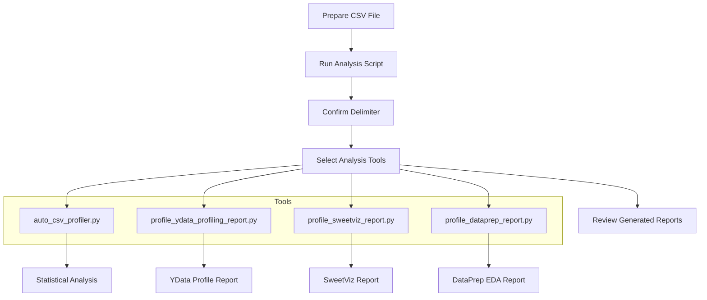
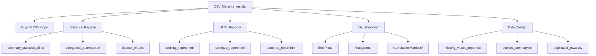
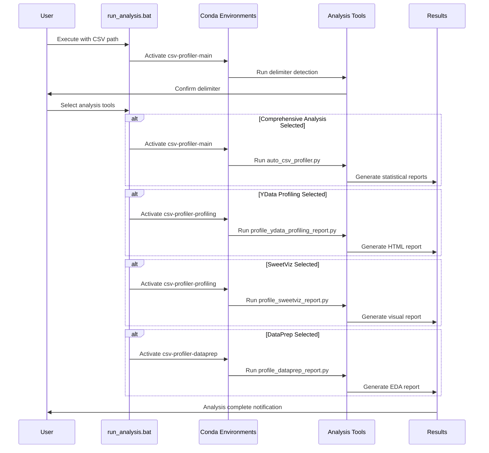

# Usage Guide - Source Distribution

This guide explains how to use AutoCSV Profiler Suite **source distribution** for comprehensive CSV data analysis with multiple profiling engines.

> **Note**: For PyPI package usage, use: `autocsv-profiler data.csv --help`  
> This guide covers the full multi-environment source distribution workflow.

## Quick Start

### Basic Analysis Workflow



### Step 1: Prepare Your Data

Ensure your CSV file meets these requirements:
- Valid CSV format with consistent delimiters
- First row contains column headers
- File size under 500MB for optimal performance
- Accessible file path without special characters

### Step 2: Run the Analysis

Open Command Prompt in the project directory and execute:
```batch
run_analysis.bat
```

### Step 3: Provide CSV File Path

When prompted, enter the complete path to your CSV file:
```
Enter the full path to the CSV file: C:\data\your_file.csv
```

### Step 4: Confirm Delimiter

The system will automatically detect the delimiter and ask for confirmation:
```
Enter the delimiter used in the CSV file (e.g., , or ;): ,
```

Common delimiters:
- `,` (comma) - Most common
- `;` (semicolon) - European standard
- `\t` (tab) - Tab-separated values

### Step 5: Select Analysis Tools

Choose which analysis tools to run:

```
+-------+------------------------+--------------------------------------+
| Index | Environment            | Python Script                        |
+-------+------------------------+--------------------------------------+
|   1   | csv-profiler-main      | auto_csv_profiler.py                 |
|   2   | csv-profiler-profiling | profile_ydata_profiling_report.py    |
|   3   | csv-profiler-profiling | profile_sweetviz_report.py           |
|   4   | csv-profiler-dataprep  | profile_dataprep_report.py           |
+-------+------------------------+--------------------------------------+
```

## Analysis Tools Overview

### Tool 1: Comprehensive Statistical Analysis

**Script**: `auto_csv_profiler.py`  
**Environment**: csv-profiler-main  
**Duration**: 5-15 minutes


**Outputs**:
- Comprehensive statistical summaries
- Missing value analysis and visualizations
- Outlier detection reports
- Box plots, histograms, and correlation matrices
- Data quality assessment

### Tool 2: YData Profiling Report

**Script**: `profile_ydata_profiling_report.py`  
**Environment**: csv-profiler-profiling  
**Duration**: 3-10 minutes

**Features**:
- Interactive HTML report
- Variable distributions and correlations
- Missing value patterns
- Sample data preview
- Data quality warnings

### Tool 3: SweetViz Report

**Script**: `profile_sweetviz_report.py`  
**Environment**: csv-profiler-profiling  
**Duration**: 2-8 minutes

**Features**:
- Visual data exploration
- Automated feature analysis
- Target variable analysis (if specified)
- Comparative analysis capabilities
- Clean, intuitive interface

### Tool 4: DataPrep EDA Report

**Script**: `profile_dataprep_report.py`  
**Environment**: csv-profiler-dataprep  
**Duration**: 3-12 minutes

**Features**:
- Comprehensive exploratory data analysis
- Advanced visualizations
- Data cleaning suggestions
- Distribution analysis
- Correlation insights

## Output Structure

After analysis completion, you'll find organized results in a directory named after your CSV file:



## Advanced Usage

### Running Individual Tools

You can run specific analysis tools directly:

```bash
# Activate the appropriate environment first
conda activate csv-profiler-main

# Run specific analysis
python src/auto_csv_profiler.py "path/to/file.csv" "output/directory/"
```

### Customizing Analysis

The comprehensive analysis tool (`auto_csv_profiler.py`) provides interactive options:

1. **Missing Value Handling**
   - Convert specific values to NaN
   - Auto-imputation options
   - Missing value pattern analysis

2. **Outlier Analysis**
   - IQR-based detection
   - Statistical summaries
   - Visual identification

3. **Relationship Analysis**
   - Correlation analysis with target variables
   - Chi-square tests for categorical variables
   - Variance Inflation Factor (VIF) calculation

### Batch Processing

For multiple files, you can modify the batch script or create loops:

```batch
for %%f in (*.csv) do (
    echo Processing %%f
    run_analysis.bat "%%f"
)
```

## Analysis Workflow Details



## Best Practices

### Data Preparation
- Clean obvious formatting issues before analysis
- Ensure consistent date formats
- Remove or flag known data quality issues
- Use descriptive column names

### Tool Selection
- **Start with comprehensive analysis** for overall data understanding
- **Use YData Profiling** for detailed variable analysis
- **Use SweetViz** for clean, presentation-ready reports
- **Use DataPrep** for advanced EDA and data preparation insights

### Performance Optimization
- Large files (>100MB): Consider sampling for initial analysis
- Complex datasets: Run tools individually to monitor memory usage
- Network drives: Copy files locally before analysis for better performance

## Interpreting Results

### Statistical Reports
- Review data quality metrics first
- Check for missing value patterns
- Identify outliers and their potential causes
- Analyze variable distributions and relationships

### HTML Reports
- Interactive exploration of data patterns
- Visual identification of data quality issues
- Quick identification of interesting variables
- Export key insights for stakeholders

## Next Steps

After completing your analysis:
1. Review all generated reports
2. Identify data quality issues
3. Plan data cleaning or preprocessing steps
4. Share HTML reports with stakeholders
5. Use insights for further analysis or modeling

For troubleshooting common issues, see the [troubleshooting guide](troubleshooting.md).