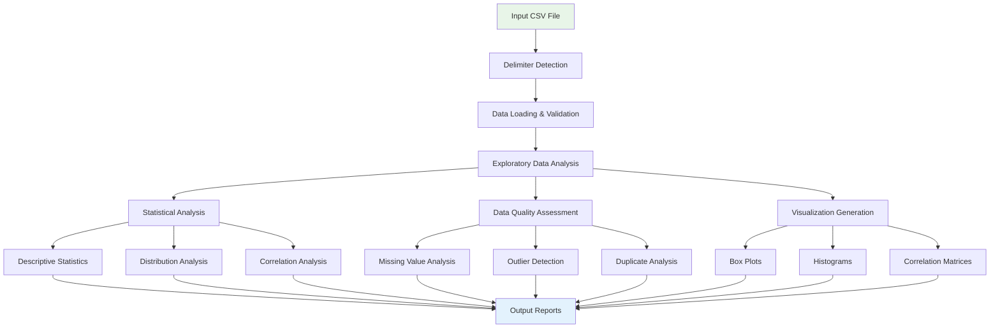
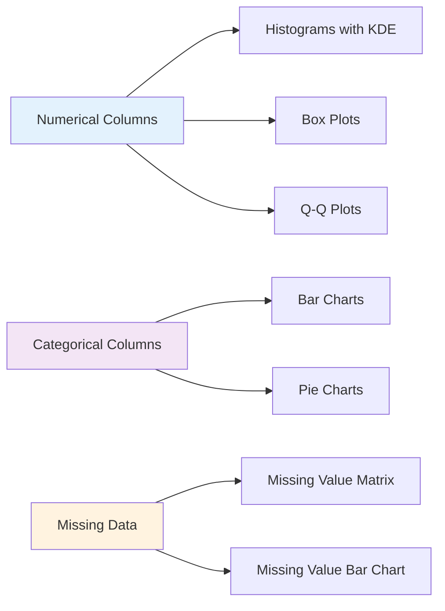
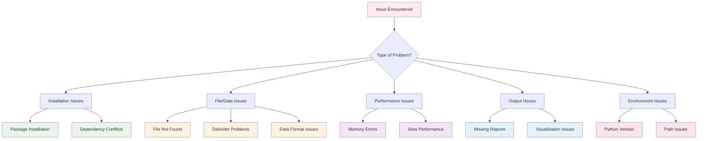
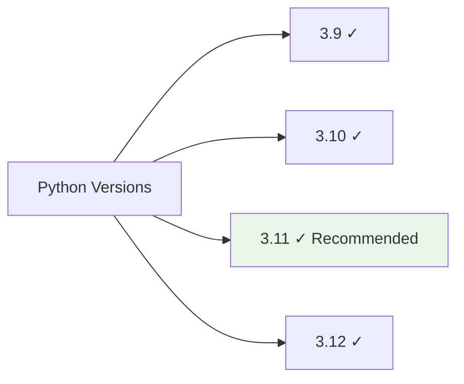
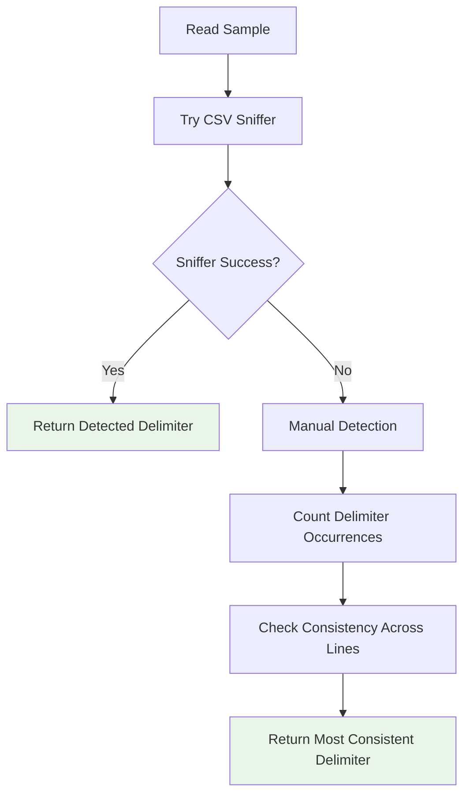

# AutoCSV Profiler Package Documentation

## Table of Contents

- [usage](#usage)
- [troubleshooting](#troubleshooting)
- [installation](#installation)
- [API Reference](#api-reference)

---

# usage

# Usage Guide

This comprehensive guide covers all aspects of using AutoCSV Profiler for data analysis.

## Quick Start

```bash
pip install autocsv-profiler
autocsv-profiler data.csv
```

### Command Line Usage

```bash
# Basic analysis
autocsv-profiler data.csv

# With custom output directory
autocsv-profiler data.csv --output ./my_analysis

# With specific delimiter
autocsv-profiler data.csv --delimiter ";"
```

### Python API Usage
```python
from autocsv_profiler import analyze_csv

# Run comprehensive analysis
analyze_csv("data.csv", "output_directory")
```

## Command Line Interface

### Basic Syntax
```bash
autocsv-profiler [OPTIONS] CSV_FILE
```

### Options Reference

#### Required Arguments
- `CSV_FILE` - Path to the CSV file to analyze

#### Optional Arguments
- `--output, -o` - Output directory (default: `CSV_FILE_analysis`)
- `--delimiter, -d` - CSV delimiter (default: auto-detect)
- `--version` - Show version information
- `--help` - Show help message

### Command Examples

#### Basic Analysis
```bash
# Analyze sales data with default settings
autocsv-profiler sales_data.csv
```

#### Custom Output Directory
```bash
# Specify where to save results
autocsv-profiler customer_data.csv --output ./customer_analysis
autocsv-profiler inventory.csv -o /path/to/results
```

#### Custom Delimiter
```bash
# For semicolon-separated files
autocsv-profiler european_data.csv --delimiter ";"

# For tab-separated files
autocsv-profiler data.tsv --delimiter "\t"

# For pipe-separated files
autocsv-profiler data.txt --delimiter "|"
```

#### Absolute and Relative Paths
```bash
# Relative paths
autocsv-profiler ./data/file.csv
autocsv-profiler ../parent_folder/data.csv

# Absolute paths
autocsv-profiler /home/user/data/file.csv
autocsv-profiler C:\Users\Name\Documents\data.csv
```

## Analysis Workflow



## Python API

### Basic Usage

#### Import and Analyze
```python
from autocsv_profiler import analyze_csv

# Basic analysis
analyze_csv("data.csv", "output_directory")
```

#### With Error Handling
```python
import os
from autocsv_profiler import analyze_csv

def analyze_file(csv_path, output_path):
    """Analyze CSV file with error handling"""
    try:
        if not os.path.exists(csv_path):
            print(f"Error: File {csv_path} not found")
            return False
            
        print(f"Analyzing {csv_path}...")
        analyze_csv(csv_path, output_path)
        print(f"Analysis complete! Results in {output_path}")
        return True
        
    except Exception as e:
        print(f"Analysis failed: {e}")
        return False

# Usage
success = analyze_file("sales_data.csv", "sales_analysis")
```

### Advanced Usage

#### Batch Processing
```python
import os
import glob
from autocsv_profiler import analyze_csv

def batch_analyze(data_directory, output_base_dir):
    """Analyze all CSV files in a directory"""
    csv_files = glob.glob(os.path.join(data_directory, "*.csv"))
    
    results = {}
    for csv_file in csv_files:
        filename = os.path.basename(csv_file)
        name_without_ext = os.path.splitext(filename)[0]
        output_dir = os.path.join(output_base_dir, f"{name_without_ext}_analysis")
        
        try:
            print(f"Processing {filename}...")
            analyze_csv(csv_file, output_dir)
            results[filename] = "Success"
            print(f"✓ {filename} analyzed successfully")
        except Exception as e:
            results[filename] = f"Failed: {e}"
            print(f"✗ {filename} failed: {e}")
    
    return results

# Usage
results = batch_analyze("./data", "./analysis_results")
for file, status in results.items():
    print(f"{file}: {status}")
```

#### Using Individual Components
```python
from autocsv_profiler.recognize_delimiter import detect_delimiter
import pandas as pd

# Detect delimiter
csv_file = "data.csv"
delimiter = detect_delimiter(csv_file)
print(f"Detected delimiter: '{delimiter}'")

# Load data
df = pd.read_csv(csv_file, delimiter=delimiter)
print(f"Loaded {len(df)} rows and {len(df.columns)} columns")

# Run full analysis
from autocsv_profiler import analyze_csv
analyze_csv(csv_file, "custom_analysis")
```

#### Custom Analysis Pipeline
```python
import pandas as pd
from autocsv_profiler import analyze_csv
from autocsv_profiler.recognize_delimiter import detect_delimiter

def custom_analysis_pipeline(csv_file, output_dir, sample_size=None):
    """Custom analysis pipeline with optional sampling"""
    
    # Step 1: Detect delimiter
    delimiter = detect_delimiter(csv_file)
    print(f"Detected delimiter: '{delimiter}'")
    
    # Step 2: Load data (with optional sampling)
    df = pd.read_csv(csv_file, delimiter=delimiter)
    print(f"Original data: {len(df)} rows, {len(df.columns)} columns")
    
    if sample_size and len(df) > sample_size:
        df_sample = df.sample(n=sample_size, random_state=42)
        sample_file = f"sample_{csv_file}"
        df_sample.to_csv(sample_file, index=False, sep=delimiter)
        print(f"Created sample: {len(df_sample)} rows")
        
        # Analyze sample
        analyze_csv(sample_file, f"{output_dir}_sample")
        
        # Clean up sample file
        import os
        os.remove(sample_file)
    
    # Step 3: Analyze full dataset
    analyze_csv(csv_file, output_dir)
    print(f"Analysis complete! Results in {output_dir}")

# Usage
custom_analysis_pipeline("large_dataset.csv", "large_analysis", sample_size=10000)
```

## Data Types and Support

### Supported File Formats
- **CSV files** (.csv)
- **Tab-separated values** (.tsv, .txt)
- **Custom delimited files** (any single character delimiter)

### Supported Data Types

#### Numerical Data
```python
# Integer columns
age, quantity, count, year

# Float columns  
price, temperature, percentage, ratio

# Analysis includes:
# - Descriptive statistics (mean, median, std)
# - Distribution analysis (skewness, kurtosis)
# - Outlier detection (IQR method)
# - Correlation analysis
```

#### Categorical Data
```python
# Text columns
name, category, department, status

# Analysis includes:
# - Frequency distributions
# - Unique value counts
# - Most/least common categories
# - Missing value patterns
```

#### Date/Time Data
```python
# Recognized formats
"2023-01-15", "01/15/2023", "15-Jan-2023"

# Analysis includes:
# - Date range identification
# - Temporal patterns
# - Missing date detection
```

#### Boolean Data
```python
# Recognized values
True/False, Yes/No, 1/0, Y/N

# Analysis includes:
# - Distribution of true/false values
# - Missing value handling
```

## Generated Outputs

### Output Directory Structure
```
your_file_analysis/
├── your_file.csv                               # Copy of original data
├── dataset_info.txt                            # Basic dataset information
├── summary_statistics_all.txt                  # Comprehensive statistics
├── categorical_summary.txt                     # Categorical analysis
├── missing_values_report.txt                   # Missing data analysis
├── outliers_summary.txt                        # Outlier detection
├── distinct_values_count_by_dtype.html         # Interactive value explorer
└── visualization/                              # Generated visualizations
    ├── box_plots/
    │   ├── age_box_plot.png
    │   └── salary_box_plot.png
    ├── histograms/
    │   ├── age_histogram.png
    │   └── salary_histogram.png
    └── correlation_matrices/
        └── correlation_heatmap.png
```

### Report Types

#### Statistical Reports
```
dataset_info.txt
├── Shape: 1000 rows × 15 columns
├── Data types: 8 numeric, 7 categorical
├── Memory usage: 2.1 MB
├── Missing values: 5.2% overall
└── Duplicates: 12 rows
```

#### Summary Statistics
```
summary_statistics_all.txt
├── Descriptive statistics for all numeric columns
├── Distribution metrics (skewness, kurtosis)
├── Quartile analysis (Q1, median, Q3)
└── Normality test results
```

#### Categorical Analysis
```
categorical_summary.txt
├── Frequency distributions
├── Unique value counts
├── Most common categories
└── Missing value patterns
```

#### Data Quality Assessment
```
missing_values_report.txt
├── Missing value counts by column
├── Missing value percentages
├── Missing value patterns
└── Recommendations for handling
```

### Interactive Reports

#### Value Explorer (HTML)
- Interactive tables showing all unique values
- Frequency counts for each value
- Filterable and searchable interface
- Dark/light mode support

### Visualizations

#### Distribution Analysis


#### Relationship Analysis
- Correlation heatmaps for numerical variables
- Scatter plots for variable pairs
- Cross-tabulation for categorical variables

## Practical Examples

### Example 1: Sales Data Analysis
```bash
# Analyze monthly sales data
autocsv-profiler monthly_sales.csv --output sales_report

# Expected insights:
# - Revenue trends and patterns
# - Product performance analysis
# - Customer segment analysis
# - Seasonal patterns identification
```

### Example 2: Customer Data Analysis
```python
from autocsv_profiler import analyze_csv

# Analyze customer demographics
analyze_csv("customer_data.csv", "customer_insights")

# Generated reports will include:
# - Age distribution analysis
# - Geographic distribution
# - Purchase behavior patterns
# - Customer segmentation insights
```

### Example 3: Financial Data Analysis
```bash
# Analyze transaction data with custom delimiter
autocsv-profiler transactions.txt --delimiter "|" --output financial_analysis

# Analysis includes:
# - Transaction amount distributions
# - Outlier detection for unusual transactions
# - Missing data patterns
# - Temporal analysis
```

### Example 4: Survey Data Analysis
```python
import os
from autocsv_profiler import analyze_csv

# Analyze survey responses
survey_file = "survey_responses.csv"
output_dir = "survey_analysis"

if os.path.exists(survey_file):
    analyze_csv(survey_file, output_dir)
    
    # Review key outputs
    print(f"Survey analysis complete!")
    print(f"Check {output_dir}/categorical_summary.txt for response distributions")
    print(f"Open {output_dir}/distinct_values_count_by_dtype.html for interactive exploration")
else:
    print("Survey file not found!")
```

## Best Practices

### Data Preparation
1. **Clean File Paths**: Avoid spaces and special characters in file names
2. **Consistent Delimiters**: Ensure consistent delimiter throughout the file
3. **Header Row**: Include descriptive column headers in the first row
4. **Data Types**: Use consistent formats within columns

### Performance Optimization
1. **File Size**: For files >100MB, consider sampling first
2. **Memory Usage**: Monitor system memory for large datasets
3. **Output Management**: Clean old analysis directories regularly

### Analysis Workflow
1. **Start Small**: Test with a sample before analyzing large datasets
2. **Review Quality**: Check data quality reports first
3. **Explore Interactively**: Use HTML reports for detailed exploration
4. **Iterate**: Use insights to refine data preparation

## Common Use Cases

### Business Intelligence
```bash
# Monthly performance analysis
autocsv-profiler monthly_metrics.csv --output performance_dashboard
```

### Research and Academia
```python
# Research data analysis
from autocsv_profiler import analyze_csv
analyze_csv("experiment_data.csv", "research_analysis")
```

### Data Quality Assessment
```bash
# Data quality check before modeling
autocsv-profiler raw_data.csv --output quality_check
```

### Regulatory Reporting
```python
# Compliance data analysis
analyze_csv("compliance_data.csv", "regulatory_report")
```

## Integration with Other Tools

### Jupyter Notebooks
```python
# In Jupyter cell
from autocsv_profiler import analyze_csv
import pandas as pd

# Analyze data
analyze_csv("data.csv", "notebook_analysis")

# Load results for further analysis
df = pd.read_csv("data.csv")
# Continue with custom analysis...
```

### Data Pipelines
```python
# Integration in data pipeline
def data_quality_check(csv_file):
    from autocsv_profiler import analyze_csv
    
    output_dir = f"quality_check_{csv_file.split('.')[0]}"
    analyze_csv(csv_file, output_dir)
    
    # Parse quality metrics
    # Add custom validation logic
    return quality_passed

# Use in pipeline
if data_quality_check("input.csv"):
    proceed_with_processing()
else:
    handle_quality_issues()
```

### Automated Reporting
```python
# Scheduled analysis script
import schedule
import time
from autocsv_profiler import analyze_csv

def daily_analysis():
    """Run daily data analysis"""
    from datetime import datetime
    
    timestamp = datetime.now().strftime("%Y%m%d")
    input_file = f"daily_data_{timestamp}.csv"
    output_dir = f"daily_analysis_{timestamp}"
    
    if os.path.exists(input_file):
        analyze_csv(input_file, output_dir)
        print(f"Daily analysis complete: {output_dir}")

# Schedule daily at 9 AM
schedule.every().day.at("09:00").do(daily_analysis)

while True:
    schedule.run_pending()
    time.sleep(3600)  # Check every hour
```

## Next Steps

After mastering basic usage:

1. **Explore [API Reference](api-reference.md)** for advanced programming
2. **Check [Examples](examples.md)** for domain-specific use cases
3. **Review [Troubleshooting](troubleshooting.md)** for common issues
4. **See [Contributing](contributing.md)** to help improve the tool

## Getting Help

For additional support:
- Review [Troubleshooting Guide](troubleshooting.md)
- Check [GitHub Issues](https://github.com/dhaneshbb/AutoCSV-Profiler-Suite/issues)
- Read [API Documentation](api-reference.md)

---

# troubleshooting

# Troubleshooting Guide

This guide helps resolve common issues encountered when using AutoCSV Profiler.

## Quick Diagnosis

### Problem Categories



## Installation Issues

### Problem: Package Installation Fails

#### Error: `pip install autocsv-profiler` fails

**Common Error Messages:**
```
ERROR: Could not find a version that satisfies the requirement autocsv-profiler
ERROR: No matching distribution found for autocsv-profiler
```

**Solutions:**

1. **Update pip:**
```bash
python -m pip install --upgrade pip
```

2. **Check Python version:**
```bash
python --version
# Should be 3.9 or higher
```

3. **Use specific Python version:**
```bash
python3.11 -m pip install autocsv-profiler
```

4. **Clear pip cache:**
```bash
pip cache purge
pip install autocsv-profiler
```

5. **Use alternative index:**
```bash
pip install -i https://pypi.org/simple/ autocsv-profiler
```

### Problem: Dependency Conflicts

#### Error: Package version conflicts

**Example Error:**
```
ERROR: pip's dependency resolver does not currently consider pre-releases.
ERROR: Cannot install autocsv-profiler because these package versions have conflicting dependencies
```

**Solutions:**

1. **Create fresh virtual environment:**
```bash
python -m venv fresh_env
# Windows:
fresh_env\Scripts\activate
# macOS/Linux:
source fresh_env/bin/activate

pip install autocsv-profiler
```

2. **Update conflicting packages:**
```bash
pip install --upgrade pandas numpy matplotlib seaborn
pip install autocsv-profiler
```

3. **Force reinstall:**
```bash
pip install --force-reinstall autocsv-profiler
```

### Problem: Permission Errors

#### Error: Permission denied during installation

**Solutions:**

1. **User installation:**
```bash
pip install --user autocsv-profiler
```

2. **Virtual environment (recommended):**
```bash
python -m venv csv_env
source csv_env/bin/activate  # Linux/Mac
csv_env\Scripts\activate     # Windows
pip install autocsv-profiler
```

3. **Administrator rights (Windows):**
```cmd
# Run Command Prompt as Administrator
pip install autocsv-profiler
```

## File and Data Issues

### Problem: CSV File Not Found

#### Error: `FileNotFoundError: [Errno 2] No such file or directory`

**Solutions:**

1. **Check file path:**
```bash
# Verify file exists
ls path/to/your/file.csv          # Linux/Mac
dir "path\to\your\file.csv"       # Windows

# Use absolute path
autocsv-profiler /full/path/to/file.csv
```

2. **Check current directory:**
```bash
pwd                               # Linux/Mac
cd                               # Windows

# Navigate to correct directory
cd /path/to/csv/files
autocsv-profiler filename.csv
```

3. **Use quotes for paths with spaces:**
```bash
autocsv-profiler "path with spaces/file name.csv"
```

4. **Check file permissions:**
```bash
ls -la file.csv                  # Linux/Mac
icacls file.csv                  # Windows
```

### Problem: Delimiter Detection Issues

#### Error: Incorrect column parsing or "All data in one column"

**Symptoms:**
- All data appears in a single column
- Column headers not properly recognized
- Data mixed up across columns

**Solutions:**

1. **Manually specify delimiter:**
```bash
# Common delimiters
autocsv-profiler file.csv --delimiter ","    # Comma
autocsv-profiler file.csv --delimiter ";"    # Semicolon  
autocsv-profiler file.csv --delimiter "\t"   # Tab
autocsv-profiler file.csv --delimiter "|"    # Pipe
```

2. **Inspect file manually:**
```bash
# View first few lines
head -5 file.csv                 # Linux/Mac
type file.csv | more             # Windows

# Look for the separator character
```

3. **Test with Python:**
```python
from autocsv_profiler import detect_delimiter

# Test delimiter detection
delimiter = detect_delimiter("problematic_file.csv")
print(f"Detected: '{delimiter}'")

# Manual inspection
with open("problematic_file.csv", 'r') as f:
    first_line = f.readline()
    print(f"First line: {first_line}")
```

4. **Fix the CSV file:**
```python
import pandas as pd

# Read with correct delimiter and save
df = pd.read_csv("file.csv", delimiter=";")
df.to_csv("fixed_file.csv", index=False)
```

### Problem: Data Format Issues

#### Error: Data parsing errors or unexpected data types

**Common Issues:**
- Dates not recognized
- Numbers treated as text
- Special characters causing issues

**Solutions:**

1. **Check file encoding:**
```python
import chardet

# Detect encoding
with open("file.csv", 'rb') as f:
    encoding = chardet.detect(f.read())
    print(f"Detected encoding: {encoding}")

# Read with correct encoding
import pandas as pd
df = pd.read_csv("file.csv", encoding='utf-8')  # or 'latin-1', 'cp1252'
```

2. **Handle special characters:**
```python
# Clean data before analysis
import pandas as pd

df = pd.read_csv("file.csv")

# Remove special characters from numeric columns
numeric_cols = df.select_dtypes(include=['object']).columns
for col in numeric_cols:
    # Remove currency symbols, commas, etc.
    df[col] = df[col].str.replace('$', '').str.replace(',', '')
    
# Try converting to numeric
df[col] = pd.to_numeric(df[col], errors='coerce')

# Save cleaned data
df.to_csv("cleaned_file.csv", index=False)
```

3. **Date format issues:**
```python
import pandas as pd

# Read with date parsing
df = pd.read_csv("file.csv", parse_dates=['date_column'])

# Or manually convert
df['date_column'] = pd.to_datetime(df['date_column'], format='%Y-%m-%d')
```

## Performance Issues

### Problem: Memory Errors

#### Error: `MemoryError` or system becomes unresponsive

**Solutions:**

1. **Check file size:**
```bash
# Check file size
ls -lh file.csv                  # Linux/Mac
dir file.csv                     # Windows

# Files >500MB may cause memory issues
```

2. **Sample large files:**
```python
import pandas as pd

# Create sample for testing
df = pd.read_csv("large_file.csv", nrows=10000)  # First 10,000 rows
df.to_csv("sample_file.csv", index=False)

# Analyze sample first
```

3. **Increase virtual memory (Windows):**
```
Control Panel → System → Advanced → Performance Settings → Advanced → Virtual Memory → Change
Set to "System managed size" or increase manually
```

4. **Monitor memory usage:**
```python
import psutil
import os

# Check available memory
available_gb = psutil.virtual_memory().available / (1024**3)
print(f"Available memory: {available_gb:.1f} GB")

# Monitor during analysis
process = psutil.Process(os.getpid())
memory_mb = process.memory_info().rss / (1024**2)
print(f"Current memory usage: {memory_mb:.1f} MB")
```

5. **Use chunked processing:**
```python
import pandas as pd
from autocsv_profiler import analyze_csv

def analyze_large_file(filename, chunk_size=10000):
    """Analyze large file in chunks"""
    
    # Read file info
    total_rows = sum(1 for line in open(filename)) - 1  # Subtract header
    print(f"Total rows: {total_rows:,}")
    
    if total_rows <= 50000:
        # Small enough to process normally
        analyze_csv(filename, "analysis_output")
    else:
        # Create sample
        sample_size = min(chunk_size, total_rows // 10)
        df_sample = pd.read_csv(filename, nrows=sample_size)
        sample_file = f"sample_{filename}"
        df_sample.to_csv(sample_file, index=False)
        
        print(f"Created sample with {sample_size:,} rows")
        analyze_csv(sample_file, "sample_analysis")

# Usage
analyze_large_file("huge_dataset.csv")
```

### Problem: Slow Performance

#### Issue: Analysis takes too long

**Solutions:**

1. **Profile the analysis:**
```python
import time
from autocsv_profiler import analyze_csv

start_time = time.time()
analyze_csv("file.csv", "output")
elapsed = time.time() - start_time
print(f"Analysis took {elapsed:.1f} seconds")
```

2. **Optimize file size:**
```python
import pandas as pd

# Load and optimize data types
df = pd.read_csv("file.csv")

# Optimize numeric types
for col in df.select_dtypes(include=['int64']).columns:
    df[col] = pd.to_numeric(df[col], downcast='integer')

for col in df.select_dtypes(include=['float64']).columns:
    df[col] = pd.to_numeric(df[col], downcast='float')

# Optimize categorical data
for col in df.select_dtypes(include=['object']).columns:
    if df[col].nunique() < len(df) * 0.5:  # Less than 50% unique values
        df[col] = df[col].astype('category')

# Save optimized file
df.to_csv("optimized_file.csv", index=False)
print(f"File size reduced from {df.memory_usage(deep=True).sum():,} to {df.memory_usage(deep=True).sum():,} bytes")
```

3. **Close other applications:**
```bash
# Free up system resources
# Close unnecessary applications
# Check available memory and CPU
```

## Output Issues

### Problem: Missing or Incomplete Reports

#### Issue: Expected output files not generated

**Solutions:**

1. **Check output directory:**
```bash
# Verify output directory exists and has content
ls -la output_directory/          # Linux/Mac
dir output_directory\             # Windows
```

2. **Check permissions:**
```bash
# Ensure write permissions
chmod 755 output_directory/       # Linux/Mac
icacls output_directory /grant Users:F  # Windows
```

3. **Run with verbose output:**
```python
import logging
from autocsv_profiler import analyze_csv

# Enable debug logging
logging.basicConfig(level=logging.DEBUG)

try:
    analyze_csv("file.csv", "debug_output")
except Exception as e:
    print(f"Error: {e}")
    import traceback
    traceback.print_exc()
```

4. **Check disk space:**
```bash
df -h                             # Linux/Mac  
dir                               # Windows
```

### Problem: Visualization Issues

#### Issue: Plots not displaying or corrupted images

**Solutions:**

1. **Check matplotlib backend:**
```python
import matplotlib
print(f"Backend: {matplotlib.get_backend()}")

# Set backend explicitly
matplotlib.use('Agg')  # Non-interactive backend
```

2. **Verify image files:**
```bash
# Check if image files exist and have content
ls -la output_directory/visualization/  # Linux/Mac
dir output_directory\visualization\     # Windows

# Check file sizes (should not be 0 bytes)
```

3. **Test plotting separately:**
```python
import matplotlib.pyplot as plt
import pandas as pd

# Test basic plotting
df = pd.read_csv("file.csv")
numeric_cols = df.select_dtypes(include=['number']).columns

if len(numeric_cols) > 0:
    plt.figure(figsize=(8, 6))
    plt.hist(df[numeric_cols[0]], bins=20)
    plt.title(f"Histogram of {numeric_cols[0]}")
    plt.savefig("test_plot.png")
    plt.close()
    print("Test plot saved successfully")
```

4. **Update graphics libraries:**
```bash
pip install --upgrade matplotlib seaborn plotly
```

### Problem: HTML Reports Not Opening

#### Issue: Interactive reports show blank pages or errors

**Solutions:**

1. **Try different browsers:**
```bash
# Test with different browsers
chrome report.html
firefox report.html
edge report.html
```

2. **Check JavaScript:**
```javascript
// Open browser console (F12) and check for errors
// Enable JavaScript if disabled
```

3. **Local file restrictions:**
```bash
# For Chrome, start with local file access
chrome --allow-file-access-from-files report.html

# Or serve via local web server
python -m http.server 8000
# Then open http://localhost:8000/report.html
```

4. **File size issues:**
```bash
# Check if HTML file is too large
ls -lh report.html               # Linux/Mac
dir report.html                  # Windows

# If >50MB, the file may be too large for browsers
```

## Environment Issues

### Problem: Python Version Issues

#### Error: Incompatible Python version

**Solutions:**

1. **Check Python version:**
```bash
python --version
python3 --version

# Should be 3.9 or higher
```

2. **Install compatible Python:**
```bash
# Using pyenv (Linux/Mac)
pyenv install 3.11.0
pyenv global 3.11.0

# Using Anaconda
conda install python=3.11
```

3. **Use specific Python version:**
```bash
# Use specific Python executable
python3.11 -m pip install autocsv-profiler
python3.11 -c "from autocsv_profiler import analyze_csv; analyze_csv('file.csv', 'output')"
```

### Problem: Path and Environment Issues

#### Issue: Command not found or import errors

**Solutions:**

1. **Check PATH:**
```bash
# Check if Python scripts directory is in PATH
echo $PATH                       # Linux/Mac
echo %PATH%                      # Windows

# Find where autocsv-profiler is installed
which autocsv-profiler           # Linux/Mac
where autocsv-profiler           # Windows
```

2. **Add to PATH:**
```bash
# Linux/Mac (add to ~/.bashrc or ~/.zshrc)
export PATH="$HOME/.local/bin:$PATH"

# Windows (System Properties → Environment Variables)
# Add Python\Scripts directory to PATH
```

3. **Use full path:**
```bash
# Use full path to executable
/usr/local/bin/autocsv-profiler file.csv
C:\Python311\Scripts\autocsv-profiler.exe file.csv
```

4. **Virtual environment activation:**
```bash
# Ensure virtual environment is activated
source venv/bin/activate         # Linux/Mac
venv\Scripts\activate            # Windows

# Check which Python is active
which python                     # Linux/Mac
where python                     # Windows
```

## Advanced Troubleshooting

### Diagnostic Script

```python
#!/usr/bin/env python3
"""
AutoCSV Profiler Diagnostic Script
Run this to diagnose common issues
"""

import sys
import os
import subprocess
import platform

def run_diagnostics():
    """Run comprehensive diagnostics"""
    
    print("AutoCSV Profiler Diagnostic Report")
    print("=" * 40)
    
    # System information
    print(f"\nSystem Information:")
    print(f"OS: {platform.system()} {platform.release()}")
    print(f"Python: {sys.version}")
    print(f"Platform: {platform.platform()}")
    
    # Python environment
    print(f"\nPython Environment:")
    print(f"Executable: {sys.executable}")
    print(f"Path: {sys.path[0]}")
    
    # Package versions
    print(f"\nPackage Versions:")
    packages = [
        'autocsv_profiler', 'pandas', 'numpy', 'matplotlib', 
        'seaborn', 'scipy', 'sklearn', 'statsmodels'
    ]
    
    for package in packages:
        try:
            module = __import__(package)
            version = getattr(module, '__version__', 'Unknown')
            print(f"{package}: {version}")
        except ImportError:
            print(f"{package}: Not installed")
    
    # Memory and disk space
    try:
        import psutil
        memory = psutil.virtual_memory()
        disk = psutil.disk_usage('.')
        
        print(f"\nSystem Resources:")
        print(f"Total Memory: {memory.total / (1024**3):.1f} GB")
        print(f"Available Memory: {memory.available / (1024**3):.1f} GB")
        print(f"Disk Free: {disk.free / (1024**3):.1f} GB")
    except ImportError:
        print(f"\nSystem Resources: psutil not available")
    
    # Test basic functionality
    print(f"\nFunctionality Tests:")
    
    # Test import
    try:
        from autocsv_profiler import analyze_csv, detect_delimiter
        print("✓ Package import successful")
    except ImportError as e:
        print(f"✗ Package import failed: {e}")
        return
    
    # Test delimiter detection
    try:
        # Create test file
        test_data = "name,age,city\nAlice,25,NYC\nBob,30,LA"
        with open("test.csv", "w") as f:
            f.write(test_data)
        
        delimiter = detect_delimiter("test.csv")
        print(f"✓ Delimiter detection successful: '{delimiter}'")
        
        # Clean up
        os.remove("test.csv")
    except Exception as e:
        print(f"✗ Delimiter detection failed: {e}")
    
    # Test analysis (with small dataset)
    try:
        # Create test dataset
        test_data = """name,age,salary,department
Alice Johnson,28,65000,Engineering
Bob Smith,34,72000,Marketing
Carol Davis,29,58000,Sales"""
        
        with open("diagnostic_test.csv", "w") as f:
            f.write(test_data)
        
        analyze_csv("diagnostic_test.csv", "diagnostic_output")
        
        # Check if output was created
        if os.path.exists("diagnostic_output"):
            output_files = os.listdir("diagnostic_output")
            print(f"✓ Analysis successful: {len(output_files)} files generated")
            
            # Clean up
            import shutil
            shutil.rmtree("diagnostic_output")
        else:
            print("✗ Analysis failed: No output generated")
        
        os.remove("diagnostic_test.csv")
        
    except Exception as e:
        print(f"✗ Analysis test failed: {e}")
    
    print(f"\nDiagnostic complete!")
    print(f"If issues persist, please share this report when seeking help.")

if __name__ == "__main__":
    run_diagnostics()
```

Save this as `diagnostic.py` and run with:
```bash
python diagnostic.py
```

### Performance Monitoring

```python
import time
import psutil
import os
from autocsv_profiler import analyze_csv

def monitored_analysis(csv_file, output_dir):
    """Run analysis with performance monitoring"""
    
    process = psutil.Process(os.getpid())
    
    # Initial state
    start_time = time.time()
    start_memory = process.memory_info().rss / (1024**2)  # MB
    
    print(f"Starting analysis of {csv_file}")
    print(f"Initial memory: {start_memory:.1f} MB")
    
    try:
        # Run analysis
        analyze_csv(csv_file, output_dir)
        
        # Final state
        end_time = time.time()
        end_memory = process.memory_info().rss / (1024**2)  # MB
        
        elapsed = end_time - start_time
        memory_used = end_memory - start_memory
        
        print(f"Analysis completed successfully!")
        print(f"Time elapsed: {elapsed:.1f} seconds")
        print(f"Memory used: {memory_used:.1f} MB")
        print(f"Peak memory: {end_memory:.1f} MB")
        
        # Check output
        if os.path.exists(output_dir):
            files = os.listdir(output_dir)
            print(f"Generated {len(files)} output files")
        
    except Exception as e:
        end_time = time.time()
        end_memory = process.memory_info().rss / (1024**2)
        
        print(f"Analysis failed after {end_time - start_time:.1f} seconds")
        print(f"Memory at failure: {end_memory:.1f} MB")
        print(f"Error: {e}")
        
        import traceback
        traceback.print_exc()

# Usage
monitored_analysis("your_file.csv", "monitored_output")
```

## Getting Additional Help

### When to Seek Help

1. **After trying solutions in this guide**
2. **Error persists across different files**
3. **System-specific issues**
4. **Performance problems with reasonable datasets**

### How to Report Issues

#### Information to Include

1. **System Information:**
   - Operating system and version
   - Python version (`python --version`)
   - AutoCSV Profiler version
   - Installation method (pip, conda, source)

2. **Error Details:**
   - Complete error message
   - Steps to reproduce
   - Sample data (anonymized if needed)
   - Command or code that caused the error

3. **Environment:**
   - Virtual environment details
   - Other installed packages (`pip list`)
   - Available memory and disk space

#### Example Issue Report

```
Title: MemoryError with 100MB CSV file

Environment:
- OS: Windows 11
- Python: 3.11.2  
- AutoCSV Profiler: 1.1.0
- RAM: 8GB
- Installation: pip install autocsv-profiler

Issue:
Getting MemoryError when analyzing a 100MB CSV file with 500k rows and 25 columns.

Error Message:
MemoryError: Unable to allocate array with shape (500000, 25) and data type float64

Steps to Reproduce:
1. autocsv-profiler large_dataset.csv
2. Error occurs during statistical analysis phase

Sample Data:
File has mixed data types - 15 numeric columns, 10 categorical columns
No obvious data quality issues
Delimiter: comma

Already Tried:
- Closing other applications
- Using virtual environment
- Sampling first 10k rows (works fine)
```

### Support Channels

- **GitHub Issues**: [Report bugs](https://github.com/dhaneshbb/AutoCSV-Profiler-Suite/issues)
- **Documentation**: [Read docs](https://github.com/dhaneshbb/AutoCSV-Profiler-Suite/tree/main/docs)  
- **Examples**: [Check examples](examples.md)

### Community Guidelines

1. **Search existing issues** before creating new ones
2. **Provide minimal reproducible examples**
3. **Use descriptive titles**
4. **Be respectful and patient**
5. **Help others when you can**

This troubleshooting guide should resolve most common issues. If you encounter problems not covered here, please create an issue on GitHub with detailed information.

---

# installation

# Installation Guide

This guide covers the installation process for AutoCSV Profiler across different platforms and environments.

## System Requirements

### Minimum Requirements
- Python 3.9 or higher
- 2GB RAM (4GB recommended for large datasets)
- 500MB free disk space
- Internet connection for package downloads

### Supported Platforms
- Windows 10/11
- macOS 10.14 or later
- Linux (Ubuntu 18.04+, CentOS 7+, or equivalent)

### Python Version Support


## Installation Methods

### Method 1: PyPI Installation (Recommended)

#### Basic Installation
```bash
pip install autocsv-profiler
```

#### With Development Dependencies
```bash
pip install autocsv-profiler[dev]
```

#### Upgrade to Latest Version
```bash
pip install --upgrade autocsv-profiler
```

### Method 2: Conda Installation

#### Using conda-forge
```bash
conda install -c conda-forge autocsv-profiler
```

#### In New Environment
```bash
conda create -n csv-analysis python=3.11
conda activate csv-analysis
pip install autocsv-profiler
```

### Method 3: Source Installation

#### From GitHub
```bash
git clone https://github.com/dhaneshbb/AutoCSV-Profiler-Suite.git
cd AutoCSV-Profiler-Suite
pip install .
```

#### Development Installation
```bash
git clone https://github.com/dhaneshbb/AutoCSV-Profiler-Suite.git
cd AutoCSV-Profiler-Suite
pip install -e .[dev]
```

## Platform-Specific Instructions

### Windows

#### Using Command Prompt
```cmd
# Install Python from python.org if not already installed
python -m pip install --upgrade pip
python -m pip install autocsv-profiler
```

#### Using PowerShell
```powershell
# Ensure execution policy allows script execution
Set-ExecutionPolicy -ExecutionPolicy RemoteSigned -Scope CurrentUser

# Install package
pip install autocsv-profiler
```

#### Using Anaconda Prompt
```bash
# Open Anaconda Prompt
conda create -n csvanalysis python=3.11
conda activate csvanalysis
pip install autocsv-profiler
```

### macOS

#### Using Terminal
```bash
# Install using pip
pip3 install autocsv-profiler

# Or using Homebrew Python
brew install python
pip3 install autocsv-profiler
```

#### Using Conda
```bash
# If using Anaconda/Miniconda
conda install -c conda-forge autocsv-profiler
```

### Linux (Ubuntu/Debian)

#### System Installation
```bash
# Update package list
sudo apt update

# Install Python and pip if not present
sudo apt install python3 python3-pip

# Install AutoCSV Profiler
pip3 install autocsv-profiler
```

#### User Installation
```bash
# Install for current user only
pip3 install --user autocsv-profiler

# Add to PATH if needed
echo 'export PATH="$HOME/.local/bin:$PATH"' >> ~/.bashrc
source ~/.bashrc
```

### Linux (CentOS/RHEL)

```bash
# Install Python and pip
sudo yum install python3 python3-pip

# Install package
pip3 install autocsv-profiler
```

## Virtual Environment Setup

### Using venv (Recommended)

```bash
# Create virtual environment
python -m venv csvprofiler-env

# Activate environment
# Windows:
csvprofiler-env\Scripts\activate
# macOS/Linux:
source csvprofiler-env/bin/activate

# Install package
pip install autocsv-profiler

# Deactivate when done
deactivate
```

### Using conda

```bash
# Create conda environment
conda create -n csvprofiler python=3.11

# Activate environment
conda activate csvprofiler

# Install package
pip install autocsv-profiler

# Deactivate when done
conda deactivate
```

## Verification

### Test Installation
```bash
# Check if package is installed
pip show autocsv-profiler

# Verify command-line tool
autocsv-profiler --version

# Test Python import
python -c "import autocsv_profiler; print(f'AutoCSV Profiler v{autocsv_profiler.__version__} installed successfully!')"
```

### Quick Functionality Test
```bash
# Create a test CSV file
echo "name,age,city
Alice,25,New York
Bob,30,London
Carol,28,Paris" > test.csv

# Run analysis
autocsv-profiler test.csv

# Check output
ls test_analysis/
```

## Dependency Information

### Core Dependencies
```
pandas>=1.5.0          # Data manipulation
numpy>=1.24.0           # Numerical computing
scipy>=1.10.0           # Scientific computing
matplotlib>=3.6.0       # Plotting
seaborn>=0.12.0         # Statistical visualization
scikit-learn>=1.2.0     # Machine learning tools
statsmodels>=0.13.0     # Statistical modeling
tqdm>=4.64.0            # Progress bars
```

### Analysis-Specific Dependencies
```
tableone>=0.7.12        # Statistical summaries
missingno>=0.5.2        # Missing data visualization
tabulate>=0.9.0         # Table formatting
```

### Optional Dependencies (Development)
```
pytest>=7.0.0           # Testing framework
black>=22.0.0           # Code formatting
flake8>=6.0.0           # Code linting
mypy>=0.991             # Type checking
```

## Installation Troubleshooting

### Common Issues

#### Permission Errors
```bash
# Use --user flag for user installation
pip install --user autocsv-profiler

# Or use virtual environment
python -m venv myenv
source myenv/bin/activate  # Linux/Mac
# or myenv\Scripts\activate  # Windows
pip install autocsv-profiler
```

#### Dependency Conflicts
```bash
# Create fresh environment
conda create -n fresh-env python=3.11
conda activate fresh-env
pip install autocsv-profiler
```

#### Network Issues
```bash
# Use different index
pip install -i https://pypi.org/simple/ autocsv-profiler

# Or upgrade pip first
python -m pip install --upgrade pip
pip install autocsv-profiler
```

#### Python Version Issues
```bash
# Check Python version
python --version

# Use specific Python version
python3.11 -m pip install autocsv-profiler
```

### Platform-Specific Issues

#### Windows Path Issues
```cmd
# Add Python Scripts to PATH
set PATH=%PATH%;%LOCALAPPDATA%\Programs\Python\Python311\Scripts

# Or use python -m
python -m autocsv_profiler.cli data.csv
```

#### macOS Permission Issues
```bash
# Use --user installation
pip3 install --user autocsv-profiler

# Or use sudo (not recommended)
sudo pip3 install autocsv-profiler
```

#### Linux Package Manager Conflicts
```bash
# Use pip instead of system package manager
python3 -m pip install --user autocsv-profiler

# Or use pipx for isolated installation
pipx install autocsv-profiler
```

## Environment Variables

### Optional Configuration
```bash
# Set default output directory
export AUTOCSV_OUTPUT_DIR="/path/to/default/output"

# Set memory limit for large files
export AUTOCSV_MEMORY_LIMIT="4GB"

# Enable debug logging
export AUTOCSV_DEBUG=1
```

## Performance Optimization

### For Large Datasets
```bash
# Install with additional dependencies for performance
pip install autocsv-profiler pandas[performance]

# Or use conda for optimized packages
conda install -c conda-forge autocsv-profiler pandas numpy
```

### Memory Management
```bash
# Monitor memory usage during installation
pip install autocsv-profiler --no-cache-dir
```

## Uninstallation

### Remove Package
```bash
# Uninstall package
pip uninstall autocsv-profiler

# Remove dependencies (if not used by other packages)
pip uninstall pandas numpy matplotlib seaborn scipy scikit-learn statsmodels tqdm tableone missingno tabulate
```

### Clean Environment
```bash
# Remove virtual environment
rm -rf csvprofiler-env  # Linux/Mac
rmdir /s csvprofiler-env  # Windows

# Or remove conda environment
conda env remove -n csvprofiler
```

## Next Steps

After successful installation:

1. **Read the [Usage Guide](usage.md)** for detailed usage instructions
2. **Check [Examples](examples.md)** for sample analyses
3. **Review [API Reference](api-reference.md)** for programmatic usage
4. **See [Troubleshooting](troubleshooting.md)** if you encounter issues

## Getting Help

If you encounter installation issues:

1. Check the [Troubleshooting Guide](troubleshooting.md)
2. Search [GitHub Issues](https://github.com/dhaneshbb/AutoCSV-Profiler-Suite/issues)
3. Create a new issue with:
   - Operating system and version
   - Python version
   - Installation method used
   - Complete error message
   - Output of `pip list` or `conda list`

---

# API Reference

# API Reference

This document provides detailed information about the AutoCSV Profiler Python API.

## Package Overview

```python
import autocsv_profiler

# Main analysis function
from autocsv_profiler import analyze_csv

# Delimiter detection
from autocsv_profiler import detect_delimiter

# Version information
print(autocsv_profiler.__version__)
```

## Core Functions

### analyze_csv()

Main function for comprehensive CSV data analysis.

#### Signature
```python
def analyze_csv(csv_path: str, output_dir: str) -> None
```

#### Parameters
- **csv_path** (`str`): Path to the CSV file to analyze
- **output_dir** (`str`): Directory where analysis results will be saved

#### Returns
- `None`: Results are saved to the specified output directory

#### Raises
- `FileNotFoundError`: If the CSV file doesn't exist
- `ValueError`: If the CSV file cannot be parsed
- `PermissionError`: If unable to write to output directory
- `MemoryError`: If the dataset is too large for available memory

#### Example Usage
```python
from autocsv_profiler import analyze_csv

# Basic usage
analyze_csv("data.csv", "analysis_output")

# With error handling
try:
    analyze_csv("large_dataset.csv", "results")
    print("Analysis completed successfully")
except FileNotFoundError:
    print("CSV file not found")
except MemoryError:
    print("Dataset too large - consider sampling")
```

#### Generated Outputs
The function creates the following files in the output directory:

**Text Reports:**
- `dataset_info.txt` - Basic dataset information
- `summary_statistics_all.txt` - Comprehensive statistics
- `categorical_summary.txt` - Categorical variable analysis
- `missing_values_report.txt` - Missing data analysis
- `outliers_summary.txt` - Outlier detection results

**Interactive Reports:**
- `distinct_values_count_by_dtype.html` - Interactive value explorer

**Visualizations:**
- `visualization/box_plots/` - Box plot visualizations
- `visualization/histograms/` - Distribution histograms
- `visualization/correlation_matrices/` - Correlation heatmaps

### detect_delimiter()

Automatic delimiter detection for CSV files.

#### Signature
```python
def detect_delimiter(csv_file: str) -> str
```

#### Parameters
- **csv_file** (`str`): Path to the CSV file

#### Returns
- `str`: Detected delimiter character

#### Raises
- `FileNotFoundError`: If the CSV file doesn't exist
- `ValueError`: If delimiter cannot be determined

#### Example Usage
```python
from autocsv_profiler import detect_delimiter

# Detect delimiter
delimiter = detect_delimiter("data.csv")
print(f"Detected delimiter: '{delimiter}'")

# Use with pandas
import pandas as pd
df = pd.read_csv("data.csv", delimiter=delimiter)
```

#### Supported Delimiters
The function can detect:
- `,` (comma) - Standard CSV
- `;` (semicolon) - European CSV standard
- `\t` (tab) - Tab-separated values
- `|` (pipe) - Pipe-separated values
- `:` (colon) - Colon-separated values

#### Detection Algorithm


## Module Reference

### autocsv_profiler.auto_csv_profiler

Main analysis module containing the comprehensive data analysis functionality.

#### Functions

##### main()
```python
def main(csv_path: str, output_dir: str) -> None
```
Internal main function called by `analyze_csv()`. Handles the complete analysis workflow.

##### check_and_install_packages()
```python
def check_and_install_packages(packages: list) -> None
```
Utility function to check and install required packages.

##### data_info()
```python
def data_info(data_copy: pd.DataFrame, save_dir: str) -> None
```
Generate basic dataset information report.

#### Classes and Data Structures

##### Colors
```python
class Colors:
    """ANSI color codes for terminal output"""
    HEADER = '\033[95m'
    OKBLUE = '\033[94m'
    OKGREEN = '\033[92m'
    WARNING = '\033[93m'
    FAIL = '\033[91m'
    ENDC = '\033[0m'
    BOLD = '\033[1m'
```

### autocsv_profiler.recognize_delimiter

Delimiter detection module.

#### Functions

##### detect_delimiter()
```python
def detect_delimiter(csv_file: str) -> str
```
Main delimiter detection function (exported to package level).

##### print_csv_head()
```python
def print_csv_head(csv_file: str) -> None
```
Print first few lines of CSV file for manual inspection.

### autocsv_profiler.cli

Command-line interface module.

#### Functions

##### main()
```python
def main() -> None
```
Command-line entry point. Handles argument parsing and execution.

## Data Analysis Components

### Statistical Analysis

#### Descriptive Statistics
```python
# Generated statistics include:
statistics = {
    'count': int,           # Number of non-null values
    'mean': float,          # Arithmetic mean
    'std': float,           # Standard deviation
    'min': float,           # Minimum value
    '25%': float,           # First quartile
    '50%': float,           # Median
    '75%': float,           # Third quartile
    'max': float,           # Maximum value
    'skewness': float,      # Distribution skewness
    'kurtosis': float,      # Distribution kurtosis
    'unique': int,          # Number of unique values
    'mode': float,          # Most frequent value
}
```

#### Missing Value Analysis
```python
# Missing value metrics
missing_info = {
    'column_name': str,
    'missing_count': int,
    'missing_percentage': float,
    'missing_pattern': str,     # 'random', 'structured', 'block'
    'imputation_suggestion': str # 'mean', 'median', 'mode', 'forward_fill'
}
```

#### Outlier Detection
```python
# Outlier detection results
outlier_info = {
    'column_name': str,
    'outlier_count': int,
    'outlier_percentage': float,
    'outlier_threshold_lower': float,
    'outlier_threshold_upper': float,
    'outlier_method': str,      # 'IQR', 'Z-score', 'Modified Z-score'
}
```

### Visualization Components

#### Plot Generation
```python
# Generated visualizations
visualizations = {
    'histograms': {
        'file_pattern': '{column}_histogram.png',
        'description': 'Distribution histogram with KDE overlay'
    },
    'box_plots': {
        'file_pattern': '{column}_boxplot.png', 
        'description': 'Box plot showing quartiles and outliers'
    },
    'correlation_matrix': {
        'file_pattern': 'correlation_heatmap.png',
        'description': 'Correlation heatmap for numerical variables'
    },
    'missing_patterns': {
        'file_pattern': 'missing_values_matrix.png',
        'description': 'Missing value pattern visualization'
    }
}
```

## Advanced Usage Patterns

### Custom Analysis Pipeline

```python
import pandas as pd
from autocsv_profiler import detect_delimiter, analyze_csv
import os

class CSVAnalyzer:
    """Custom CSV analysis wrapper"""
    
    def __init__(self, csv_path: str):
        self.csv_path = csv_path
        self.delimiter = None
        self.data = None
        self.analysis_dir = None
    
    def load_data(self):
        """Load CSV data with automatic delimiter detection"""
        self.delimiter = detect_delimiter(self.csv_path)
        self.data = pd.read_csv(self.csv_path, delimiter=self.delimiter)
        return self.data
    
    def quick_info(self):
        """Get quick dataset information"""
        if self.data is None:
            self.load_data()
        
        return {
            'shape': self.data.shape,
            'columns': list(self.data.columns),
            'dtypes': dict(self.data.dtypes),
            'missing_values': self.data.isnull().sum().sum(),
            'memory_usage': self.data.memory_usage(deep=True).sum()
        }
    
    def run_analysis(self, output_dir: str = None):
        """Run comprehensive analysis"""
        if output_dir is None:
            base_name = os.path.splitext(os.path.basename(self.csv_path))[0]
            output_dir = f"{base_name}_analysis"
        
        self.analysis_dir = output_dir
        analyze_csv(self.csv_path, output_dir)
        return output_dir
    
    def get_results(self):
        """Get analysis results as dictionary"""
        if self.analysis_dir is None:
            raise ValueError("Analysis not run yet. Call run_analysis() first.")
        
        results = {}
        
        # Read text reports
        report_files = [
            'dataset_info.txt',
            'summary_statistics_all.txt', 
            'categorical_summary.txt',
            'missing_values_report.txt',
            'outliers_summary.txt'
        ]
        
        for report_file in report_files:
            file_path = os.path.join(self.analysis_dir, report_file)
            if os.path.exists(file_path):
                with open(file_path, 'r') as f:
                    results[report_file] = f.read()
        
        return results

# Usage example
analyzer = CSVAnalyzer("sales_data.csv")
info = analyzer.quick_info()
print(f"Dataset: {info['shape'][0]} rows, {info['shape'][1]} columns")

output_dir = analyzer.run_analysis()
results = analyzer.get_results()
```

### Batch Processing Framework

```python
from autocsv_profiler import analyze_csv, detect_delimiter
import os
import glob
from concurrent.futures import ThreadPoolExecutor, as_completed
import logging

class BatchCSVAnalyzer:
    """Batch processing for multiple CSV files"""
    
    def __init__(self, input_dir: str, output_base_dir: str, max_workers: int = 4):
        self.input_dir = input_dir
        self.output_base_dir = output_base_dir
        self.max_workers = max_workers
        self.results = {}
        
        # Setup logging
        logging.basicConfig(level=logging.INFO)
        self.logger = logging.getLogger(__name__)
    
    def find_csv_files(self):
        """Find all CSV files in input directory"""
        pattern = os.path.join(self.input_dir, "*.csv")
        return glob.glob(pattern)
    
    def analyze_single_file(self, csv_path: str):
        """Analyze a single CSV file"""
        filename = os.path.basename(csv_path)
        name_without_ext = os.path.splitext(filename)[0]
        output_dir = os.path.join(self.output_base_dir, f"{name_without_ext}_analysis")
        
        try:
            self.logger.info(f"Starting analysis: {filename}")
            
            # Quick validation
            delimiter = detect_delimiter(csv_path)
            self.logger.info(f"Detected delimiter for {filename}: '{delimiter}'")
            
            # Run analysis
            analyze_csv(csv_path, output_dir)
            
            return {
                'file': filename,
                'status': 'success',
                'output_dir': output_dir,
                'delimiter': delimiter
            }
            
        except Exception as e:
            self.logger.error(f"Failed to analyze {filename}: {e}")
            return {
                'file': filename,
                'status': 'failed',
                'error': str(e)
            }
    
    def run_batch_analysis(self):
        """Run analysis on all CSV files"""
        csv_files = self.find_csv_files()
        
        if not csv_files:
            self.logger.warning(f"No CSV files found in {self.input_dir}")
            return {}
        
        self.logger.info(f"Found {len(csv_files)} CSV files to analyze")
        
        # Create output directory
        os.makedirs(self.output_base_dir, exist_ok=True)
        
        # Process files in parallel
        with ThreadPoolExecutor(max_workers=self.max_workers) as executor:
            future_to_file = {
                executor.submit(self.analyze_single_file, csv_file): csv_file 
                for csv_file in csv_files
            }
            
            for future in as_completed(future_to_file):
                result = future.result()
                self.results[result['file']] = result
                
                if result['status'] == 'success':
                    self.logger.info(f"✓ Completed: {result['file']}")
                else:
                    self.logger.error(f"✗ Failed: {result['file']}")
        
        return self.results
    
    def generate_summary_report(self):
        """Generate summary report of batch analysis"""
        if not self.results:
            return "No analysis results available"
        
        total_files = len(self.results)
        successful = sum(1 for r in self.results.values() if r['status'] == 'success')
        failed = total_files - successful
        
        summary = f"""
Batch Analysis Summary
=====================
Total files processed: {total_files}
Successful analyses: {successful}
Failed analyses: {failed}
Success rate: {(successful/total_files)*100:.1f}%

Detailed Results:
"""
        
        for filename, result in self.results.items():
            if result['status'] == 'success':
                summary += f"✓ {filename} -> {result['output_dir']}\n"
            else:
                summary += f"✗ {filename} -> {result['error']}\n"
        
        # Save summary
        summary_path = os.path.join(self.output_base_dir, "batch_analysis_summary.txt")
        with open(summary_path, 'w') as f:
            f.write(summary)
        
        return summary

# Usage example
batch_analyzer = BatchCSVAnalyzer("./data", "./batch_results", max_workers=2)
results = batch_analyzer.run_batch_analysis()
summary = batch_analyzer.generate_summary_report()
print(summary)
```

## Error Handling

### Common Exceptions

```python
from autocsv_profiler import analyze_csv, detect_delimiter

def robust_analysis(csv_path: str, output_dir: str):
    """Robust analysis with comprehensive error handling"""
    
    try:
        # Validate input file
        if not os.path.exists(csv_path):
            raise FileNotFoundError(f"CSV file not found: {csv_path}")
        
        if not csv_path.lower().endswith('.csv'):
            print("Warning: File doesn't have .csv extension")
        
        # Check file size
        file_size = os.path.getsize(csv_path)
        if file_size > 500 * 1024 * 1024:  # 500MB
            print(f"Warning: Large file ({file_size/1024/1024:.1f}MB)")
        
        # Detect delimiter
        delimiter = detect_delimiter(csv_path)
        print(f"Detected delimiter: '{delimiter}'")
        
        # Run analysis
        analyze_csv(csv_path, output_dir)
        print(f"Analysis completed successfully: {output_dir}")
        
    except FileNotFoundError as e:
        print(f"File error: {e}")
    except PermissionError as e:
        print(f"Permission error: {e}")
    except MemoryError as e:
        print(f"Memory error: {e}")
        print("Try with a smaller dataset or more RAM")
    except ValueError as e:
        print(f"Data error: {e}")
        print("Check CSV format and delimiter")
    except Exception as e:
        print(f"Unexpected error: {e}")
        import traceback
        traceback.print_exc()

# Usage
robust_analysis("problematic_data.csv", "safe_analysis")
```

## Performance Considerations

### Memory Usage
```python
import psutil
import os
from autocsv_profiler import analyze_csv

def memory_aware_analysis(csv_path: str, output_dir: str, memory_limit_gb: float = 4.0):
    """Analyze CSV with memory monitoring"""
    
    # Check available memory
    available_memory = psutil.virtual_memory().available / (1024**3)  # GB
    
    if available_memory < memory_limit_gb:
        print(f"Warning: Low memory ({available_memory:.1f}GB available)")
    
    # Monitor memory during analysis
    process = psutil.Process(os.getpid())
    initial_memory = process.memory_info().rss / (1024**2)  # MB
    
    print(f"Starting analysis (Initial memory: {initial_memory:.1f}MB)")
    
    try:
        analyze_csv(csv_path, output_dir)
        
        final_memory = process.memory_info().rss / (1024**2)  # MB
        memory_used = final_memory - initial_memory
        
        print(f"Analysis complete (Memory used: {memory_used:.1f}MB)")
        
    except MemoryError:
        print("Memory error occurred. Consider:")
        print("1. Using a smaller sample of the data")
        print("2. Increasing available RAM") 
        print("3. Processing data in chunks")

# Usage
memory_aware_analysis("large_dataset.csv", "memory_analysis")
```

## Package Information

### Version Management
```python
import autocsv_profiler

# Get version information
print(f"AutoCSV Profiler version: {autocsv_profiler.__version__}")
print(f"Author: {autocsv_profiler.__author__}")
print(f"License: {autocsv_profiler.__license__}")

# Check if specific features are available
try:
    from autocsv_profiler import analyze_csv
    print("Core analysis available")
except ImportError:
    print("Core analysis not available")

try:
    from autocsv_profiler import detect_delimiter
    print("Delimiter detection available")
except ImportError:
    print("Delimiter detection not available")
```

### Dependencies
```python
# Check if required packages are available
def check_dependencies():
    """Check if all required packages are available"""
    required_packages = [
        'pandas', 'numpy', 'matplotlib', 'seaborn', 
        'scipy', 'sklearn', 'statsmodels', 'tqdm',
        'tableone', 'missingno', 'tabulate'
    ]
    
    missing_packages = []
    
    for package in required_packages:
        try:
            __import__(package)
        except ImportError:
            missing_packages.append(package)
    
    if missing_packages:
        print(f"Missing packages: {missing_packages}")
        print("Install with: pip install " + " ".join(missing_packages))
    else:
        print("All dependencies are available")

check_dependencies()
```

## Integration Examples

### Jupyter Notebook Integration
```python
# In Jupyter notebook cell
from autocsv_profiler import analyze_csv
import pandas as pd
from IPython.display import HTML, display

# Run analysis
csv_file = "notebook_data.csv"
output_dir = "notebook_analysis"
analyze_csv(csv_file, output_dir)

# Load and display summary
df = pd.read_csv(csv_file)
print(f"Dataset shape: {df.shape}")

# Display interactive report
html_report = f"{output_dir}/distinct_values_count_by_dtype.html"
with open(html_report, 'r') as f:
    display(HTML(f.read()))
```

### Flask Web Application Integration
```python
from flask import Flask, request, render_template, send_file
from autocsv_profiler import analyze_csv
import os
import tempfile

app = Flask(__name__)

@app.route('/analyze', methods=['POST'])
def analyze_endpoint():
    """Web endpoint for CSV analysis"""
    
    if 'csv_file' not in request.files:
        return {'error': 'No file provided'}, 400
    
    file = request.files['csv_file']
    
    if file.filename == '':
        return {'error': 'No file selected'}, 400
    
    # Save uploaded file
    with tempfile.NamedTemporaryFile(delete=False, suffix='.csv') as tmp_file:
        file.save(tmp_file.name)
        
        # Create output directory
        output_dir = tempfile.mkdtemp()
        
        try:
            # Run analysis
            analyze_csv(tmp_file.name, output_dir)
            
            # Return analysis results
            return {
                'status': 'success',
                'output_dir': output_dir,
                'files': os.listdir(output_dir)
            }
            
        except Exception as e:
            return {'error': str(e)}, 500
        
        finally:
            # Clean up uploaded file
            os.unlink(tmp_file.name)

if __name__ == '__main__':
    app.run(debug=True)
```

This API reference provides comprehensive documentation for integrating AutoCSV Profiler into various Python applications and workflows.

---


