# autocsv-profiler-suite Documentation

## Table of Contents

- [Usage](#usage)
- [Troubleshooting](#troubleshooting)
- [Installation](#installation)
- [Environments](#environments)

---

# Usage

# Usage Guide - Source Distribution

This guide explains how to use autocsv-profiler-suite for CSV data analysis with multiple profiling engines.

  
> This guide covers the full multi-environment source distribution workflow.

## Quick Start

### Basic Analysis Workflow

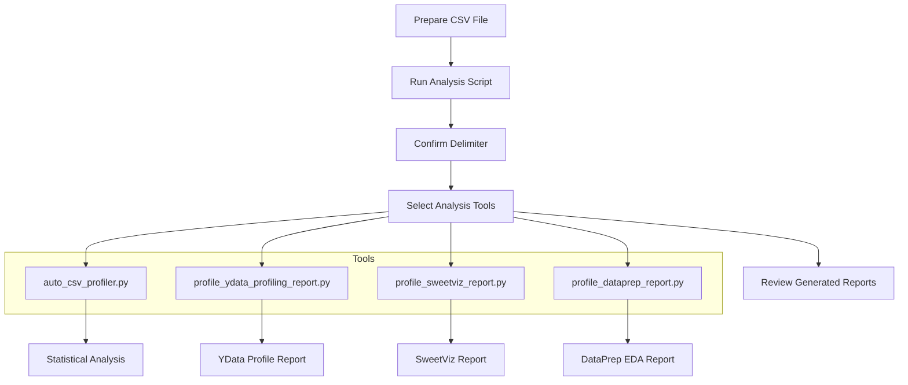

### Step 1: Prepare Your Data

Ensure your CSV file meets these requirements:
- Valid CSV format with consistent delimiters
- First row contains column headers
- File size under 500MB for better performance
- Accessible file path without special characters

### Step 2: Run the Analysis

Open Command Prompt in the project directory and execute:
```batch
run_analysis.bat
```

### Step 3: Provide CSV File Path

When prompted, enter the full path to your CSV file:
```
Enter the full path to the CSV file: C:\data\your_file.csv
```

### Step 4: Confirm Delimiter

The system will automatically detect the delimiter and ask for confirmation:
```
Enter the delimiter used in the CSV file (e.g., , or ;): ,
```

Common delimiters:
- `,` (comma) - Most common
- `;` (semicolon) - European standard
- `\t` (tab) - Tab-separated values

### Step 5: Select Analysis Tools

Choose which analysis tools to run:

```
+-------+------------------------+--------------------------------------+
| Index | Environment            | Python Script                        |
+-------+------------------------+--------------------------------------+
|   1   | csv-profiler-main      | auto_csv_profiler.py                 |
|   2   | csv-profiler-profiling | profile_ydata_profiling_report.py    |
|   3   | csv-profiler-profiling | profile_sweetviz_report.py           |
|   4   | csv-profiler-dataprep  | profile_dataprep_report.py           |
+-------+------------------------+--------------------------------------+
```

## Analysis Tools Overview

### Tool 1: Comprehensive Statistical Analysis

**Script**: `auto_csv_profiler.py`  
**Environment**: csv-profiler-main  
**Duration**: 5-15 minutes


**Outputs**:
- Comprehensive statistical summaries
- Missing value analysis and visualizations
- Outlier detection reports
- Box plots, histograms, and correlation matrices
- Data quality assessment

### Tool 2: YData Profiling Report

**Script**: `profile_ydata_profiling_report.py`  
**Environment**: csv-profiler-profiling  
**Duration**: 3-10 minutes

**Features**:
- Interactive HTML report
- Variable distributions and correlations
- Missing value patterns
- Sample data preview
- Data quality warnings

### Tool 3: SweetViz Report

**Script**: `profile_sweetviz_report.py`  
**Environment**: csv-profiler-profiling  
**Duration**: 2-8 minutes

**Features**:
- Visual data exploration
- Automated feature analysis
- Target variable analysis (if specified)
- Comparative analysis capabilities
- Clean, intuitive interface

### Tool 4: DataPrep EDA Report

**Script**: `profile_dataprep_report.py`  
**Environment**: csv-profiler-dataprep  
**Duration**: 3-12 minutes

**Features**:
- Comprehensive exploratory data analysis
- Advanced visualizations
- Data cleaning suggestions
- Distribution analysis
- Correlation insights

## Output Structure

After analysis completion, you'll find organized results in a directory named after your CSV file:

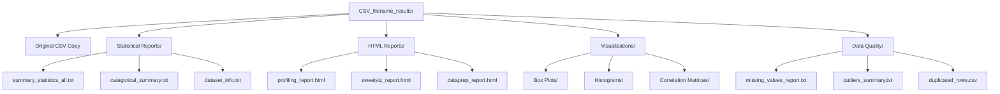

## Advanced Usage

### Running Individual Tools

You can run specific analysis tools directly:

```bash
# Activate the appropriate environment first
conda activate csv-profiler-main

# Run specific analysis
python src/auto_csv_profiler.py "path/to/file.csv" "output/directory/"
```

### Customizing Analysis

The analysis tool (`auto_csv_profiler.py`) provides interactive options:

1. **Missing Value Handling**
   - Convert specific values to NaN
   - Auto-imputation options
   - Missing value pattern analysis

2. **Outlier Analysis**
   - IQR-based detection
   - Statistical summaries
   - Visual identification

3. **Relationship Analysis**
   - Correlation analysis with target variables
   - Chi-square tests for categorical variables
   - Variance Inflation Factor (VIF) calculation

### Batch Processing

For multiple files, you can modify the batch script or create loops:

```batch
for %%f in (*.csv) do (
    echo Processing %%f
    run_analysis.bat "%%f"
)
```

## Analysis Workflow Details

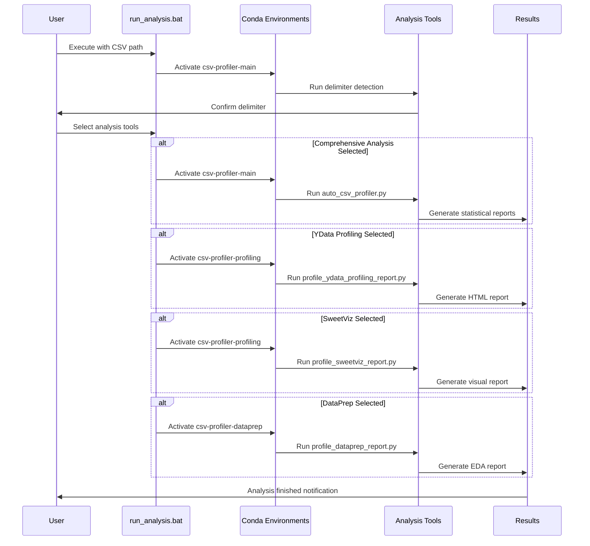

## Best Practices

### Data Preparation
- Clean obvious formatting issues before analysis
- Ensure consistent date formats
- Remove or flag known data quality issues
- Use descriptive column names

### Tool Selection
- **Start with comprehensive analysis** for overall data understanding
- **Use YData Profiling** for detailed variable analysis
- **Use SweetViz** for clean, presentation-ready reports
- **Use DataPrep** for advanced EDA and data preparation insights

### Performance Optimization
- Large files (>100MB): Consider sampling for initial analysis
- Complex datasets: Run tools individually to monitor memory usage
- Network drives: Copy files locally before analysis for better performance

## Interpreting Results

### Statistical Reports
- Review data quality metrics first
- Check for missing value patterns
- Identify outliers and their potential causes
- Analyze variable distributions and relationships

### HTML Reports
- Interactive exploration of data patterns
- Visual identification of data quality issues
- Quick identification of interesting variables
- Export key insights for stakeholders

## Next Steps

After completing your analysis:
1. Review all generated reports
2. Identify data quality issues
3. Plan data cleaning or preprocessing steps
4. Share HTML reports with stakeholders
5. Use insights for further analysis or modeling

For troubleshooting common issues, see the [troubleshooting guide](troubleshooting.md).

---

# Troubleshooting

# Troubleshooting Guide

This guide helps resolve common issues encountered when using autocsv-profiler-suite.

## Environment Issues

### Problem: Conda Not Found

**Error Message**:
```
'conda' is not recognized as an internal or external command
```

**Solution**:
1. Ensure Anaconda/Miniconda is installed
2. Add conda to your PATH environment variable
3. Restart Command Prompt
4. Try using Anaconda Prompt instead

**Alternative**: Run from Anaconda Prompt:
```bash
# Navigate to project directory in Anaconda Prompt
cd C:\path\to\autocsv-profiler-suite
.\scripts\setup_environments.ps1
```

### Problem: Environment Creation Fails

**Error Messages**:
- `CondaHTTPError: HTTP 000 CONNECTION FAILED`
- `PackagesNotFoundError`
- `ResolvePackageNotFound`

**Solutions**:

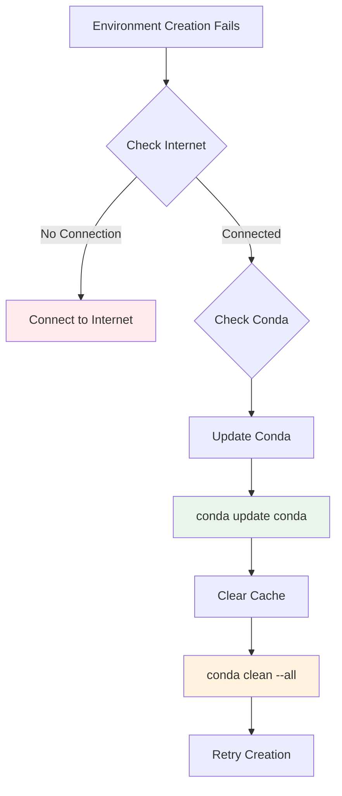

**Step-by-step resolution**:
1. Update conda:
   ```bash
   conda update conda
   ```

2. Clear conda cache:
   ```bash
   conda clean --all
   ```

3. Try creating environments individually:
   ```bash
   conda env create -f environments/environment-main.yml
   ```

4. If specific packages fail, try without version constraints:
   ```bash
   conda install pandas numpy matplotlib
   ```

### Problem: PowerShell Execution Policy

**Error Message**:
```
cannot be loaded because running scripts is disabled on this system
```

**Solution**:
```powershell
Set-ExecutionPolicy -ExecutionPolicy RemoteSigned -Scope CurrentUser
```

**Verification**:
```powershell
Get-ExecutionPolicy -Scope CurrentUser
```
Should return: `RemoteSigned`

## File and Path Issues

### Problem: CSV File Not Found

**Error Message**:
```
Error: CSV file not found at "path"
```

**Solutions**:
1. **Check file path**: Ensure the path is correct and accessible
2. **Use quotes**: Wrap paths with spaces in quotes
   ```
   "C:\Users\Name\Documents\data file.csv"
   ```
3. **Check permissions**: Ensure you have read access to the file
4. **Copy file locally**: Move CSV to project directory to avoid path issues

### Problem: Invalid Delimiter Detection

**Symptoms**:
- Incorrect column parsing
- All data in single column
- Delimiter detection fails

**Solutions**:

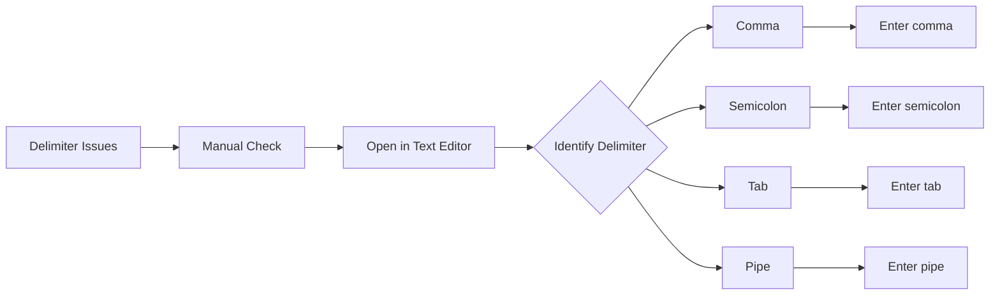

**Manual delimiter identification**:
1. Open CSV in Notepad or text editor
2. Look at the first few lines
3. Identify the character separating columns
4. Enter the correct delimiter when prompted

**Common delimiters**:
- `,` (comma) - Standard CSV
- `;` (semicolon) - European CSV
- `\t` (tab) - Tab-separated values
- `|` (pipe) - Alternative separator

## Memory and Performance Issues

### Problem: Out of Memory Errors

**Error Messages**:
- `MemoryError`
- `killed` (process terminated)
- System becomes unresponsive

**Solutions**:

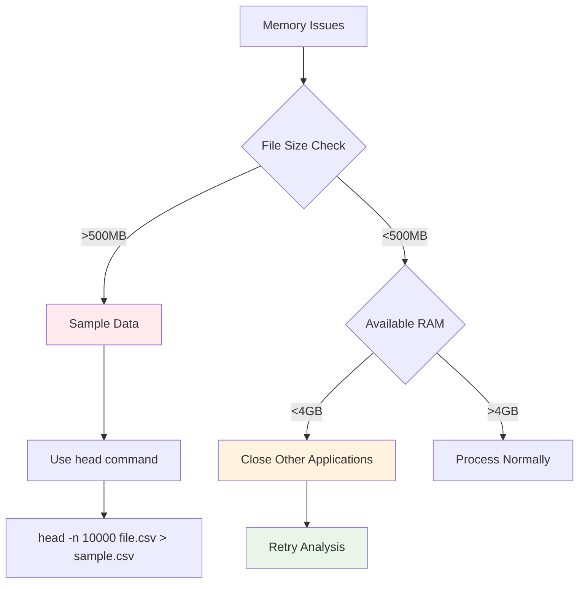

**Immediate solutions**:
1. **Close unnecessary applications**
2. **Sample large files**:
   ```bash
   # Create smaller sample file
   head -n 5000 large_file.csv > sample_file.csv
   ```
3. **Run tools individually** instead of all at once
4. **Increase virtual memory** in Windows settings

### Problem: Analysis Takes Too Long

**Symptoms**:
- Process runs for hours
- No progress indicators
- System becomes slow

**Solutions**:
1. **Check file size**: Large files naturally take longer
2. **Monitor resource usage**: Use Task Manager to check CPU/Memory
3. **Run subset analysis**: Start with smaller portions of data
4. **Skip complex tools**: Start with basic analysis only

## Analysis Tool Specific Issues

### Problem: YData Profiling Fails

**Error Messages**:
- `ImportError: cannot import name`
- `AttributeError: module has no attribute`

**Solutions**:
1. **Update environment**:
   ```bash
   conda activate csv-profiler-profiling
   conda update --all
   ```

2. **Reinstall ydata-profiling**:
   ```bash
   pip uninstall ydata-profiling
   pip install ydata-profiling
   ```

### Problem: SweetViz Report Generation Fails

**Common issues**:
- Missing dependencies
- Incompatible pandas version
- Large categorical variables

**Solutions**:
1. **Check pandas version compatibility**:
   ```bash
   conda activate csv-profiler-profiling
   conda list pandas
   ```

2. **Reduce categorical complexity**:
   - Limit categories with high cardinality
   - Sample data before analysis

### Problem: DataPrep Analysis Errors

**Error Types**:
- Package conflicts
- Visualization failures
- Bokeh server issues

**Solutions**:
1. **Update DataPrep environment**:
   ```bash
   conda activate csv-profiler-dataprep
   conda env update -f environments/environment-dataprep.yml --prune
   ```

2. **Clear browser cache** if HTML reports don't display correctly

## Output and Report Issues

### Problem: HTML Reports Won't Open

**Symptoms**:
- Blank pages in browser
- File not found errors
- JavaScript errors

**Solutions**:

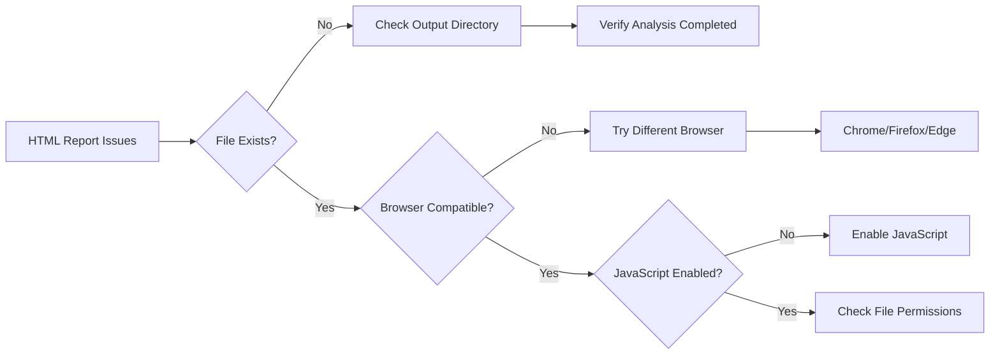

**Step-by-step resolution**:
1. **Verify file existence**: Check if HTML files were created
2. **Try different browser**: Chrome, Firefox, or Edge
3. **Check file permissions**: Ensure read access
4. **Disable ad blockers**: They may block report content
5. **Enable JavaScript**: Required for interactive features

### Problem: Missing Visualizations

**Symptoms**:
- Empty plot areas
- "Image not found" errors
- Incomplete reports

**Solutions**:
1. **Check disk space**: Ensure sufficient space for image files
2. **Verify write permissions**: Ensure output directory is writable
3. **Re-run specific analysis**: Focus on failed components
4. **Check error logs**: Review console output for specific errors

## Data-Specific Issues

### Problem: All Columns Detected as Text

**Causes**:
- Incorrect delimiter
- Mixed data types in columns
- Special characters in numeric data

**Solutions**:
1. **Verify delimiter**: Ensure correct separator is used
2. **Clean data**: Remove non-numeric characters from number columns
3. **Check encoding**: Ensure proper character encoding (UTF-8)

### Problem: Missing Value Issues

**Symptoms**:
- Incorrect missing value counts
- Values not recognized as missing
- Imputation failures

**Solutions**:
1. **Specify missing value markers**: Use the interactive prompt to define custom missing values
2. **Common missing indicators**: "", "NA", "NULL", "N/A", "-"
3. **Review source data**: Check for non-standard missing value representations

## Getting Help

### Before Reporting Issues

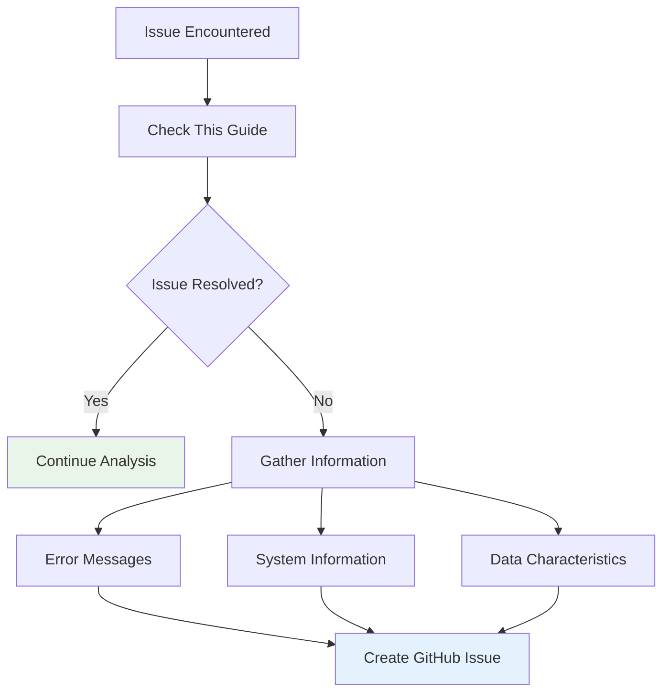

**Information to gather**:
1. **Error messages**: Copy exact error text
2. **System information**: Windows version, RAM, disk space
3. **Data characteristics**: File size, number of columns, data types
4. **Steps to reproduce**: Exact sequence that caused the issue

### Creating Effective Issue Reports

Include the following in your GitHub issue:
1. **Clear title**: Describe the problem briefly
2. **Environment details**: OS, conda version, environment name
3. **Expected behavior**: What should happen
4. **Actual behavior**: What actually happens
5. **Error logs**: Paste relevant error messages
6. **Data sample**: Provide small example if possible (anonymized)

### Community Resources

- **GitHub Issues**: [Report bugs and request features](https://github.com/dhaneshbb/autocsv-profiler-suite/issues)
- **Documentation**: Refer to installation and usage guides
- **Changelog**: Check recent changes for known issues

### Emergency Workarounds

If you need immediate results:
1. **Use individual tools**: Run analysis scripts separately
2. **Simplify data**: Work with smaller datasets first
3. **Manual analysis**: Use pandas directly for basic statistics
4. **Alternative tools**: Consider other EDA libraries as backup

Remember: Most issues are environment-related and can be resolved by recreating the conda environments or updating packages.

---

# Installation

# Installation Guide - Source Distribution

This guide covers the complete installation process for autocsv-profiler-suite on Windows systems.

This comprehensive toolkit uses three specialized conda environments to provide the complete suite of analysis tools with maximum compatibility and functionality.

## Prerequisites

### System Requirements
- Windows 10 or later
- PowerShell 5.1 or later
- At least 4GB RAM
- 3GB free disk space for environments
- Internet connection for package downloads

### Required Software

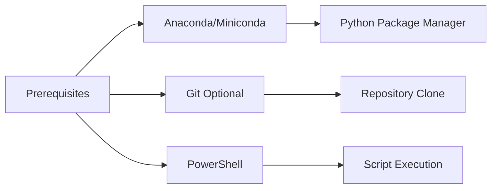

## Step 1: Install Anaconda or Miniconda

### Option 1: Miniconda (Recommended)
1. Download Miniconda from [https://docs.conda.io/en/latest/miniconda.html](https://docs.conda.io/en/latest/miniconda.html)
2. Run the installer and follow the setup wizard
3. Select "Add Anaconda to my PATH environment variable" during installation
4. Restart your command prompt after installation

### Option 2: Anaconda
1. Download Anaconda from [https://www.anaconda.com/products/distribution](https://www.anaconda.com/products/distribution)
2. Run the installer with default settings
3. Restart your command prompt after installation

### Verify Installation
Open Command Prompt and run:
```bash
conda --version
```

You should see output similar to:
```
conda 25.5.1
```

## Step 2: Download autocsv-profiler-suite

### Option 1: Git Clone (Recommended)
```bash
git clone https://github.com/dhaneshbb/autocsv-profiler-suite.git
cd autocsv-profiler-suite
```

### Option 2: Download ZIP
1. Go to [https://github.com/dhaneshbb/autocsv-profiler-suite](https://github.com/dhaneshbb/autocsv-profiler-suite)
2. Click "Code" → "Download ZIP"
3. Extract the ZIP file to your desired location
4. Open Command Prompt in the extracted folder

## Step 3: Set Up Conda Environments

### Automatic Setup
Navigate to the project directory and run:
```powershell
.\scripts\setup_environments.ps1
```

This will:
- Check conda availability
- Display environment status
- Allow interactive installation of all environments

### Manual Setup (Alternative)
If you prefer manual setup, run these commands:

```bash
# Main analysis environment
conda env create -f environments/environment-main.yml

# Profiling environment
conda env create -f environments/environment-profiling.yml

# DataPrep environment
conda env create -f environments/environment-dataprep.yml
```

## Step 4: Verify Installation

### Check Environment Status
Run the environment manager:
```powershell
.\scripts\setup_environments.ps1
```

You should see all three environments marked as "Installed":
```
Environment Status:
1. csv-profiler-main - ✓ Installed
2. csv-profiler-profiling - ✓ Installed
3. csv-profiler-dataprep - ✓ Installed
```

### Test Analysis Script
Run a quick test:
```batch
run_analysis.bat
```

Enter a sample CSV file path when prompted. The script should:
- Detect the delimiter successfully
- Activate environments without errors
- Present the analysis tool selection menu

## Installation Flow

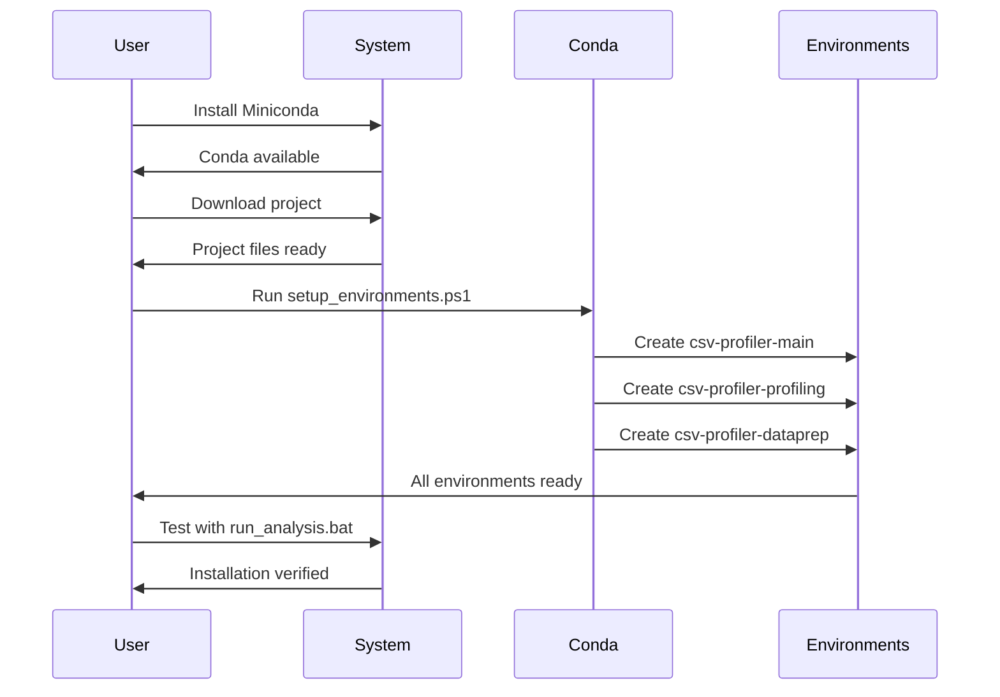

## Troubleshooting

### Common Issues

**Conda not recognized**
- Ensure Anaconda/Miniconda is in your PATH
- Restart your command prompt
- Try running from Anaconda Prompt

**PowerShell execution policy**
```powershell
Set-ExecutionPolicy -ExecutionPolicy RemoteSigned -Scope CurrentUser
```

**Environment creation fails**
- Check internet connection
- Update conda: `conda update conda`
- Clear conda cache: `conda clean --all`

**Disk space issues**
- Each environment requires approximately 1GB
- Ensure at least 3GB free space before installation

### Getting Help

If you encounter issues:
1. Check the [troubleshooting guide](troubleshooting.md)
2. Review error messages in the console output
3. Create an issue on [GitHub](https://github.com/dhaneshbb/autocsv-profiler-suite/issues)

## Next Steps

After successful installation:
1. Read the [usage guide](usage.md)
2. Try the analysis with your own CSV files
3. Explore the different profiling tools available

Your autocsv-profiler-suite is now ready for use!

---

# Environments

# Environment Management

autocsv-profiler-suite uses three specialized conda environments to ensure compatibility and optimal performance across different analysis tools.

## Environment Architecture

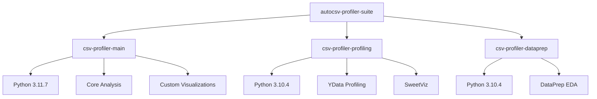

## Environment Details

### csv-profiler-main

**Purpose**: Core statistical analysis and custom visualizations

**Python Version**: 3.11.7

**Key Packages**:
- `pandas>=1.5.0` - Data manipulation and analysis
- `numpy>=1.24.0` - Numerical computing
- `scipy>=1.10.0` - Scientific computing
- `matplotlib>=3.6.0` - Static plotting
- `seaborn>=0.12.0` - Statistical visualization
- `scikit-learn>=1.2.0` - Machine learning utilities
- `statsmodels>=0.13.0` - Statistical modeling
- `tqdm>=4.64.0` - Progress bars
- `tableone>=0.7.12` - Descriptive statistics
- `missingno>=0.5.2` - Missing value visualization
- `tabulate>=0.9.0` - Table formatting

**Use Cases**:
- Comprehensive statistical analysis
- Custom visualization generation
- Outlier detection and analysis
- Correlation and relationship testing
- Missing value analysis and imputation

### csv-profiler-profiling

**Purpose**: Automated profiling reports with specialized tools

**Python Version**: 3.10.4

**Key Packages**:
- `pandas>=1.4.0,<2.0.0` - Data manipulation (version constrained)
- `numpy>=1.21.0,<1.25.0` - Numerical computing (version constrained)
- `matplotlib>=3.5.0,<3.7.0` - Plotting (version constrained)
- `ydata-profiling>=4.0.0` - Comprehensive data profiling
- `sweetviz>=2.1.4` - Visual data analysis

**Use Cases**:
- Generate comprehensive HTML profiling reports
- Automated data quality assessment
- Interactive visualizations
- Comparative analysis between datasets
- Quick overview of data characteristics

### csv-profiler-dataprep

**Purpose**: Fast EDA with DataPrep library

**Python Version**: 3.10.4

**Key Packages**:
- `pandas>=1.4.0,<2.0.0` - Data manipulation (version constrained)
- `numpy>=1.21.0,<1.25.0` - Numerical computing (version constrained)
- `dataprep>=0.4.5` - Fast EDA and data preparation

**Use Cases**:
- Rapid exploratory data analysis
- Data quality assessment
- Interactive plotting capabilities
- Large dataset handling
- Feature relationship analysis

## Environment Management Commands

### Using the Interactive Manager

```powershell
.\scripts\setup_environments.ps1
```

**Menu Options**:
1. Install All - Create all three environments
2. Update All - Update existing environments
3. Remove All - Delete all environments
4. Install Single - Create specific environment
5. Remove Single - Delete specific environment

### Manual Commands

**List all environments**:
```cmd
conda env list
```

**Create specific environment**:
```cmd
conda env create -f environments/environment-main.yml
```

**Update environment**:
```cmd
conda env update -f environments/environment-main.yml --prune
```

**Remove environment**:
```cmd
conda env remove -n csv-profiler-main
```

**Activate environment**:
```cmd
conda activate csv-profiler-main
```

**Deactivate environment**:
```cmd
conda deactivate
```

## Version Constraints Explained

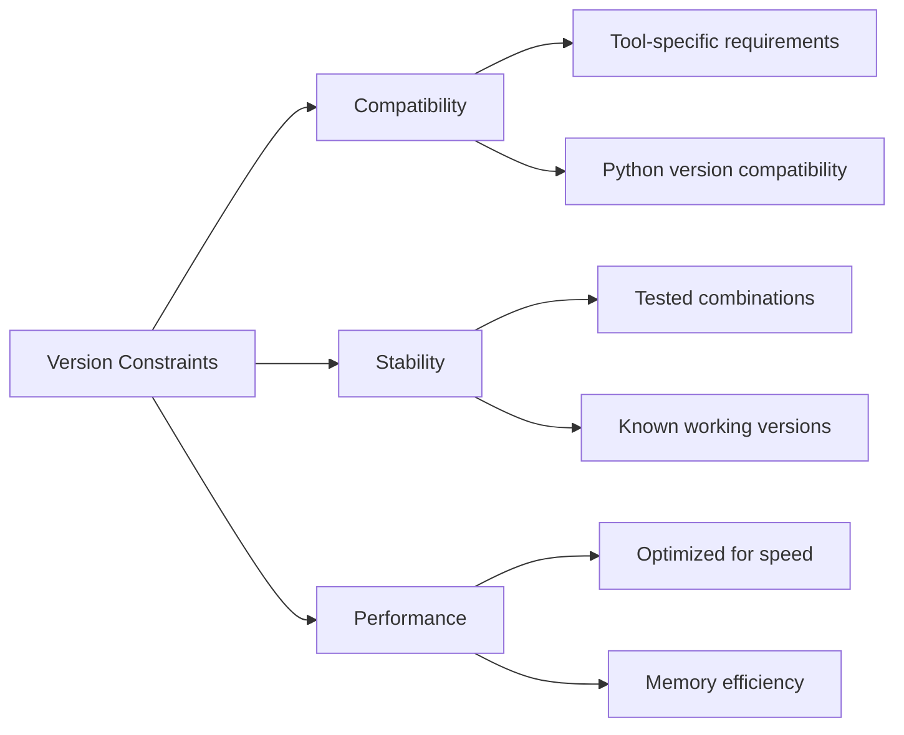

### Why Different Python Versions?

**Python 3.11.7 (Main Environment)**:
- Latest stable version with performance improvements
- Better error messages and debugging
- Enhanced typing support
- Optimal for custom analysis code

**Python 3.10.4 (Profiling & DataPrep)**:
- Required for compatibility with profiling tools
- Stable version with proven compatibility
- Reduces dependency conflicts
- Ensures consistent behavior across tools

### Package Version Constraints

**Strict Versioning for Profiling Tools**:
- Ensures compatibility between ydata-profiling and dependencies
- Prevents breaking changes in report generation
- Maintains consistent output formats

**Flexible Versioning for Main Environment**:
- Allows for latest features and bug fixes
- Better performance with newer versions
- More flexibility for custom analysis

## Environment Isolation Benefits

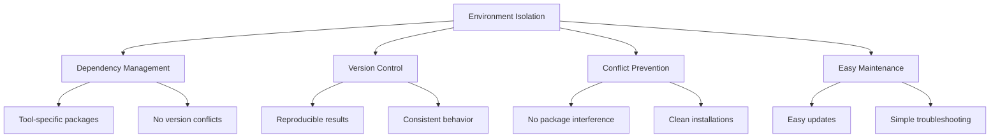

**Benefits**:
1. **No package conflicts** between different tools
2. **Reproducible results** with fixed versions
3. **Easy maintenance** - update one environment without affecting others
4. **Clean separation** of concerns
5. **Faster troubleshooting** when issues arise

## Best Practices

### Environment Usage
1. **Always activate** the correct environment before running scripts
2. **Deactivate environments** when switching between tools
3. **Check environment status** before starting analysis
4. **Update environments regularly** for security and performance

### Maintenance
1. **Regular updates** using the environment manager
2. **Clean unused packages** with `conda clean --all`
3. **Monitor disk space** as environments can be large
4. **Backup environment configurations** before major changes

### Troubleshooting
1. **Check environment activation** if imports fail
2. **Verify package versions** if unexpected behavior occurs
3. **Recreate environments** if corruption is suspected
4. **Use fresh environments** for testing new features

## Storage Requirements

**Typical Environment Sizes**:
- csv-profiler-main: ~1.5GB
- csv-profiler-profiling: ~1.2GB  
- csv-profiler-dataprep: ~800MB

**Total Space Required**: ~3.5GB for all environments

**Additional Space**:
- Conda cache: ~500MB
- Temporary files during installation: ~1GB
- **Recommended free space**: 6GB minimum

## Advanced Configuration

### Adding Custom Packages

Add packages to specific environments:

```cmd
conda activate csv-profiler-main
conda install plotly  # Interactive plotting
pip install custom-package
```

### Exporting Environment

Create shareable environment file:

```cmd
conda activate csv-profiler-main
conda env export > my-environment.yml
```

### Environment Cloning

Create backup of environment:

```cmd
conda create --name csv-profiler-main-backup --clone csv-profiler-main
```

This environment management system ensures reliable, reproducible, and efficient data analysis workflows.

---

## License & Disclaimers

**Software License:** MIT License - Copyright (c) 2025 dhaneshbb

**Important Disclaimers:**
- This software is provided "AS IS" without warranty of any kind
- Users are responsible for installing and maintaining conda environments
- Users must ensure license compliance of all installed dependencies
- Data accuracy and analysis interpretation are user responsibilities
- The software does not guarantee data security or backup

**Third-Party Dependencies:** This project references but does not distribute third-party libraries. Users installing conda environments accept responsibility for compliance with all dependency licenses, which may include GPL, LGPL, BSD, MIT, and other terms.

For complete licensing information, see the [LICENSE](../LICENSE) and [NOTICE](../NOTICE) files in the project root.

---


