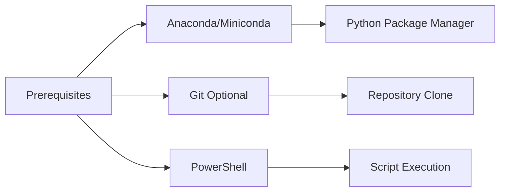
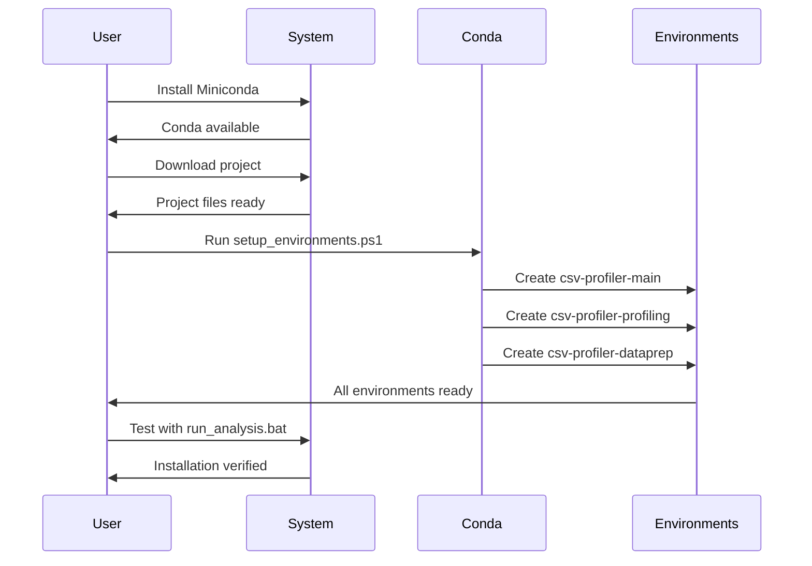

# Installation Guide - Source Distribution

This guide covers the complete installation process for AutoCSV Profiler Suite **source distribution** on Windows systems. 

> **Note**: For the simplified PyPI package, use: `pip install autocsv-profiler`  
> This guide is for users who want the full multi-environment setup with all profiling tools.

## Distribution Comparison

| Method | Installation | Features |
|--------|-------------|----------|
| **PyPI Package** | `pip install autocsv-profiler` | Core analysis, single environment |
| **Source Distribution** | Download + conda setup | Full suite, multiple tools, three environments |

**Continue with this guide for Source Distribution setup.**

## Prerequisites

### System Requirements
- Windows 10 or later
- PowerShell 5.1 or later
- At least 4GB RAM
- 3GB free disk space for environments
- Internet connection for package downloads

### Required Software



## Step 1: Install Anaconda or Miniconda

### Option 1: Miniconda (Recommended)
1. Download Miniconda from [https://docs.conda.io/en/latest/miniconda.html](https://docs.conda.io/en/latest/miniconda.html)
2. Run the installer and follow the setup wizard
3. Select "Add Anaconda to my PATH environment variable" during installation
4. Restart your command prompt after installation

### Option 2: Anaconda
1. Download Anaconda from [https://www.anaconda.com/products/distribution](https://www.anaconda.com/products/distribution)
2. Run the installer with default settings
3. Restart your command prompt after installation

### Verify Installation
Open Command Prompt and run:
```bash
conda --version
```

You should see output similar to:
```
conda 25.5.1
```

## Step 2: Download AutoCSV Profiler Suite

### Option 1: Git Clone (Recommended)
```bash
git clone https://github.com/dhaneshbb/AutoCSV-Profiler-Suite.git
cd AutoCSV-Profiler-Suite
```

### Option 2: Download ZIP
1. Go to [https://github.com/dhaneshbb/AutoCSV-Profiler-Suite](https://github.com/dhaneshbb/AutoCSV-Profiler-Suite)
2. Click "Code" → "Download ZIP"
3. Extract the ZIP file to your desired location
4. Open Command Prompt in the extracted folder

## Step 3: Set Up Conda Environments

### Automatic Setup
Navigate to the project directory and run:
```powershell
.\scripts\setup_environments.ps1
```

This will:
- Check conda availability
- Display environment status
- Allow interactive installation of all environments

### Manual Setup (Alternative)
If you prefer manual setup, run these commands:

```bash
# Main analysis environment
conda env create -f environments/environment-main.yml

# Profiling environment
conda env create -f environments/environment-profiling.yml

# DataPrep environment
conda env create -f environments/environment-dataprep.yml
```

## Step 4: Verify Installation

### Check Environment Status
Run the environment manager:
```powershell
.\scripts\setup_environments.ps1
```

You should see all three environments marked as "Installed":
```
Environment Status:
1. csv-profiler-main - ✓ Installed
2. csv-profiler-profiling - ✓ Installed
3. csv-profiler-dataprep - ✓ Installed
```

### Test Analysis Script
Run a quick test:
```batch
run_analysis.bat
```

Enter a sample CSV file path when prompted. The script should:
- Detect the delimiter successfully
- Activate environments without errors
- Present the analysis tool selection menu

## Installation Flow



## Troubleshooting

### Common Issues

**Conda not recognized**
- Ensure Anaconda/Miniconda is in your PATH
- Restart your command prompt
- Try running from Anaconda Prompt

**PowerShell execution policy**
```powershell
Set-ExecutionPolicy -ExecutionPolicy RemoteSigned -Scope CurrentUser
```

**Environment creation fails**
- Check internet connection
- Update conda: `conda update conda`
- Clear conda cache: `conda clean --all`

**Disk space issues**
- Each environment requires approximately 1GB
- Ensure at least 3GB free space before installation

### Getting Help

If you encounter issues:
1. Check the [troubleshooting guide](troubleshooting.md)
2. Review error messages in the console output
3. Create an issue on [GitHub](https://github.com/dhaneshbb/AutoCSV-Profiler-Suite/issues)

## Next Steps

After successful installation:
1. Read the [usage guide](usage.md)
2. Try the analysis with your own CSV files
3. Explore the different profiling tools available

Your AutoCSV Profiler Suite is now ready for use!