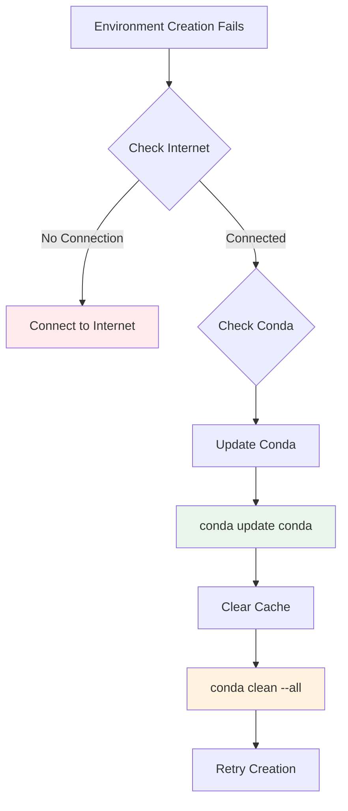
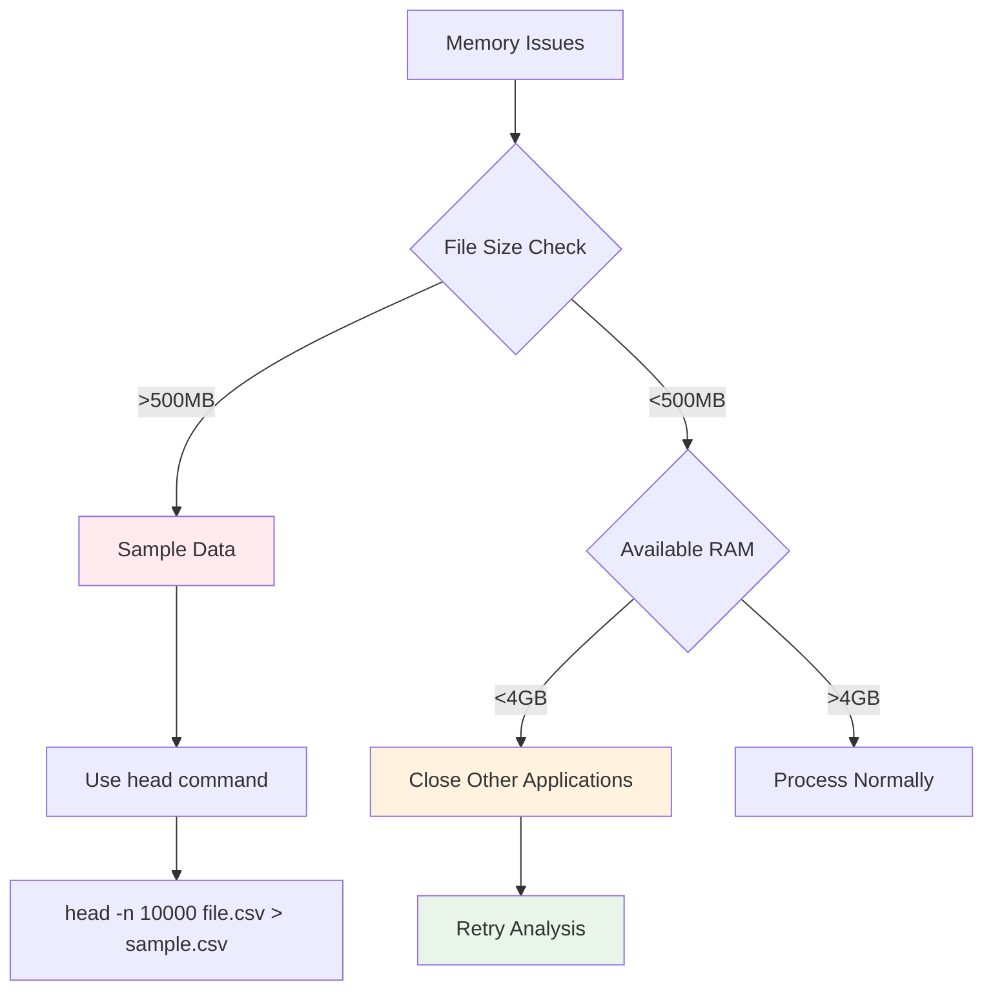
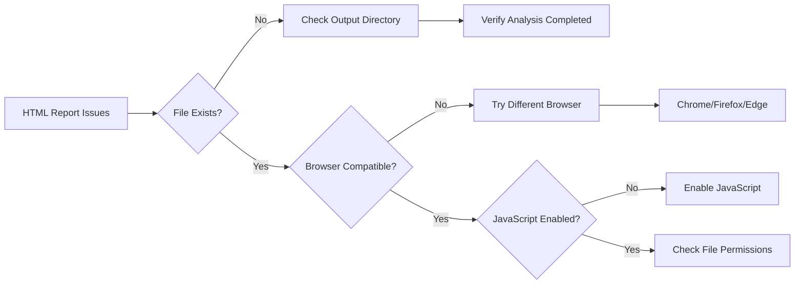
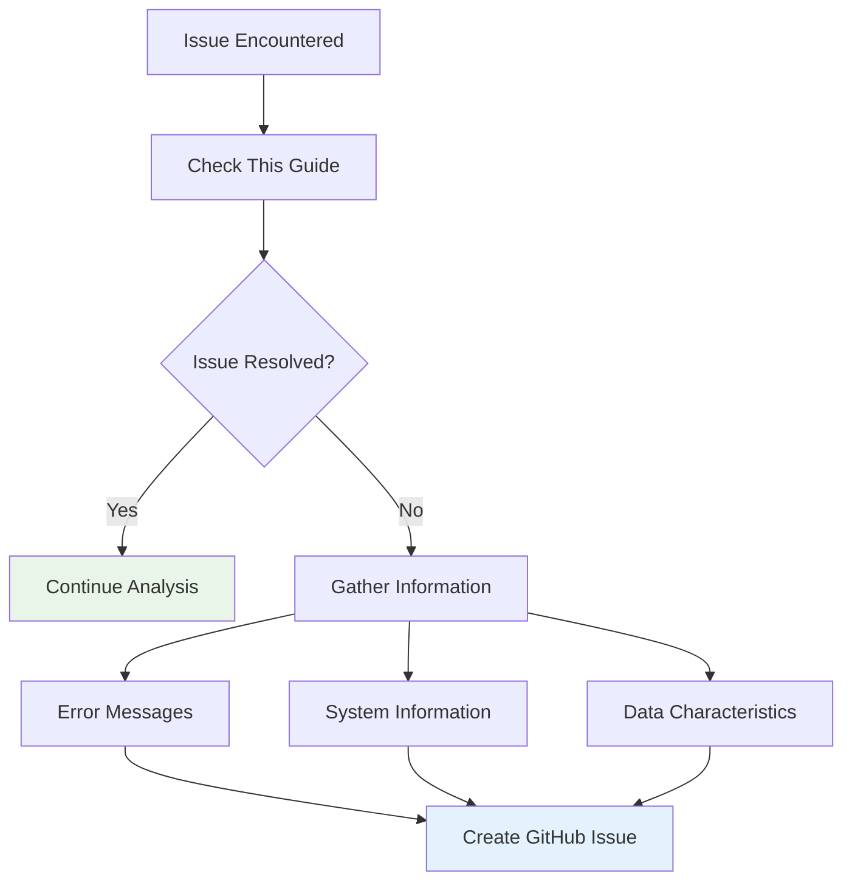

# Troubleshooting Guide

This guide helps resolve common issues encountered when using AutoCSV Profiler Suite.

## Environment Issues

### Problem: Conda Not Found

**Error Message**:
```
'conda' is not recognized as an internal or external command
```

**Solution**:
1. Ensure Anaconda/Miniconda is installed
2. Add conda to your PATH environment variable
3. Restart Command Prompt
4. Try using Anaconda Prompt instead

**Alternative**: Run from Anaconda Prompt:
```bash
# Navigate to project directory in Anaconda Prompt
cd C:\path\to\AutoCSV-Profiler-Suite
.\scripts\setup_environments.ps1
```

### Problem: Environment Creation Fails

**Error Messages**:
- `CondaHTTPError: HTTP 000 CONNECTION FAILED`
- `PackagesNotFoundError`
- `ResolvePackageNotFound`

**Solutions**:



**Step-by-step resolution**:
1. Update conda:
   ```bash
   conda update conda
   ```

2. Clear conda cache:
   ```bash
   conda clean --all
   ```

3. Try creating environments individually:
   ```bash
   conda env create -f environments/environment-main.yml
   ```

4. If specific packages fail, try without version constraints:
   ```bash
   conda install pandas numpy matplotlib
   ```

### Problem: PowerShell Execution Policy

**Error Message**:
```
cannot be loaded because running scripts is disabled on this system
```

**Solution**:
```powershell
Set-ExecutionPolicy -ExecutionPolicy RemoteSigned -Scope CurrentUser
```

**Verification**:
```powershell
Get-ExecutionPolicy -Scope CurrentUser
```
Should return: `RemoteSigned`

## File and Path Issues

### Problem: CSV File Not Found

**Error Message**:
```
Error: CSV file not found at "path"
```

**Solutions**:
1. **Check file path**: Ensure the path is correct and accessible
2. **Use quotes**: Wrap paths with spaces in quotes
   ```
   "C:\Users\Name\Documents\data file.csv"
   ```
3. **Check permissions**: Ensure you have read access to the file
4. **Copy file locally**: Move CSV to project directory to avoid path issues

### Problem: Invalid Delimiter Detection

**Symptoms**:
- Incorrect column parsing
- All data in single column
- Delimiter detection fails

**Solutions**:

```mermaid
graph LR
    A[Delimiter Issues] --> B[Manual Check]
    B --> C[Open in Text Editor]
    C --> D{Identify Delimiter}
    
    D --> E[Comma ,]
    D --> F[Semicolon ;]
    D --> G[Tab \t]
    D --> H[Pipe |]
    
    E --> I[Enter: ,]
    F --> I[Enter: ;]
    G --> I[Enter: \t]
    H --> I[Enter: |]
```

**Manual delimiter identification**:
1. Open CSV in Notepad or text editor
2. Look at the first few lines
3. Identify the character separating columns
4. Enter the correct delimiter when prompted

**Common delimiters**:
- `,` (comma) - Standard CSV
- `;` (semicolon) - European CSV
- `\t` (tab) - Tab-separated values
- `|` (pipe) - Alternative separator

## Memory and Performance Issues

### Problem: Out of Memory Errors

**Error Messages**:
- `MemoryError`
- `killed` (process terminated)
- System becomes unresponsive

**Solutions**:



**Immediate solutions**:
1. **Close unnecessary applications**
2. **Sample large files**:
   ```bash
   # Create smaller sample file
   head -n 5000 large_file.csv > sample_file.csv
   ```
3. **Run tools individually** instead of all at once
4. **Increase virtual memory** in Windows settings

### Problem: Analysis Takes Too Long

**Symptoms**:
- Process runs for hours
- No progress indicators
- System becomes slow

**Solutions**:
1. **Check file size**: Large files naturally take longer
2. **Monitor resource usage**: Use Task Manager to check CPU/Memory
3. **Run subset analysis**: Start with smaller portions of data
4. **Skip complex tools**: Start with basic analysis only

## Analysis Tool Specific Issues

### Problem: YData Profiling Fails

**Error Messages**:
- `ImportError: cannot import name`
- `AttributeError: module has no attribute`

**Solutions**:
1. **Update environment**:
   ```bash
   conda activate csv-profiler-profiling
   conda update --all
   ```

2. **Reinstall ydata-profiling**:
   ```bash
   pip uninstall ydata-profiling
   pip install ydata-profiling
   ```

### Problem: SweetViz Report Generation Fails

**Common issues**:
- Missing dependencies
- Incompatible pandas version
- Large categorical variables

**Solutions**:
1. **Check pandas version compatibility**:
   ```bash
   conda activate csv-profiler-profiling
   conda list pandas
   ```

2. **Reduce categorical complexity**:
   - Limit categories with high cardinality
   - Sample data before analysis

### Problem: DataPrep Analysis Errors

**Error Types**:
- Package conflicts
- Visualization failures
- Bokeh server issues

**Solutions**:
1. **Update DataPrep environment**:
   ```bash
   conda activate csv-profiler-dataprep
   conda env update -f environments/environment-dataprep.yml --prune
   ```

2. **Clear browser cache** if HTML reports don't display correctly

## Output and Report Issues

### Problem: HTML Reports Won't Open

**Symptoms**:
- Blank pages in browser
- File not found errors
- JavaScript errors

**Solutions**:



**Step-by-step resolution**:
1. **Verify file existence**: Check if HTML files were created
2. **Try different browser**: Chrome, Firefox, or Edge
3. **Check file permissions**: Ensure read access
4. **Disable ad blockers**: They may block report content
5. **Enable JavaScript**: Required for interactive features

### Problem: Missing Visualizations

**Symptoms**:
- Empty plot areas
- "Image not found" errors
- Incomplete reports

**Solutions**:
1. **Check disk space**: Ensure sufficient space for image files
2. **Verify write permissions**: Ensure output directory is writable
3. **Re-run specific analysis**: Focus on failed components
4. **Check error logs**: Review console output for specific errors

## Data-Specific Issues

### Problem: All Columns Detected as Text

**Causes**:
- Incorrect delimiter
- Mixed data types in columns
- Special characters in numeric data

**Solutions**:
1. **Verify delimiter**: Ensure correct separator is used
2. **Clean data**: Remove non-numeric characters from number columns
3. **Check encoding**: Ensure proper character encoding (UTF-8)

### Problem: Missing Value Issues

**Symptoms**:
- Incorrect missing value counts
- Values not recognized as missing
- Imputation failures

**Solutions**:
1. **Specify missing value markers**: Use the interactive prompt to define custom missing values
2. **Common missing indicators**: "", "NA", "NULL", "N/A", "-"
3. **Review source data**: Check for non-standard missing value representations

## Getting Help

### Before Reporting Issues



**Information to gather**:
1. **Error messages**: Copy exact error text
2. **System information**: Windows version, RAM, disk space
3. **Data characteristics**: File size, number of columns, data types
4. **Steps to reproduce**: Exact sequence that caused the issue

### Creating Effective Issue Reports

Include the following in your GitHub issue:
1. **Clear title**: Describe the problem briefly
2. **Environment details**: OS, conda version, environment name
3. **Expected behavior**: What should happen
4. **Actual behavior**: What actually happens
5. **Error logs**: Paste relevant error messages
6. **Data sample**: Provide small example if possible (anonymized)

### Community Resources

- **GitHub Issues**: [Report bugs and request features](https://github.com/dhaneshbb/AutoCSV-Profiler-Suite/issues)
- **Documentation**: Refer to installation and usage guides
- **Changelog**: Check recent changes for known issues

### Emergency Workarounds

If you need immediate results:
1. **Use individual tools**: Run analysis scripts separately
2. **Simplify data**: Work with smaller datasets first
3. **Manual analysis**: Use pandas directly for basic statistics
4. **Alternative tools**: Consider other EDA libraries as backup

Remember: Most issues are environment-related and can be resolved by recreating the conda environments or updating packages.