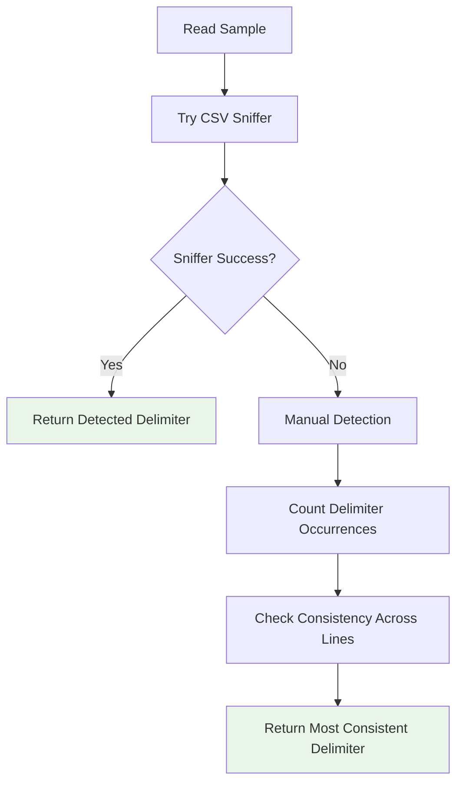

# API Reference

This document provides detailed information about the AutoCSV Profiler Python API.

## Package Overview

```python
import autocsv_profiler

# Main analysis function
from autocsv_profiler import analyze_csv

# Delimiter detection
from autocsv_profiler import detect_delimiter

# Version information
print(autocsv_profiler.__version__)
```

## Core Functions

### analyze_csv()

Main function for comprehensive CSV data analysis.

#### Signature
```python
def analyze_csv(csv_path: str, output_dir: str) -> None
```

#### Parameters
- **csv_path** (`str`): Path to the CSV file to analyze
- **output_dir** (`str`): Directory where analysis results will be saved

#### Returns
- `None`: Results are saved to the specified output directory

#### Raises
- `FileNotFoundError`: If the CSV file doesn't exist
- `ValueError`: If the CSV file cannot be parsed
- `PermissionError`: If unable to write to output directory
- `MemoryError`: If the dataset is too large for available memory

#### Example Usage
```python
from autocsv_profiler import analyze_csv

# Basic usage
analyze_csv("data.csv", "analysis_output")

# With error handling
try:
    analyze_csv("large_dataset.csv", "results")
    print("Analysis completed successfully")
except FileNotFoundError:
    print("CSV file not found")
except MemoryError:
    print("Dataset too large - consider sampling")
```

#### Generated Outputs
The function creates the following files in the output directory:

**Text Reports:**
- `dataset_info.txt` - Basic dataset information
- `summary_statistics_all.txt` - Comprehensive statistics
- `categorical_summary.txt` - Categorical variable analysis
- `missing_values_report.txt` - Missing data analysis
- `outliers_summary.txt` - Outlier detection results

**Interactive Reports:**
- `distinct_values_count_by_dtype.html` - Interactive value explorer

**Visualizations:**
- `visualization/box_plots/` - Box plot visualizations
- `visualization/histograms/` - Distribution histograms
- `visualization/correlation_matrices/` - Correlation heatmaps

### detect_delimiter()

Automatic delimiter detection for CSV files.

#### Signature
```python
def detect_delimiter(csv_file: str) -> str
```

#### Parameters
- **csv_file** (`str`): Path to the CSV file

#### Returns
- `str`: Detected delimiter character

#### Raises
- `FileNotFoundError`: If the CSV file doesn't exist
- `ValueError`: If delimiter cannot be determined

#### Example Usage
```python
from autocsv_profiler import detect_delimiter

# Detect delimiter
delimiter = detect_delimiter("data.csv")
print(f"Detected delimiter: '{delimiter}'")

# Use with pandas
import pandas as pd
df = pd.read_csv("data.csv", delimiter=delimiter)
```

#### Supported Delimiters
The function can detect:
- `,` (comma) - Standard CSV
- `;` (semicolon) - European CSV standard
- `\t` (tab) - Tab-separated values
- `|` (pipe) - Pipe-separated values
- `:` (colon) - Colon-separated values

#### Detection Algorithm


## Module Reference

### autocsv_profiler.auto_csv_profiler

Main analysis module containing the comprehensive data analysis functionality.

#### Functions

##### main()
```python
def main(csv_path: str, output_dir: str) -> None
```
Internal main function called by `analyze_csv()`. Handles the complete analysis workflow.

##### check_and_install_packages()
```python
def check_and_install_packages(packages: list) -> None
```
Utility function to check and install required packages.

##### data_info()
```python
def data_info(data_copy: pd.DataFrame, save_dir: str) -> None
```
Generate basic dataset information report.

#### Classes and Data Structures

##### Colors
```python
class Colors:
    """ANSI color codes for terminal output"""
    HEADER = '\033[95m'
    OKBLUE = '\033[94m'
    OKGREEN = '\033[92m'
    WARNING = '\033[93m'
    FAIL = '\033[91m'
    ENDC = '\033[0m'
    BOLD = '\033[1m'
```

### autocsv_profiler.recognize_delimiter

Delimiter detection module.

#### Functions

##### detect_delimiter()
```python
def detect_delimiter(csv_file: str) -> str
```
Main delimiter detection function (exported to package level).

##### print_csv_head()
```python
def print_csv_head(csv_file: str) -> None
```
Print first few lines of CSV file for manual inspection.

### autocsv_profiler.cli

Command-line interface module.

#### Functions

##### main()
```python
def main() -> None
```
Command-line entry point. Handles argument parsing and execution.

## Data Analysis Components

### Statistical Analysis

#### Descriptive Statistics
```python
# Generated statistics include:
statistics = {
    'count': int,           # Number of non-null values
    'mean': float,          # Arithmetic mean
    'std': float,           # Standard deviation
    'min': float,           # Minimum value
    '25%': float,           # First quartile
    '50%': float,           # Median
    '75%': float,           # Third quartile
    'max': float,           # Maximum value
    'skewness': float,      # Distribution skewness
    'kurtosis': float,      # Distribution kurtosis
    'unique': int,          # Number of unique values
    'mode': float,          # Most frequent value
}
```

#### Missing Value Analysis
```python
# Missing value metrics
missing_info = {
    'column_name': str,
    'missing_count': int,
    'missing_percentage': float,
    'missing_pattern': str,     # 'random', 'structured', 'block'
    'imputation_suggestion': str # 'mean', 'median', 'mode', 'forward_fill'
}
```

#### Outlier Detection
```python
# Outlier detection results
outlier_info = {
    'column_name': str,
    'outlier_count': int,
    'outlier_percentage': float,
    'outlier_threshold_lower': float,
    'outlier_threshold_upper': float,
    'outlier_method': str,      # 'IQR', 'Z-score', 'Modified Z-score'
}
```

### Visualization Components

#### Plot Generation
```python
# Generated visualizations
visualizations = {
    'histograms': {
        'file_pattern': '{column}_histogram.png',
        'description': 'Distribution histogram with KDE overlay'
    },
    'box_plots': {
        'file_pattern': '{column}_boxplot.png', 
        'description': 'Box plot showing quartiles and outliers'
    },
    'correlation_matrix': {
        'file_pattern': 'correlation_heatmap.png',
        'description': 'Correlation heatmap for numerical variables'
    },
    'missing_patterns': {
        'file_pattern': 'missing_values_matrix.png',
        'description': 'Missing value pattern visualization'
    }
}
```

## Advanced Usage Patterns

### Custom Analysis Pipeline

```python
import pandas as pd
from autocsv_profiler import detect_delimiter, analyze_csv
import os

class CSVAnalyzer:
    """Custom CSV analysis wrapper"""
    
    def __init__(self, csv_path: str):
        self.csv_path = csv_path
        self.delimiter = None
        self.data = None
        self.analysis_dir = None
    
    def load_data(self):
        """Load CSV data with automatic delimiter detection"""
        self.delimiter = detect_delimiter(self.csv_path)
        self.data = pd.read_csv(self.csv_path, delimiter=self.delimiter)
        return self.data
    
    def quick_info(self):
        """Get quick dataset information"""
        if self.data is None:
            self.load_data()
        
        return {
            'shape': self.data.shape,
            'columns': list(self.data.columns),
            'dtypes': dict(self.data.dtypes),
            'missing_values': self.data.isnull().sum().sum(),
            'memory_usage': self.data.memory_usage(deep=True).sum()
        }
    
    def run_analysis(self, output_dir: str = None):
        """Run comprehensive analysis"""
        if output_dir is None:
            base_name = os.path.splitext(os.path.basename(self.csv_path))[0]
            output_dir = f"{base_name}_analysis"
        
        self.analysis_dir = output_dir
        analyze_csv(self.csv_path, output_dir)
        return output_dir
    
    def get_results(self):
        """Get analysis results as dictionary"""
        if self.analysis_dir is None:
            raise ValueError("Analysis not run yet. Call run_analysis() first.")
        
        results = {}
        
        # Read text reports
        report_files = [
            'dataset_info.txt',
            'summary_statistics_all.txt', 
            'categorical_summary.txt',
            'missing_values_report.txt',
            'outliers_summary.txt'
        ]
        
        for report_file in report_files:
            file_path = os.path.join(self.analysis_dir, report_file)
            if os.path.exists(file_path):
                with open(file_path, 'r') as f:
                    results[report_file] = f.read()
        
        return results

# Usage example
analyzer = CSVAnalyzer("sales_data.csv")
info = analyzer.quick_info()
print(f"Dataset: {info['shape'][0]} rows, {info['shape'][1]} columns")

output_dir = analyzer.run_analysis()
results = analyzer.get_results()
```

### Batch Processing Framework

```python
from autocsv_profiler import analyze_csv, detect_delimiter
import os
import glob
from concurrent.futures import ThreadPoolExecutor, as_completed
import logging

class BatchCSVAnalyzer:
    """Batch processing for multiple CSV files"""
    
    def __init__(self, input_dir: str, output_base_dir: str, max_workers: int = 4):
        self.input_dir = input_dir
        self.output_base_dir = output_base_dir
        self.max_workers = max_workers
        self.results = {}
        
        # Setup logging
        logging.basicConfig(level=logging.INFO)
        self.logger = logging.getLogger(__name__)
    
    def find_csv_files(self):
        """Find all CSV files in input directory"""
        pattern = os.path.join(self.input_dir, "*.csv")
        return glob.glob(pattern)
    
    def analyze_single_file(self, csv_path: str):
        """Analyze a single CSV file"""
        filename = os.path.basename(csv_path)
        name_without_ext = os.path.splitext(filename)[0]
        output_dir = os.path.join(self.output_base_dir, f"{name_without_ext}_analysis")
        
        try:
            self.logger.info(f"Starting analysis: {filename}")
            
            # Quick validation
            delimiter = detect_delimiter(csv_path)
            self.logger.info(f"Detected delimiter for {filename}: '{delimiter}'")
            
            # Run analysis
            analyze_csv(csv_path, output_dir)
            
            return {
                'file': filename,
                'status': 'success',
                'output_dir': output_dir,
                'delimiter': delimiter
            }
            
        except Exception as e:
            self.logger.error(f"Failed to analyze {filename}: {e}")
            return {
                'file': filename,
                'status': 'failed',
                'error': str(e)
            }
    
    def run_batch_analysis(self):
        """Run analysis on all CSV files"""
        csv_files = self.find_csv_files()
        
        if not csv_files:
            self.logger.warning(f"No CSV files found in {self.input_dir}")
            return {}
        
        self.logger.info(f"Found {len(csv_files)} CSV files to analyze")
        
        # Create output directory
        os.makedirs(self.output_base_dir, exist_ok=True)
        
        # Process files in parallel
        with ThreadPoolExecutor(max_workers=self.max_workers) as executor:
            future_to_file = {
                executor.submit(self.analyze_single_file, csv_file): csv_file 
                for csv_file in csv_files
            }
            
            for future in as_completed(future_to_file):
                result = future.result()
                self.results[result['file']] = result
                
                if result['status'] == 'success':
                    self.logger.info(f"✓ Completed: {result['file']}")
                else:
                    self.logger.error(f"✗ Failed: {result['file']}")
        
        return self.results
    
    def generate_summary_report(self):
        """Generate summary report of batch analysis"""
        if not self.results:
            return "No analysis results available"
        
        total_files = len(self.results)
        successful = sum(1 for r in self.results.values() if r['status'] == 'success')
        failed = total_files - successful
        
        summary = f"""
Batch Analysis Summary
=====================
Total files processed: {total_files}
Successful analyses: {successful}
Failed analyses: {failed}
Success rate: {(successful/total_files)*100:.1f}%

Detailed Results:
"""
        
        for filename, result in self.results.items():
            if result['status'] == 'success':
                summary += f"✓ {filename} -> {result['output_dir']}\n"
            else:
                summary += f"✗ {filename} -> {result['error']}\n"
        
        # Save summary
        summary_path = os.path.join(self.output_base_dir, "batch_analysis_summary.txt")
        with open(summary_path, 'w') as f:
            f.write(summary)
        
        return summary

# Usage example
batch_analyzer = BatchCSVAnalyzer("./data", "./batch_results", max_workers=2)
results = batch_analyzer.run_batch_analysis()
summary = batch_analyzer.generate_summary_report()
print(summary)
```

## Error Handling

### Common Exceptions

```python
from autocsv_profiler import analyze_csv, detect_delimiter

def robust_analysis(csv_path: str, output_dir: str):
    """Robust analysis with comprehensive error handling"""
    
    try:
        # Validate input file
        if not os.path.exists(csv_path):
            raise FileNotFoundError(f"CSV file not found: {csv_path}")
        
        if not csv_path.lower().endswith('.csv'):
            print("Warning: File doesn't have .csv extension")
        
        # Check file size
        file_size = os.path.getsize(csv_path)
        if file_size > 500 * 1024 * 1024:  # 500MB
            print(f"Warning: Large file ({file_size/1024/1024:.1f}MB)")
        
        # Detect delimiter
        delimiter = detect_delimiter(csv_path)
        print(f"Detected delimiter: '{delimiter}'")
        
        # Run analysis
        analyze_csv(csv_path, output_dir)
        print(f"Analysis completed successfully: {output_dir}")
        
    except FileNotFoundError as e:
        print(f"File error: {e}")
    except PermissionError as e:
        print(f"Permission error: {e}")
    except MemoryError as e:
        print(f"Memory error: {e}")
        print("Try with a smaller dataset or more RAM")
    except ValueError as e:
        print(f"Data error: {e}")
        print("Check CSV format and delimiter")
    except Exception as e:
        print(f"Unexpected error: {e}")
        import traceback
        traceback.print_exc()

# Usage
robust_analysis("problematic_data.csv", "safe_analysis")
```

## Performance Considerations

### Memory Usage
```python
import psutil
import os
from autocsv_profiler import analyze_csv

def memory_aware_analysis(csv_path: str, output_dir: str, memory_limit_gb: float = 4.0):
    """Analyze CSV with memory monitoring"""
    
    # Check available memory
    available_memory = psutil.virtual_memory().available / (1024**3)  # GB
    
    if available_memory < memory_limit_gb:
        print(f"Warning: Low memory ({available_memory:.1f}GB available)")
    
    # Monitor memory during analysis
    process = psutil.Process(os.getpid())
    initial_memory = process.memory_info().rss / (1024**2)  # MB
    
    print(f"Starting analysis (Initial memory: {initial_memory:.1f}MB)")
    
    try:
        analyze_csv(csv_path, output_dir)
        
        final_memory = process.memory_info().rss / (1024**2)  # MB
        memory_used = final_memory - initial_memory
        
        print(f"Analysis complete (Memory used: {memory_used:.1f}MB)")
        
    except MemoryError:
        print("Memory error occurred. Consider:")
        print("1. Using a smaller sample of the data")
        print("2. Increasing available RAM") 
        print("3. Processing data in chunks")

# Usage
memory_aware_analysis("large_dataset.csv", "memory_analysis")
```

## Package Information

### Version Management
```python
import autocsv_profiler

# Get version information
print(f"AutoCSV Profiler version: {autocsv_profiler.__version__}")
print(f"Author: {autocsv_profiler.__author__}")
print(f"License: {autocsv_profiler.__license__}")

# Check if specific features are available
try:
    from autocsv_profiler import analyze_csv
    print("Core analysis available")
except ImportError:
    print("Core analysis not available")

try:
    from autocsv_profiler import detect_delimiter
    print("Delimiter detection available")
except ImportError:
    print("Delimiter detection not available")
```

### Dependencies
```python
# Check if required packages are available
def check_dependencies():
    """Check if all required packages are available"""
    required_packages = [
        'pandas', 'numpy', 'matplotlib', 'seaborn', 
        'scipy', 'sklearn', 'statsmodels', 'tqdm',
        'tableone', 'missingno', 'tabulate'
    ]
    
    missing_packages = []
    
    for package in required_packages:
        try:
            __import__(package)
        except ImportError:
            missing_packages.append(package)
    
    if missing_packages:
        print(f"Missing packages: {missing_packages}")
        print("Install with: pip install " + " ".join(missing_packages))
    else:
        print("All dependencies are available")

check_dependencies()
```

## Integration Examples

### Jupyter Notebook Integration
```python
# In Jupyter notebook cell
from autocsv_profiler import analyze_csv
import pandas as pd
from IPython.display import HTML, display

# Run analysis
csv_file = "notebook_data.csv"
output_dir = "notebook_analysis"
analyze_csv(csv_file, output_dir)

# Load and display summary
df = pd.read_csv(csv_file)
print(f"Dataset shape: {df.shape}")

# Display interactive report
html_report = f"{output_dir}/distinct_values_count_by_dtype.html"
with open(html_report, 'r') as f:
    display(HTML(f.read()))
```

### Flask Web Application Integration
```python
from flask import Flask, request, render_template, send_file
from autocsv_profiler import analyze_csv
import os
import tempfile

app = Flask(__name__)

@app.route('/analyze', methods=['POST'])
def analyze_endpoint():
    """Web endpoint for CSV analysis"""
    
    if 'csv_file' not in request.files:
        return {'error': 'No file provided'}, 400
    
    file = request.files['csv_file']
    
    if file.filename == '':
        return {'error': 'No file selected'}, 400
    
    # Save uploaded file
    with tempfile.NamedTemporaryFile(delete=False, suffix='.csv') as tmp_file:
        file.save(tmp_file.name)
        
        # Create output directory
        output_dir = tempfile.mkdtemp()
        
        try:
            # Run analysis
            analyze_csv(tmp_file.name, output_dir)
            
            # Return analysis results
            return {
                'status': 'success',
                'output_dir': output_dir,
                'files': os.listdir(output_dir)
            }
            
        except Exception as e:
            return {'error': str(e)}, 500
        
        finally:
            # Clean up uploaded file
            os.unlink(tmp_file.name)

if __name__ == '__main__':
    app.run(debug=True)
```

This API reference provides comprehensive documentation for integrating AutoCSV Profiler into various Python applications and workflows.