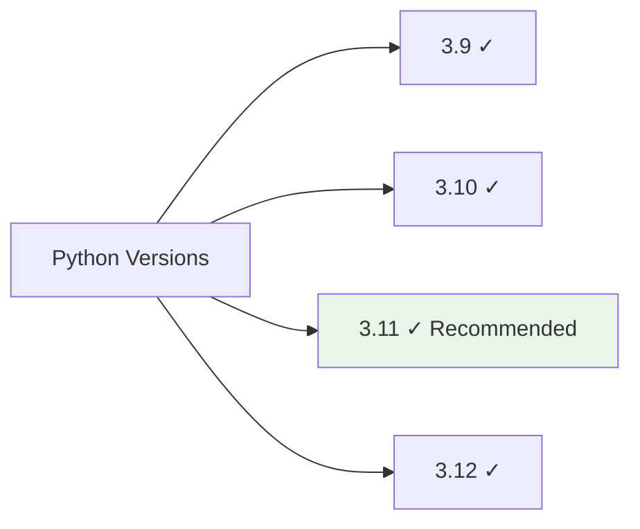

# Installation Guide

This guide covers the installation process for AutoCSV Profiler across different platforms and environments.

## System Requirements

### Minimum Requirements
- Python 3.9 or higher
- 2GB RAM (4GB recommended for large datasets)
- 500MB free disk space
- Internet connection for package downloads

### Supported Platforms
- Windows 10/11
- macOS 10.14 or later
- Linux (Ubuntu 18.04+, CentOS 7+, or equivalent)

### Python Version Support


## Installation Methods

### Method 1: PyPI Installation (Recommended)

#### Basic Installation
```bash
pip install autocsv-profiler
```

#### With Development Dependencies
```bash
pip install autocsv-profiler[dev]
```

#### Upgrade to Latest Version
```bash
pip install --upgrade autocsv-profiler
```

### Method 2: Conda Installation

#### Using conda-forge
```bash
conda install -c conda-forge autocsv-profiler
```

#### In New Environment
```bash
conda create -n csv-analysis python=3.11
conda activate csv-analysis
pip install autocsv-profiler
```

### Method 3: Source Installation

#### From GitHub
```bash
git clone https://github.com/dhaneshbb/AutoCSV-Profiler-Suite.git
cd AutoCSV-Profiler-Suite
pip install .
```

#### Development Installation
```bash
git clone https://github.com/dhaneshbb/AutoCSV-Profiler-Suite.git
cd AutoCSV-Profiler-Suite
pip install -e .[dev]
```

## Platform-Specific Instructions

### Windows

#### Using Command Prompt
```cmd
# Install Python from python.org if not already installed
python -m pip install --upgrade pip
python -m pip install autocsv-profiler
```

#### Using PowerShell
```powershell
# Ensure execution policy allows script execution
Set-ExecutionPolicy -ExecutionPolicy RemoteSigned -Scope CurrentUser

# Install package
pip install autocsv-profiler
```

#### Using Anaconda Prompt
```bash
# Open Anaconda Prompt
conda create -n csvanalysis python=3.11
conda activate csvanalysis
pip install autocsv-profiler
```

### macOS

#### Using Terminal
```bash
# Install using pip
pip3 install autocsv-profiler

# Or using Homebrew Python
brew install python
pip3 install autocsv-profiler
```

#### Using Conda
```bash
# If using Anaconda/Miniconda
conda install -c conda-forge autocsv-profiler
```

### Linux (Ubuntu/Debian)

#### System Installation
```bash
# Update package list
sudo apt update

# Install Python and pip if not present
sudo apt install python3 python3-pip

# Install AutoCSV Profiler
pip3 install autocsv-profiler
```

#### User Installation
```bash
# Install for current user only
pip3 install --user autocsv-profiler

# Add to PATH if needed
echo 'export PATH="$HOME/.local/bin:$PATH"' >> ~/.bashrc
source ~/.bashrc
```

### Linux (CentOS/RHEL)

```bash
# Install Python and pip
sudo yum install python3 python3-pip

# Install package
pip3 install autocsv-profiler
```

## Virtual Environment Setup

### Using venv (Recommended)

```bash
# Create virtual environment
python -m venv csvprofiler-env

# Activate environment
# Windows:
csvprofiler-env\Scripts\activate
# macOS/Linux:
source csvprofiler-env/bin/activate

# Install package
pip install autocsv-profiler

# Deactivate when done
deactivate
```

### Using conda

```bash
# Create conda environment
conda create -n csvprofiler python=3.11

# Activate environment
conda activate csvprofiler

# Install package
pip install autocsv-profiler

# Deactivate when done
conda deactivate
```

## Verification

### Test Installation
```bash
# Check if package is installed
pip show autocsv-profiler

# Verify command-line tool
autocsv-profiler --version

# Test Python import
python -c "import autocsv_profiler; print(f'AutoCSV Profiler v{autocsv_profiler.__version__} installed successfully!')"
```

### Quick Functionality Test
```bash
# Create a test CSV file
echo "name,age,city
Alice,25,New York
Bob,30,London
Carol,28,Paris" > test.csv

# Run analysis
autocsv-profiler test.csv

# Check output
ls test_analysis/
```

## Dependency Information

### Core Dependencies
```
pandas>=1.5.0          # Data manipulation
numpy>=1.24.0           # Numerical computing
scipy>=1.10.0           # Scientific computing
matplotlib>=3.6.0       # Plotting
seaborn>=0.12.0         # Statistical visualization
scikit-learn>=1.2.0     # Machine learning tools
statsmodels>=0.13.0     # Statistical modeling
tqdm>=4.64.0            # Progress bars
```

### Analysis-Specific Dependencies
```
tableone>=0.7.12        # Statistical summaries
missingno>=0.5.2        # Missing data visualization
tabulate>=0.9.0         # Table formatting
```

### Optional Dependencies (Development)
```
pytest>=7.0.0           # Testing framework
black>=22.0.0           # Code formatting
flake8>=6.0.0           # Code linting
mypy>=0.991             # Type checking
```

## Installation Troubleshooting

### Common Issues

#### Permission Errors
```bash
# Use --user flag for user installation
pip install --user autocsv-profiler

# Or use virtual environment
python -m venv myenv
source myenv/bin/activate  # Linux/Mac
# or myenv\Scripts\activate  # Windows
pip install autocsv-profiler
```

#### Dependency Conflicts
```bash
# Create fresh environment
conda create -n fresh-env python=3.11
conda activate fresh-env
pip install autocsv-profiler
```

#### Network Issues
```bash
# Use different index
pip install -i https://pypi.org/simple/ autocsv-profiler

# Or upgrade pip first
python -m pip install --upgrade pip
pip install autocsv-profiler
```

#### Python Version Issues
```bash
# Check Python version
python --version

# Use specific Python version
python3.11 -m pip install autocsv-profiler
```

### Platform-Specific Issues

#### Windows Path Issues
```cmd
# Add Python Scripts to PATH
set PATH=%PATH%;%LOCALAPPDATA%\Programs\Python\Python311\Scripts

# Or use python -m
python -m autocsv_profiler.cli data.csv
```

#### macOS Permission Issues
```bash
# Use --user installation
pip3 install --user autocsv-profiler

# Or use sudo (not recommended)
sudo pip3 install autocsv-profiler
```

#### Linux Package Manager Conflicts
```bash
# Use pip instead of system package manager
python3 -m pip install --user autocsv-profiler

# Or use pipx for isolated installation
pipx install autocsv-profiler
```

## Environment Variables

### Optional Configuration
```bash
# Set default output directory
export AUTOCSV_OUTPUT_DIR="/path/to/default/output"

# Set memory limit for large files
export AUTOCSV_MEMORY_LIMIT="4GB"

# Enable debug logging
export AUTOCSV_DEBUG=1
```

## Performance Optimization

### For Large Datasets
```bash
# Install with additional dependencies for performance
pip install autocsv-profiler pandas[performance]

# Or use conda for optimized packages
conda install -c conda-forge autocsv-profiler pandas numpy
```

### Memory Management
```bash
# Monitor memory usage during installation
pip install autocsv-profiler --no-cache-dir
```

## Uninstallation

### Remove Package
```bash
# Uninstall package
pip uninstall autocsv-profiler

# Remove dependencies (if not used by other packages)
pip uninstall pandas numpy matplotlib seaborn scipy scikit-learn statsmodels tqdm tableone missingno tabulate
```

### Clean Environment
```bash
# Remove virtual environment
rm -rf csvprofiler-env  # Linux/Mac
rmdir /s csvprofiler-env  # Windows

# Or remove conda environment
conda env remove -n csvprofiler
```

## Next Steps

After successful installation:

1. **Read the [Usage Guide](usage.md)** for detailed usage instructions
2. **Check [Examples](examples.md)** for sample analyses
3. **Review [API Reference](api-reference.md)** for programmatic usage
4. **See [Troubleshooting](troubleshooting.md)** if you encounter issues

## Getting Help

If you encounter installation issues:

1. Check the [Troubleshooting Guide](troubleshooting.md)
2. Search [GitHub Issues](https://github.com/dhaneshbb/AutoCSV-Profiler-Suite/issues)
3. Create a new issue with:
   - Operating system and version
   - Python version
   - Installation method used
   - Complete error message
   - Output of `pip list` or `conda list`