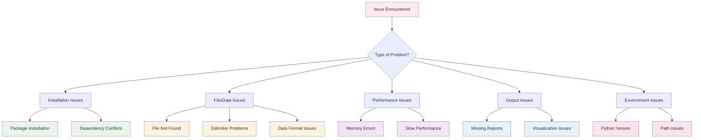

# Troubleshooting Guide

This guide helps resolve common issues encountered when using AutoCSV Profiler.

## Quick Diagnosis

### Problem Categories



## Installation Issues

### Problem: Package Installation Fails

#### Error: `pip install autocsv-profiler` fails

**Common Error Messages:**
```
ERROR: Could not find a version that satisfies the requirement autocsv-profiler
ERROR: No matching distribution found for autocsv-profiler
```

**Solutions:**

1. **Update pip:**
```bash
python -m pip install --upgrade pip
```

2. **Check Python version:**
```bash
python --version
# Should be 3.9 or higher
```

3. **Use specific Python version:**
```bash
python3.11 -m pip install autocsv-profiler
```

4. **Clear pip cache:**
```bash
pip cache purge
pip install autocsv-profiler
```

5. **Use alternative index:**
```bash
pip install -i https://pypi.org/simple/ autocsv-profiler
```

### Problem: Dependency Conflicts

#### Error: Package version conflicts

**Example Error:**
```
ERROR: pip's dependency resolver does not currently consider pre-releases.
ERROR: Cannot install autocsv-profiler because these package versions have conflicting dependencies
```

**Solutions:**

1. **Create fresh virtual environment:**
```bash
python -m venv fresh_env
# Windows:
fresh_env\Scripts\activate
# macOS/Linux:
source fresh_env/bin/activate

pip install autocsv-profiler
```

2. **Update conflicting packages:**
```bash
pip install --upgrade pandas numpy matplotlib seaborn
pip install autocsv-profiler
```

3. **Force reinstall:**
```bash
pip install --force-reinstall autocsv-profiler
```

### Problem: Permission Errors

#### Error: Permission denied during installation

**Solutions:**

1. **User installation:**
```bash
pip install --user autocsv-profiler
```

2. **Virtual environment (recommended):**
```bash
python -m venv csv_env
source csv_env/bin/activate  # Linux/Mac
csv_env\Scripts\activate     # Windows
pip install autocsv-profiler
```

3. **Administrator rights (Windows):**
```cmd
# Run Command Prompt as Administrator
pip install autocsv-profiler
```

## File and Data Issues

### Problem: CSV File Not Found

#### Error: `FileNotFoundError: [Errno 2] No such file or directory`

**Solutions:**

1. **Check file path:**
```bash
# Verify file exists
ls path/to/your/file.csv          # Linux/Mac
dir "path\to\your\file.csv"       # Windows

# Use absolute path
autocsv-profiler /full/path/to/file.csv
```

2. **Check current directory:**
```bash
pwd                               # Linux/Mac
cd                               # Windows

# Navigate to correct directory
cd /path/to/csv/files
autocsv-profiler filename.csv
```

3. **Use quotes for paths with spaces:**
```bash
autocsv-profiler "path with spaces/file name.csv"
```

4. **Check file permissions:**
```bash
ls -la file.csv                  # Linux/Mac
icacls file.csv                  # Windows
```

### Problem: Delimiter Detection Issues

#### Error: Incorrect column parsing or "All data in one column"

**Symptoms:**
- All data appears in a single column
- Column headers not properly recognized
- Data mixed up across columns

**Solutions:**

1. **Manually specify delimiter:**
```bash
# Common delimiters
autocsv-profiler file.csv --delimiter ","    # Comma
autocsv-profiler file.csv --delimiter ";"    # Semicolon  
autocsv-profiler file.csv --delimiter "\t"   # Tab
autocsv-profiler file.csv --delimiter "|"    # Pipe
```

2. **Inspect file manually:**
```bash
# View first few lines
head -5 file.csv                 # Linux/Mac
type file.csv | more             # Windows

# Look for the separator character
```

3. **Test with Python:**
```python
from autocsv_profiler import detect_delimiter

# Test delimiter detection
delimiter = detect_delimiter("problematic_file.csv")
print(f"Detected: '{delimiter}'")

# Manual inspection
with open("problematic_file.csv", 'r') as f:
    first_line = f.readline()
    print(f"First line: {first_line}")
```

4. **Fix the CSV file:**
```python
import pandas as pd

# Read with correct delimiter and save
df = pd.read_csv("file.csv", delimiter=";")
df.to_csv("fixed_file.csv", index=False)
```

### Problem: Data Format Issues

#### Error: Data parsing errors or unexpected data types

**Common Issues:**
- Dates not recognized
- Numbers treated as text
- Special characters causing issues

**Solutions:**

1. **Check file encoding:**
```python
import chardet

# Detect encoding
with open("file.csv", 'rb') as f:
    encoding = chardet.detect(f.read())
    print(f"Detected encoding: {encoding}")

# Read with correct encoding
import pandas as pd
df = pd.read_csv("file.csv", encoding='utf-8')  # or 'latin-1', 'cp1252'
```

2. **Handle special characters:**
```python
# Clean data before analysis
import pandas as pd

df = pd.read_csv("file.csv")

# Remove special characters from numeric columns
numeric_cols = df.select_dtypes(include=['object']).columns
for col in numeric_cols:
    # Remove currency symbols, commas, etc.
    df[col] = df[col].str.replace('$', '').str.replace(',', '')
    
# Try converting to numeric
df[col] = pd.to_numeric(df[col], errors='coerce')

# Save cleaned data
df.to_csv("cleaned_file.csv", index=False)
```

3. **Date format issues:**
```python
import pandas as pd

# Read with date parsing
df = pd.read_csv("file.csv", parse_dates=['date_column'])

# Or manually convert
df['date_column'] = pd.to_datetime(df['date_column'], format='%Y-%m-%d')
```

## Performance Issues

### Problem: Memory Errors

#### Error: `MemoryError` or system becomes unresponsive

**Solutions:**

1. **Check file size:**
```bash
# Check file size
ls -lh file.csv                  # Linux/Mac
dir file.csv                     # Windows

# Files >500MB may cause memory issues
```

2. **Sample large files:**
```python
import pandas as pd

# Create sample for testing
df = pd.read_csv("large_file.csv", nrows=10000)  # First 10,000 rows
df.to_csv("sample_file.csv", index=False)

# Analyze sample first
```

3. **Increase virtual memory (Windows):**
```
Control Panel → System → Advanced → Performance Settings → Advanced → Virtual Memory → Change
Set to "System managed size" or increase manually
```

4. **Monitor memory usage:**
```python
import psutil
import os

# Check available memory
available_gb = psutil.virtual_memory().available / (1024**3)
print(f"Available memory: {available_gb:.1f} GB")

# Monitor during analysis
process = psutil.Process(os.getpid())
memory_mb = process.memory_info().rss / (1024**2)
print(f"Current memory usage: {memory_mb:.1f} MB")
```

5. **Use chunked processing:**
```python
import pandas as pd
from autocsv_profiler import analyze_csv

def analyze_large_file(filename, chunk_size=10000):
    """Analyze large file in chunks"""
    
    # Read file info
    total_rows = sum(1 for line in open(filename)) - 1  # Subtract header
    print(f"Total rows: {total_rows:,}")
    
    if total_rows <= 50000:
        # Small enough to process normally
        analyze_csv(filename, "analysis_output")
    else:
        # Create sample
        sample_size = min(chunk_size, total_rows // 10)
        df_sample = pd.read_csv(filename, nrows=sample_size)
        sample_file = f"sample_{filename}"
        df_sample.to_csv(sample_file, index=False)
        
        print(f"Created sample with {sample_size:,} rows")
        analyze_csv(sample_file, "sample_analysis")

# Usage
analyze_large_file("huge_dataset.csv")
```

### Problem: Slow Performance

#### Issue: Analysis takes too long

**Solutions:**

1. **Profile the analysis:**
```python
import time
from autocsv_profiler import analyze_csv

start_time = time.time()
analyze_csv("file.csv", "output")
elapsed = time.time() - start_time
print(f"Analysis took {elapsed:.1f} seconds")
```

2. **Optimize file size:**
```python
import pandas as pd

# Load and optimize data types
df = pd.read_csv("file.csv")

# Optimize numeric types
for col in df.select_dtypes(include=['int64']).columns:
    df[col] = pd.to_numeric(df[col], downcast='integer')

for col in df.select_dtypes(include=['float64']).columns:
    df[col] = pd.to_numeric(df[col], downcast='float')

# Optimize categorical data
for col in df.select_dtypes(include=['object']).columns:
    if df[col].nunique() < len(df) * 0.5:  # Less than 50% unique values
        df[col] = df[col].astype('category')

# Save optimized file
df.to_csv("optimized_file.csv", index=False)
print(f"File size reduced from {df.memory_usage(deep=True).sum():,} to {df.memory_usage(deep=True).sum():,} bytes")
```

3. **Close other applications:**
```bash
# Free up system resources
# Close unnecessary applications
# Check available memory and CPU
```

## Output Issues

### Problem: Missing or Incomplete Reports

#### Issue: Expected output files not generated

**Solutions:**

1. **Check output directory:**
```bash
# Verify output directory exists and has content
ls -la output_directory/          # Linux/Mac
dir output_directory\             # Windows
```

2. **Check permissions:**
```bash
# Ensure write permissions
chmod 755 output_directory/       # Linux/Mac
icacls output_directory /grant Users:F  # Windows
```

3. **Run with verbose output:**
```python
import logging
from autocsv_profiler import analyze_csv

# Enable debug logging
logging.basicConfig(level=logging.DEBUG)

try:
    analyze_csv("file.csv", "debug_output")
except Exception as e:
    print(f"Error: {e}")
    import traceback
    traceback.print_exc()
```

4. **Check disk space:**
```bash
df -h                             # Linux/Mac  
dir                               # Windows
```

### Problem: Visualization Issues

#### Issue: Plots not displaying or corrupted images

**Solutions:**

1. **Check matplotlib backend:**
```python
import matplotlib
print(f"Backend: {matplotlib.get_backend()}")

# Set backend explicitly
matplotlib.use('Agg')  # Non-interactive backend
```

2. **Verify image files:**
```bash
# Check if image files exist and have content
ls -la output_directory/visualization/  # Linux/Mac
dir output_directory\visualization\     # Windows

# Check file sizes (should not be 0 bytes)
```

3. **Test plotting separately:**
```python
import matplotlib.pyplot as plt
import pandas as pd

# Test basic plotting
df = pd.read_csv("file.csv")
numeric_cols = df.select_dtypes(include=['number']).columns

if len(numeric_cols) > 0:
    plt.figure(figsize=(8, 6))
    plt.hist(df[numeric_cols[0]], bins=20)
    plt.title(f"Histogram of {numeric_cols[0]}")
    plt.savefig("test_plot.png")
    plt.close()
    print("Test plot saved successfully")
```

4. **Update graphics libraries:**
```bash
pip install --upgrade matplotlib seaborn plotly
```

### Problem: HTML Reports Not Opening

#### Issue: Interactive reports show blank pages or errors

**Solutions:**

1. **Try different browsers:**
```bash
# Test with different browsers
chrome report.html
firefox report.html
edge report.html
```

2. **Check JavaScript:**
```javascript
// Open browser console (F12) and check for errors
// Enable JavaScript if disabled
```

3. **Local file restrictions:**
```bash
# For Chrome, start with local file access
chrome --allow-file-access-from-files report.html

# Or serve via local web server
python -m http.server 8000
# Then open http://localhost:8000/report.html
```

4. **File size issues:**
```bash
# Check if HTML file is too large
ls -lh report.html               # Linux/Mac
dir report.html                  # Windows

# If >50MB, the file may be too large for browsers
```

## Environment Issues

### Problem: Python Version Issues

#### Error: Incompatible Python version

**Solutions:**

1. **Check Python version:**
```bash
python --version
python3 --version

# Should be 3.9 or higher
```

2. **Install compatible Python:**
```bash
# Using pyenv (Linux/Mac)
pyenv install 3.11.0
pyenv global 3.11.0

# Using Anaconda
conda install python=3.11
```

3. **Use specific Python version:**
```bash
# Use specific Python executable
python3.11 -m pip install autocsv-profiler
python3.11 -c "from autocsv_profiler import analyze_csv; analyze_csv('file.csv', 'output')"
```

### Problem: Path and Environment Issues

#### Issue: Command not found or import errors

**Solutions:**

1. **Check PATH:**
```bash
# Check if Python scripts directory is in PATH
echo $PATH                       # Linux/Mac
echo %PATH%                      # Windows

# Find where autocsv-profiler is installed
which autocsv-profiler           # Linux/Mac
where autocsv-profiler           # Windows
```

2. **Add to PATH:**
```bash
# Linux/Mac (add to ~/.bashrc or ~/.zshrc)
export PATH="$HOME/.local/bin:$PATH"

# Windows (System Properties → Environment Variables)
# Add Python\Scripts directory to PATH
```

3. **Use full path:**
```bash
# Use full path to executable
/usr/local/bin/autocsv-profiler file.csv
C:\Python311\Scripts\autocsv-profiler.exe file.csv
```

4. **Virtual environment activation:**
```bash
# Ensure virtual environment is activated
source venv/bin/activate         # Linux/Mac
venv\Scripts\activate            # Windows

# Check which Python is active
which python                     # Linux/Mac
where python                     # Windows
```

## Advanced Troubleshooting

### Diagnostic Script

```python
#!/usr/bin/env python3
"""
AutoCSV Profiler Diagnostic Script
Run this to diagnose common issues
"""

import sys
import os
import subprocess
import platform

def run_diagnostics():
    """Run comprehensive diagnostics"""
    
    print("AutoCSV Profiler Diagnostic Report")
    print("=" * 40)
    
    # System information
    print(f"\nSystem Information:")
    print(f"OS: {platform.system()} {platform.release()}")
    print(f"Python: {sys.version}")
    print(f"Platform: {platform.platform()}")
    
    # Python environment
    print(f"\nPython Environment:")
    print(f"Executable: {sys.executable}")
    print(f"Path: {sys.path[0]}")
    
    # Package versions
    print(f"\nPackage Versions:")
    packages = [
        'autocsv_profiler', 'pandas', 'numpy', 'matplotlib', 
        'seaborn', 'scipy', 'sklearn', 'statsmodels'
    ]
    
    for package in packages:
        try:
            module = __import__(package)
            version = getattr(module, '__version__', 'Unknown')
            print(f"{package}: {version}")
        except ImportError:
            print(f"{package}: Not installed")
    
    # Memory and disk space
    try:
        import psutil
        memory = psutil.virtual_memory()
        disk = psutil.disk_usage('.')
        
        print(f"\nSystem Resources:")
        print(f"Total Memory: {memory.total / (1024**3):.1f} GB")
        print(f"Available Memory: {memory.available / (1024**3):.1f} GB")
        print(f"Disk Free: {disk.free / (1024**3):.1f} GB")
    except ImportError:
        print(f"\nSystem Resources: psutil not available")
    
    # Test basic functionality
    print(f"\nFunctionality Tests:")
    
    # Test import
    try:
        from autocsv_profiler import analyze_csv, detect_delimiter
        print("✓ Package import successful")
    except ImportError as e:
        print(f"✗ Package import failed: {e}")
        return
    
    # Test delimiter detection
    try:
        # Create test file
        test_data = "name,age,city\nAlice,25,NYC\nBob,30,LA"
        with open("test.csv", "w") as f:
            f.write(test_data)
        
        delimiter = detect_delimiter("test.csv")
        print(f"✓ Delimiter detection successful: '{delimiter}'")
        
        # Clean up
        os.remove("test.csv")
    except Exception as e:
        print(f"✗ Delimiter detection failed: {e}")
    
    # Test analysis (with small dataset)
    try:
        # Create test dataset
        test_data = """name,age,salary,department
Alice Johnson,28,65000,Engineering
Bob Smith,34,72000,Marketing
Carol Davis,29,58000,Sales"""
        
        with open("diagnostic_test.csv", "w") as f:
            f.write(test_data)
        
        analyze_csv("diagnostic_test.csv", "diagnostic_output")
        
        # Check if output was created
        if os.path.exists("diagnostic_output"):
            output_files = os.listdir("diagnostic_output")
            print(f"✓ Analysis successful: {len(output_files)} files generated")
            
            # Clean up
            import shutil
            shutil.rmtree("diagnostic_output")
        else:
            print("✗ Analysis failed: No output generated")
        
        os.remove("diagnostic_test.csv")
        
    except Exception as e:
        print(f"✗ Analysis test failed: {e}")
    
    print(f"\nDiagnostic complete!")
    print(f"If issues persist, please share this report when seeking help.")

if __name__ == "__main__":
    run_diagnostics()
```

Save this as `diagnostic.py` and run with:
```bash
python diagnostic.py
```

### Performance Monitoring

```python
import time
import psutil
import os
from autocsv_profiler import analyze_csv

def monitored_analysis(csv_file, output_dir):
    """Run analysis with performance monitoring"""
    
    process = psutil.Process(os.getpid())
    
    # Initial state
    start_time = time.time()
    start_memory = process.memory_info().rss / (1024**2)  # MB
    
    print(f"Starting analysis of {csv_file}")
    print(f"Initial memory: {start_memory:.1f} MB")
    
    try:
        # Run analysis
        analyze_csv(csv_file, output_dir)
        
        # Final state
        end_time = time.time()
        end_memory = process.memory_info().rss / (1024**2)  # MB
        
        elapsed = end_time - start_time
        memory_used = end_memory - start_memory
        
        print(f"Analysis completed successfully!")
        print(f"Time elapsed: {elapsed:.1f} seconds")
        print(f"Memory used: {memory_used:.1f} MB")
        print(f"Peak memory: {end_memory:.1f} MB")
        
        # Check output
        if os.path.exists(output_dir):
            files = os.listdir(output_dir)
            print(f"Generated {len(files)} output files")
        
    except Exception as e:
        end_time = time.time()
        end_memory = process.memory_info().rss / (1024**2)
        
        print(f"Analysis failed after {end_time - start_time:.1f} seconds")
        print(f"Memory at failure: {end_memory:.1f} MB")
        print(f"Error: {e}")
        
        import traceback
        traceback.print_exc()

# Usage
monitored_analysis("your_file.csv", "monitored_output")
```

## Getting Additional Help

### When to Seek Help

1. **After trying solutions in this guide**
2. **Error persists across different files**
3. **System-specific issues**
4. **Performance problems with reasonable datasets**

### How to Report Issues

#### Information to Include

1. **System Information:**
   - Operating system and version
   - Python version (`python --version`)
   - AutoCSV Profiler version
   - Installation method (pip, conda, source)

2. **Error Details:**
   - Complete error message
   - Steps to reproduce
   - Sample data (anonymized if needed)
   - Command or code that caused the error

3. **Environment:**
   - Virtual environment details
   - Other installed packages (`pip list`)
   - Available memory and disk space

#### Example Issue Report

```
Title: MemoryError with 100MB CSV file

Environment:
- OS: Windows 11
- Python: 3.11.2  
- AutoCSV Profiler: 1.1.0
- RAM: 8GB
- Installation: pip install autocsv-profiler

Issue:
Getting MemoryError when analyzing a 100MB CSV file with 500k rows and 25 columns.

Error Message:
MemoryError: Unable to allocate array with shape (500000, 25) and data type float64

Steps to Reproduce:
1. autocsv-profiler large_dataset.csv
2. Error occurs during statistical analysis phase

Sample Data:
File has mixed data types - 15 numeric columns, 10 categorical columns
No obvious data quality issues
Delimiter: comma

Already Tried:
- Closing other applications
- Using virtual environment
- Sampling first 10k rows (works fine)
```

### Support Channels

- **GitHub Issues**: [Report bugs](https://github.com/dhaneshbb/AutoCSV-Profiler-Suite/issues)
- **Documentation**: [Read docs](https://github.com/dhaneshbb/AutoCSV-Profiler-Suite/tree/main/docs)  
- **Examples**: [Check examples](examples.md)

### Community Guidelines

1. **Search existing issues** before creating new ones
2. **Provide minimal reproducible examples**
3. **Use descriptive titles**
4. **Be respectful and patient**
5. **Help others when you can**

This troubleshooting guide should resolve most common issues. If you encounter problems not covered here, please create an issue on GitHub with detailed information.