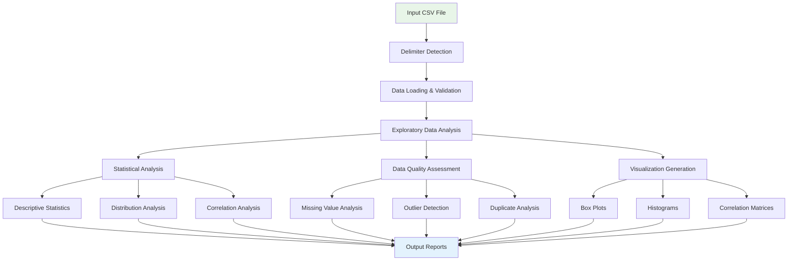
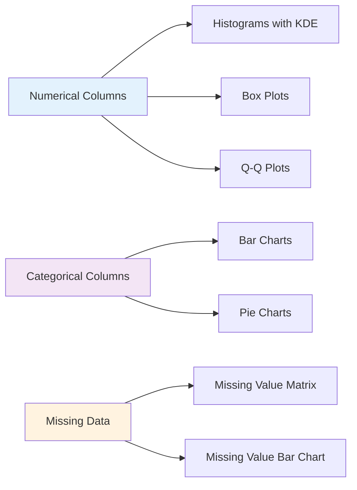

# Usage Guide

This comprehensive guide covers all aspects of using AutoCSV Profiler for data analysis.

## Quick Start

### Command Line Usage
```bash
# Basic analysis
autocsv-profiler data.csv

# With custom output directory
autocsv-profiler data.csv --output ./my_analysis

# With specific delimiter
autocsv-profiler data.csv --delimiter ";"
```

### Python API Usage
```python
from autocsv_profiler import analyze_csv

# Run comprehensive analysis
analyze_csv("data.csv", "output_directory")
```

## Command Line Interface

### Basic Syntax
```bash
autocsv-profiler [OPTIONS] CSV_FILE
```

### Options Reference

#### Required Arguments
- `CSV_FILE` - Path to the CSV file to analyze

#### Optional Arguments
- `--output, -o` - Output directory (default: `CSV_FILE_analysis`)
- `--delimiter, -d` - CSV delimiter (default: auto-detect)
- `--version` - Show version information
- `--help` - Show help message

### Command Examples

#### Basic Analysis
```bash
# Analyze sales data with default settings
autocsv-profiler sales_data.csv
```

#### Custom Output Directory
```bash
# Specify where to save results
autocsv-profiler customer_data.csv --output ./customer_analysis
autocsv-profiler inventory.csv -o /path/to/results
```

#### Custom Delimiter
```bash
# For semicolon-separated files
autocsv-profiler european_data.csv --delimiter ";"

# For tab-separated files
autocsv-profiler data.tsv --delimiter "\t"

# For pipe-separated files
autocsv-profiler data.txt --delimiter "|"
```

#### Absolute and Relative Paths
```bash
# Relative paths
autocsv-profiler ./data/file.csv
autocsv-profiler ../parent_folder/data.csv

# Absolute paths
autocsv-profiler /home/user/data/file.csv
autocsv-profiler C:\Users\Name\Documents\data.csv
```

## Analysis Workflow



## Python API

### Basic Usage

#### Import and Analyze
```python
from autocsv_profiler import analyze_csv

# Basic analysis
analyze_csv("data.csv", "output_directory")
```

#### With Error Handling
```python
import os
from autocsv_profiler import analyze_csv

def analyze_file(csv_path, output_path):
    """Analyze CSV file with error handling"""
    try:
        if not os.path.exists(csv_path):
            print(f"Error: File {csv_path} not found")
            return False
            
        print(f"Analyzing {csv_path}...")
        analyze_csv(csv_path, output_path)
        print(f"Analysis complete! Results in {output_path}")
        return True
        
    except Exception as e:
        print(f"Analysis failed: {e}")
        return False

# Usage
success = analyze_file("sales_data.csv", "sales_analysis")
```

### Advanced Usage

#### Batch Processing
```python
import os
import glob
from autocsv_profiler import analyze_csv

def batch_analyze(data_directory, output_base_dir):
    """Analyze all CSV files in a directory"""
    csv_files = glob.glob(os.path.join(data_directory, "*.csv"))
    
    results = {}
    for csv_file in csv_files:
        filename = os.path.basename(csv_file)
        name_without_ext = os.path.splitext(filename)[0]
        output_dir = os.path.join(output_base_dir, f"{name_without_ext}_analysis")
        
        try:
            print(f"Processing {filename}...")
            analyze_csv(csv_file, output_dir)
            results[filename] = "Success"
            print(f"✓ {filename} analyzed successfully")
        except Exception as e:
            results[filename] = f"Failed: {e}"
            print(f"✗ {filename} failed: {e}")
    
    return results

# Usage
results = batch_analyze("./data", "./analysis_results")
for file, status in results.items():
    print(f"{file}: {status}")
```

#### Using Individual Components
```python
from autocsv_profiler.recognize_delimiter import detect_delimiter
import pandas as pd

# Detect delimiter
csv_file = "data.csv"
delimiter = detect_delimiter(csv_file)
print(f"Detected delimiter: '{delimiter}'")

# Load data
df = pd.read_csv(csv_file, delimiter=delimiter)
print(f"Loaded {len(df)} rows and {len(df.columns)} columns")

# Run full analysis
from autocsv_profiler import analyze_csv
analyze_csv(csv_file, "custom_analysis")
```

#### Custom Analysis Pipeline
```python
import pandas as pd
from autocsv_profiler import analyze_csv
from autocsv_profiler.recognize_delimiter import detect_delimiter

def custom_analysis_pipeline(csv_file, output_dir, sample_size=None):
    """Custom analysis pipeline with optional sampling"""
    
    # Step 1: Detect delimiter
    delimiter = detect_delimiter(csv_file)
    print(f"Detected delimiter: '{delimiter}'")
    
    # Step 2: Load data (with optional sampling)
    df = pd.read_csv(csv_file, delimiter=delimiter)
    print(f"Original data: {len(df)} rows, {len(df.columns)} columns")
    
    if sample_size and len(df) > sample_size:
        df_sample = df.sample(n=sample_size, random_state=42)
        sample_file = f"sample_{csv_file}"
        df_sample.to_csv(sample_file, index=False, sep=delimiter)
        print(f"Created sample: {len(df_sample)} rows")
        
        # Analyze sample
        analyze_csv(sample_file, f"{output_dir}_sample")
        
        # Clean up sample file
        import os
        os.remove(sample_file)
    
    # Step 3: Analyze full dataset
    analyze_csv(csv_file, output_dir)
    print(f"Analysis complete! Results in {output_dir}")

# Usage
custom_analysis_pipeline("large_dataset.csv", "large_analysis", sample_size=10000)
```

## Data Types and Support

### Supported File Formats
- **CSV files** (.csv)
- **Tab-separated values** (.tsv, .txt)
- **Custom delimited files** (any single character delimiter)

### Supported Data Types

#### Numerical Data
```python
# Integer columns
age, quantity, count, year

# Float columns  
price, temperature, percentage, ratio

# Analysis includes:
# - Descriptive statistics (mean, median, std)
# - Distribution analysis (skewness, kurtosis)
# - Outlier detection (IQR method)
# - Correlation analysis
```

#### Categorical Data
```python
# Text columns
name, category, department, status

# Analysis includes:
# - Frequency distributions
# - Unique value counts
# - Most/least common categories
# - Missing value patterns
```

#### Date/Time Data
```python
# Recognized formats
"2023-01-15", "01/15/2023", "15-Jan-2023"

# Analysis includes:
# - Date range identification
# - Temporal patterns
# - Missing date detection
```

#### Boolean Data
```python
# Recognized values
True/False, Yes/No, 1/0, Y/N

# Analysis includes:
# - Distribution of true/false values
# - Missing value handling
```

## Generated Outputs

### Output Directory Structure
```
your_file_analysis/
├── your_file.csv                               # Copy of original data
├── dataset_info.txt                            # Basic dataset information
├── summary_statistics_all.txt                  # Comprehensive statistics
├── categorical_summary.txt                     # Categorical analysis
├── missing_values_report.txt                   # Missing data analysis
├── outliers_summary.txt                        # Outlier detection
├── distinct_values_count_by_dtype.html         # Interactive value explorer
└── visualization/                              # Generated visualizations
    ├── box_plots/
    │   ├── age_box_plot.png
    │   └── salary_box_plot.png
    ├── histograms/
    │   ├── age_histogram.png
    │   └── salary_histogram.png
    └── correlation_matrices/
        └── correlation_heatmap.png
```

### Report Types

#### Statistical Reports
```
dataset_info.txt
├── Shape: 1000 rows × 15 columns
├── Data types: 8 numeric, 7 categorical
├── Memory usage: 2.1 MB
├── Missing values: 5.2% overall
└── Duplicates: 12 rows
```

#### Summary Statistics
```
summary_statistics_all.txt
├── Descriptive statistics for all numeric columns
├── Distribution metrics (skewness, kurtosis)
├── Quartile analysis (Q1, median, Q3)
└── Normality test results
```

#### Categorical Analysis
```
categorical_summary.txt
├── Frequency distributions
├── Unique value counts
├── Most common categories
└── Missing value patterns
```

#### Data Quality Assessment
```
missing_values_report.txt
├── Missing value counts by column
├── Missing value percentages
├── Missing value patterns
└── Recommendations for handling
```

### Interactive Reports

#### Value Explorer (HTML)
- Interactive tables showing all unique values
- Frequency counts for each value
- Filterable and searchable interface
- Dark/light mode support

### Visualizations

#### Distribution Analysis


#### Relationship Analysis
- Correlation heatmaps for numerical variables
- Scatter plots for variable pairs
- Cross-tabulation for categorical variables

## Practical Examples

### Example 1: Sales Data Analysis
```bash
# Analyze monthly sales data
autocsv-profiler monthly_sales.csv --output sales_report

# Expected insights:
# - Revenue trends and patterns
# - Product performance analysis
# - Customer segment analysis
# - Seasonal patterns identification
```

### Example 2: Customer Data Analysis
```python
from autocsv_profiler import analyze_csv

# Analyze customer demographics
analyze_csv("customer_data.csv", "customer_insights")

# Generated reports will include:
# - Age distribution analysis
# - Geographic distribution
# - Purchase behavior patterns
# - Customer segmentation insights
```

### Example 3: Financial Data Analysis
```bash
# Analyze transaction data with custom delimiter
autocsv-profiler transactions.txt --delimiter "|" --output financial_analysis

# Analysis includes:
# - Transaction amount distributions
# - Outlier detection for unusual transactions
# - Missing data patterns
# - Temporal analysis
```

### Example 4: Survey Data Analysis
```python
import os
from autocsv_profiler import analyze_csv

# Analyze survey responses
survey_file = "survey_responses.csv"
output_dir = "survey_analysis"

if os.path.exists(survey_file):
    analyze_csv(survey_file, output_dir)
    
    # Review key outputs
    print(f"Survey analysis complete!")
    print(f"Check {output_dir}/categorical_summary.txt for response distributions")
    print(f"Open {output_dir}/distinct_values_count_by_dtype.html for interactive exploration")
else:
    print("Survey file not found!")
```

## Best Practices

### Data Preparation
1. **Clean File Paths**: Avoid spaces and special characters in file names
2. **Consistent Delimiters**: Ensure consistent delimiter throughout the file
3. **Header Row**: Include descriptive column headers in the first row
4. **Data Types**: Use consistent formats within columns

### Performance Optimization
1. **File Size**: For files >100MB, consider sampling first
2. **Memory Usage**: Monitor system memory for large datasets
3. **Output Management**: Clean old analysis directories regularly

### Analysis Workflow
1. **Start Small**: Test with a sample before analyzing large datasets
2. **Review Quality**: Check data quality reports first
3. **Explore Interactively**: Use HTML reports for detailed exploration
4. **Iterate**: Use insights to refine data preparation

## Common Use Cases

### Business Intelligence
```bash
# Monthly performance analysis
autocsv-profiler monthly_metrics.csv --output performance_dashboard
```

### Research and Academia
```python
# Research data analysis
from autocsv_profiler import analyze_csv
analyze_csv("experiment_data.csv", "research_analysis")
```

### Data Quality Assessment
```bash
# Data quality check before modeling
autocsv-profiler raw_data.csv --output quality_check
```

### Regulatory Reporting
```python
# Compliance data analysis
analyze_csv("compliance_data.csv", "regulatory_report")
```

## Integration with Other Tools

### Jupyter Notebooks
```python
# In Jupyter cell
from autocsv_profiler import analyze_csv
import pandas as pd

# Analyze data
analyze_csv("data.csv", "notebook_analysis")

# Load results for further analysis
df = pd.read_csv("data.csv")
# Continue with custom analysis...
```

### Data Pipelines
```python
# Integration in data pipeline
def data_quality_check(csv_file):
    from autocsv_profiler import analyze_csv
    
    output_dir = f"quality_check_{csv_file.split('.')[0]}"
    analyze_csv(csv_file, output_dir)
    
    # Parse quality metrics
    # Add custom validation logic
    return quality_passed

# Use in pipeline
if data_quality_check("input.csv"):
    proceed_with_processing()
else:
    handle_quality_issues()
```

### Automated Reporting
```python
# Scheduled analysis script
import schedule
import time
from autocsv_profiler import analyze_csv

def daily_analysis():
    """Run daily data analysis"""
    from datetime import datetime
    
    timestamp = datetime.now().strftime("%Y%m%d")
    input_file = f"daily_data_{timestamp}.csv"
    output_dir = f"daily_analysis_{timestamp}"
    
    if os.path.exists(input_file):
        analyze_csv(input_file, output_dir)
        print(f"Daily analysis complete: {output_dir}")

# Schedule daily at 9 AM
schedule.every().day.at("09:00").do(daily_analysis)

while True:
    schedule.run_pending()
    time.sleep(3600)  # Check every hour
```

## Next Steps

After mastering basic usage:

1. **Explore [API Reference](api-reference.md)** for advanced programming
2. **Check [Examples](examples.md)** for domain-specific use cases
3. **Review [Troubleshooting](troubleshooting.md)** for common issues
4. **See [Contributing](contributing.md)** to help improve the tool

## Getting Help

For additional support:
- Review [Troubleshooting Guide](troubleshooting.md)
- Check [GitHub Issues](https://github.com/dhaneshbb/AutoCSV-Profiler-Suite/issues)
- Read [API Documentation](api-reference.md)